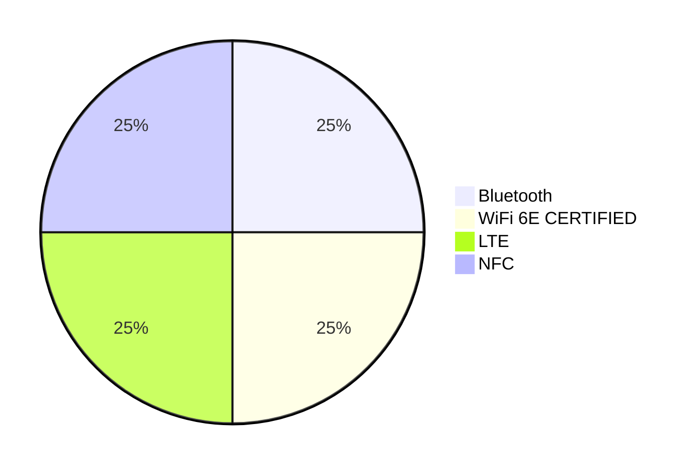

## START: 1)PM452.md
Point Mobile 2024
# PM452
PURPOSE BUILT FOR DEMANDING OPERATIONS
[The image shows a rugged mobile device with a large touchscreen display. The screen shows the Android interface with various app icons including Google, AudioPlayer, EmKit, and Play Store. The device has a full QWERTY keyboard with additional function keys below the screen.]
   
# The Ultimate Solution for Data Capture in Any Environment
The PM452 brings you the latest in mobility features and options to maximize worker efficiency and boost the return on your device investment. Designed for logistics, warehousing, and retail, it thrives in the demanding conditions of 24/7 operations, ensuring your workforce stays connected and productive wherever they are.
   
# Future Proof Operating System
Android 13 with GMS certification ensures modern app compatibility and smooth operations. PM452 is upgradeable to Android 18, offering unmatched longevity.
# Rugged Durability
MIL STD 810H certification for military grade durability. Ensures seamless operations, even in temperatures as low as  30°C.
# Hot Swappable Battery
Choice of 4,000mAh or 5,700mAh batteries for uninterrupted operations in demanding environments. Hot swappable capability eliminates downtime during battery changes.
# Compact and Lightweight
Weighs only 450g, making it lighter and more ergonomic than most competitors.
# Advanced Scanning
Multiple 1D/2D scanning engines, including long range scanning up to 29 meters. Outperforms competitions in long range barcode scanning.
# 3 Keypad Options
Offers Numeric, Function Numeric, and Alphanumeric keypads for diverse data entry requirements.
   
# Two Model Types
The PM452 is available in two versatile configurations to address varied operational demands
## Standard Form Factor
01. A compact, lightweight design optimized for mobility, making it suitable for applications requiring a balance of scanning, data entry, and portability.
02. Perfect for multi functional workflows in field services, healthcare, and transportation, where users perform a combination of data capture and manual input tasks.
03. Its streamlined design supports easy integration into vehicle mounted or handheld workflows.
## Gun Trigger
01. Designed for intensive scanning operations, the pistol grip form factor enhances ergonomics and reduces operator fatigue during extended use.
02. Ideal for applications in industries such as warehousing, logistics, and retail inventory management, where workers require a scanning focused workflow.
03. Provides a secure, natural grip, ensuring speed and accuracy during repetitive scanning tasks.
   
# Seamless Upgrade
## Protect Your Investments, Transition with Ease
The PM452 supports all existing PM451 accessories, offering a cost effective and seamless upgrade path. Transitioning to the next generation of handheld terminals has never been easier.
### Accessory Compatibility
Leverage your current inventory of charging cradles, cables, batteries, and more without additional expenses.
### Reduced Deployment Costs
No need for extensive reconfiguration   simply integrate the PM452 into your existing workflows.
### Device Management Tools
Integrates with current device management solutions for centralized control over device fleets.
   
# Start Strong with the Best
Whether you're upgrading from the PM452 or adopting Point Mobile technology for the first time
| CPU | OS | Memory | Storage |
|                   |                                       |                           |                            |
| Octa core 2.2 GHz | Android 13 (upgradable to Android 18) | 4GB / 64GB or 6GB / 128GB | 512GB micro SD 1 micro SIM |
## Why it Matters
  **Application Efficiency**: A powerful CPU ensures faster data processing, enabling quick barcode scans, real time analytics, and seamless application performance.
  **Energy Efficiency**: Modern processors optimize power consumption, extending battery life during intensive tasks.
  **Future Ready**: A robust CPU supports evolving software and application needs, ensuring the device remains relevant for years.
  **Security Updates**: Regular updates protect against emerging cybersecurity threats, ensuring data safety.
  **User Experience**: Familiar and intuitive interfaces reduce training time and improve user efficiency.
  **App Compatibility**: Android's vast ecosystem ensures compatibility with the latest enterprise applications and tools.
  **Application Performance**: Ensures smooth multitasking and prevents lag when running complex applications, enabling seamless operation in demanding environments.
  **Data Handling**: Ample storage is vital for storing large datasets, including scanned barcode information, images, and logs, without requiring frequent data transfers to external systems.
  **Future Proofing**: Expandable storage allows businesses to scale their operations without replacing devices, ensuring the device remains useful as data requirements grow.
  **Support for Modern Software**: Applications and updates often require substantial memory and storage space to function efficiently, ensuring the device can support future advancements and additional functionality.
   
# Powering the PM452
## Delivering High Performance Solutions for AIDC at a Smarter Cost
For AIDC specific needs, where efficiency, affordability, and scalability are critical, the MTK CPU is a highly competitive option. Qualcomm may excel in premium consumer devices, but MediaTek provides all the essential features needed for industrial environments at a fraction of the cost.
### AnTuTu Benchmark Results: +26% CPU
| | CPU | GPU | Memory |
|       |        |       |        |
| PM451 | 93469 | 37639 | 58698 |
| PM452 | 127471 | 63361 | 98847 |
### High Performance Architecture
Octa core, perfect balance of speed and efficiency
The octa core configuration strikes a balance between power and efficiency, making it ideal for devices that require multitasking capabilities.
### Energy Efficiency
Longer battery life and thermal stability
The 6nm process and efficient core architecture make MediaTek chips highly power efficient, a critical feature for AIDC devices that must last long shifts.
### Seamless Connectivity
Offers reliable 4G LTE and Wi Fi 5 support, with a focus on affordable and stable connectivity options ideal for industrial devices.
### Cost and Scalability
Known for cost effective solutions that provide robust performance and scalability, enabling businesses to deploy devices across large fleets affordably.
   
# Cold Storage Ready
Frozen food safety standards under the EU regulations mandate maintaining at least  18°C to preserve product quality during storage and transport.
## PM452 is engineered to perform in sub zero temperatures, reaching as low as  30°C
Forget your device working in the cold storage area? No worries—the PM452 stays fully operational and ready for use when you retrieve it.
   
# Scanning Options
Advanced scan engine options for every task
Rapid, first time barcode capture for enhanced productivity and versatility for close, medium, and long range scanning needs.
## 1D/2D N5703
  Compact and reliable for general purpose barcode scanning.
  Reads standard and high density barcodes quickly and accurately, ideal for scanning product labels in retail stores.
## EX30 (29m)
  Scans barcodes from short distances to 29 meters, making it perfect for logistics, warehousing, and pallet scanning.
  Enables both near and far barcode scanning in a single device, enhances job efficiency with fast, aim and scan capability.
## N6803 FR
  Excels in reading damaged, poorly printed, or low contrast barcodes
  Suitable for applications requiring scanning at varying distances without compromising ergonomics or speed.
  Capturing barcodes on assembly lines, or operating in environments with poor lighting conditions.
The image on the right shows a handheld barcode scanner being used in a warehouse setting. The scanner is black with orange accents and is being held over boxes on a blue pallet. In the background, there are stacks of cardboard boxes on wooden pallets.
   
# Camera & NFC Integration
## High Resolution Camera for Critical Documentation
  13 Megapixel Rear Camera
  F. No. 2.0 Aperture
  Phase Detection Auto Focus (PDAF)
  LED Flash
## Comprehensive NFC Compatibility
  Supports NFC Forum Tag Types 1 to 5
  Standards Compliance:
  ISO/IEC 14443 A/B: Smart cards and secure access
  ISO/IEC 15693: Long range identification and inventory
  Supports Popular NFC Formats:
  Mifare Classic (1K/4K): Public transportation and secure access
  Mifare DESFire: High security applications
  Mifare UltraLight: Cost effective disposable tags
  Sony FeliCa: Payment systems and transportation cards
The image on the right shows a hand holding a rugged handheld device with a large touchscreen display and a full QWERTY keyboard. The device appears to be designed for industrial or field use, consistent with the specifications listed for camera and NFC capabilities.
   
# Connectivity
Offering robust and reliable options without overcomplication.
| Bluetooth 5.2 | WiFi 6 Certified | LTE Support | NFC Integration |
|               |                  |             |                 |
| Enables efficient pairing with peripherals like printers, scanners, and headsets, enhancing operational flexibility. | Ensures fast, reliable wireless performance in high density environments such as warehouses and retail settings. | Provides seamless cellular connectivity for mobile workforces, enabling real time data access in the field. | Supports fast and secure data exchange for applications like access control, payment processing, and asset tracking. |

   
# Keypad Options
Select the keypad that best matches your data capture requirements, guaranteeing smooth operations and outstanding efficiency.
Numeric
(31 Key)
Swift quantity entries
during stock takes.
Function Numeric
(53 Key)
Expedite service tasks requiring
frequent function key usage.
Alpha Numeric
(42 Key)
Detailed product descriptions and
customer information entries.
*The Function Numeric Keypad configuration on the PM452 is subject to potential updates or changes.
   
# Tailored for your Industry
Future proof technology and rugged durability meet in the Point Mobile PM452, a versatile handheld terminal designed to handle the toughest business environments.
## LOGISTICS
  Pallet Tracking: Use the extra long range scan engine to read barcodes on pallets from over 20 meters, improving efficiency in large distribution centers.
  Shipment Verification: Utilize PM452 for real time tracking and verification of goods during transit.
## RETAIL/WAREHOUSING
  Inventory Management: Quick and accurate product labeling and restocking tasks.
  Checkout Assistance: Compact design and lightweight build make the PM452 ideal for streamlining checkout operations.
  Cold Storage: Rugged build and temperature tolerance enable efficient handling in frozen goods storage facilities.
## FIELD SERVICES
  On Site Inspections/Repairs: Scan utility meters, access digital manuals and inventory information, ensuring accurate repairs with minimal downtime.
  Task and Route Optimization: GPS integration with the right applications enable field workers to efficiently plan routes and update job statuses directly from the device.
   
# Comparison Chart: PM452
| | PM452 | Zebra MC9400/MC9450 | Honeywell CK67 | Urovo RT40S | Bluebird EK430 | Unitech HT730 |
|                     |                                            |                                 |                                |                              |                                      |                       |
| Processor | MTK MT8781V/CA Octa core 2.2 GHz | Qualcomm 4490 Octa core 2.4 GHz | Qualcomm 4490 Octa core | Qualcomm Octa core 2.45GHz | Qualcomm SD660 Octa core 2.2 GHz | Qualcomm 720G |
| RAM/ Storage | 4GB/64GB or 6GB/128GB | 6GB /128GB | 8GB/128GB | 4GB/64GB | 4GB/64GB | 4GB/64GB |
| Storage Expansion | MicroSD (up to 512GB) | MicroSD (up to 256GB) | MicroSD (up to 512GB) | MicroSD (up to 256GB) | MicroSD (up to 512GB) | MicroSD (up to 256GB) |
| SIM/SAM Slots | 1 micro SIM slot | 1 Nano SIM, eSIM | Not Specified | Not Specified | Not Specified | Not Specified |
| Android OS | Android 13 GMS Upgradable to Android 18 | Upgradable to Android 17 | Android 14 18 Supported | Android 11 GMS | Android 10 Upgradeable to Android 14 | Android 10 GMS |
| Display | 4.3 in. WVGA, IPS 500 nits (Gorilla Glass) | 4.3 in. WVGA (Gorilla Glass) | 4.3 in. WVGA | 4.0 in. WVGA (Gorilla Glass) | 4.3 in. WVGA | 4.0 in. WVGA |
| Battery | 4,000mAh / 5,700mAh (+60mAh Back up) | 7,000mAh | 7,000mAh | 5,200mAh | 7,000mAh | 6,700mAh |
| Hot Swap | ✓ | ✓ | ✓ | | ✓ | ✓ |
| Drop Resistance | 2m | 3.65m | 2.4m | 1.8m | 1.8m | 2.4m |
| IP Rating | IP65 | IP65/IP68 | IP68 | IP68 | IP65 | IP65/IP67 |
| Durability | MIL STD 810H | MIL STD 810H | MIL STD 810H | Not Specified | MIL STD 810G | MIL STD 810H |
| Connectivity | Wi Fi 6, 4G LTE | Wi Fi 6E, 5G | Wi Fi 6E, 5G | Wi Fi 5, 4G LTE | Wi Fi 6, LTE | Wi Fi 6, LTE |
| Scanning Options | 1D/2D N5703, EX30 (29m), N6803FR | 1D/2D SE58 Extended Range (21m) | FlexRange™ (30m) | 1D/2D (8m) | 1D/2D (10m) | 1D/2D Megapixel (20m) |
| Camera | 13MP Top PDAF | 16MP Rear, 8MP Front | 16MP Rear, 8MP Front | 13MP Rear | 13MP Rear | 13MP Rear |
| Weight | 450g | 516g | 516g | 425g | 450g | 410g |
| Enterprise Solution | PMDM, EmKit, PULS | Mobility DNA Suite | Operational Intelligence Suite | Basic Suite | TE Powered by Wavelink | Standard Suite |
   
POINT Mobile logo
# Thank You
Contact us to learn more
Point Mobile Europe GmbH
Am Seestern 8
40547 Düsseldorf
www.pointmobile.com
info.pmeg@pointmobile.com
+49 211 1588 5913
## END: 1)PM452.md
## START: 10)PM84 DS3.0 EN.md
POINT MOBILE DATA SHEET
PM84 DS3.0 EN
# PM84
## ELEVATE YOUR BUSINESS WITH A PRACTICAL AND HIGH QUALITY MOBILE COMPUTER
### Enterprise Mobile Device for All Business Sizes
Meticulously designed, the PM84 stands out as a practical choice for businesses, yet delivers uncompromising performance. Powered by an octa core processor and furnished with 4 GB RAM and 64 GB ROM standard storage, the device ensures a smooth user experience. A robust, easily replaceable 4,950 mAh (opt. 7,020 mAh) battery powers the device throughout the day. The back cover and the battery comprise one integrated part, contributing to increased safety and robustness, and offering a much easier on the spot battery replacement. PM84 features a 13 MP rear camera with Auto Focus for quick and clear on site image capture, while 5 MP front camera facilitates video calls for clearer communication, especially when delivering real time on site information.
### Productivity Enhancing Business Features
Enjoy optimal user experience for your business with the PM84, certified by Android Enterprise Recommended. AER certified devices meet Google's strict requirements, including regular and consistent software and security updates. The unique Enterprise Hot Swap feature saves time and safeguards your ongoing tasks, by allowing uninterrupted screen operation during battery replacement and initiating a safe shutdown countdown timer. Managing your devices has never been easier with Point Mobile Device Management (PMDM). It enables a remarkably straightforward and centralized process for the initial setup and updating of hundreds of devices. Furthermore, Point Mobile's extensive partnerships with third party solution providers offer a variety of advanced MDM solutions from which you can choose to meet your specific business needs. The scan engine is optimized for fast and accurate data capture reading all commonly used 1D/2D symbologies, expanding the applicability of PM84 to various industries including retail, e commerce, delivery services, transportation, and warehouse management.
### Built for Durability and Longevity
Built to excel in demanding business environments, the PM84 boasts 1.8 m (6 ft.) drop resistance with the Rugged Boot and 1.5 m (5 ft.) without, onto granite and meets MIL STD 810H drop standards. It passed a 500 cycle, 0.5 m (1.6 ft.) tumble test and operates within a temperature range of  20 °C to 60 °C ( 4 °F to 140 °F), proving its suitability for even the harshest industrial settings. Equipped with Corning Gorilla Glass, the PM84 is designed for an extended lifecycle and exceptional durability.
### Industries and Accessories
| Industries | Accessories | |
|                                                                              |                                                                                                                                  |                                                                                                               |
| Field Services Transport & Logistics Warehouse Management Retail Hospitality | **Standard** AC/DC Power Adaptor Country Plug LCD Protection Film Battery   Standard: 4,950 mAh   Extended: 7,020 mAh Hand Strap | **Optional** Single Slot Cradle (opt. Ethernet) 4 Slot Battery Charger Gun Handle UHF RFID Reader Rugged Boot |
### Key Features
  2.0 GHz Octa core processor
  Android 13
  4 GB RAM / 64 GB ROM
  1 nano SIM
  5.5" HD+ 720 x 1440 display
  Gorilla Glass
  4,950 mAh / 7,020 mAh battery
  Enterprise Hot Swap
  GNSS
  4G LTE
  Wi Fi
  Bluetooth Class I Ver. 5.1
  2D Imager
  13 MP Rear / 5 MP Front camera
  NFC
  1.8 m (6 ft.) / 1.5 m (5 ft.) drop resistance
  IP65 / IP67 rated
  PULS Service
   
# PM84
## PERFORMANCE CHARACTERISTICS
### Main processor
Octa core @ 2.0 GHz
### Operating system
Google Android: Android 13 (upgradable to Android 15*)
(GMS & AOSP): FOTA (Firmware Over The Air) update
### Memory and storage
  RAM/ROM: 4 GB / 64 GB
  micro SD: Supports up to 512 GB using ExFAT file system
  SIM: 1 nano SIM
### Sensor
Proximity sensor, Light ambient sensor, Accelerometer, Gyro sensor, Digital compass
## PHYSICAL CHARACTERISTICS
### Dimensions
164.8 x 78 x 17.6 mm
6.5 x 3.1 x 0.7 in.
### Weight
266 g / 9.4 oz.
### Display
  5.5" IPS panel (720 x 1440 pixels), HD+
  LED backlight
  Daylight readable (440 nits, typical)
  Wideviewing angle
  Multi touch capacitive
  Corning Gorilla Glass
### Power
  Standard battery: 4,950 mAh, 3.87 V, Li ion rechargeable
  Extended battery: 7,020 mAh, 3.87 V, Li ion rechargeable
  Back up battery: 95 mAh, 3.7 V (10C), Enterprise Hot Swap
### Key & Buttons
  Right: Scan
  Left: Scan, Volume
  Top: Power
### Voice & Audio
  Dual microphones
  Receiver
  Speaker on front side (93 ± 3 dB)
### Standard communications
  USB 2.0 Type C/OTG
  POGO 2 pin
  POGO 5 pin in rear
### Notification
2 x Dual LEDs for power (R/G) and warning (R/B) indication
Vibration
## WIRELESS
### Wireless WAN
  EDGE/GPRS/GSM: 900/1800/850/1900
  WCDMA: B1/2/4/5/6/8/19
  LTE FDD: B1/2/3/4/5/7/8/12/13/17/19/20/25/26/28/66
  LTE TDD: B38/39/40/41
### Wireless LAN
  Radio: IEEE 802.11 a/b/g/n/ac/d/h/i/k/r/v, 1x1 MU MIMO
  Data rates:
  5 GHz: 802.11 a/n/ac: Up to 433 Mbps
  2.4 GHz: 802.11 b/g/n: Up to 150 Mbps
  Operating channels:
  1 to 13 (2412~2472 MHz)
  36 to 165 (5180~5825 MHz)
  Channel bandwidth: 20, 40, 80 MHz
  Security and encryption: WEP / WPA / WPA2 / WEP, RC4 Algorithm / TKIP, RC4 Algorithm / AES, Rijndael Algorithm, EAP TLS / EAP TTLS / PEAP GTC /PEAP MSCHAPv2 /LEAP supported, WiFi Direct and Hot spot support, WPA3 Personal WPA3, Enterprise, Enhanced Open (OWE)
  Fast Roam: 802.11r
### Wireless PAN
Bluetooth: Class I, ver. 5.1, BLE support
## DATA CAPTURE
### Integrated scan engine
Supporting 1D/2D barcode symbologies
### Camera
  Rear: 13 MP, F. No. 1.8, Auto Focus
  Front: 5 MP
### NFC (Near Field Communication)
  NFC Forum (NFC IP Modes): Reader for NFC Forum (Tag Types 1 to 5)
  Reader (PCD – VCD): ISO/IEC 14443 A, ISO/IEC 14443 B, ISO/IEC 15693, Mifare Classic 1K/4K, Mifare DESFire, Mifare UltraLight©, Sony FeliCa
## USER ENVIRONMENT
  Operating temperature:  20 °C to 60 °C ( 4 °F to 140 °F)
  Storage temperature:  25 °C to 70 °C ( 13 °F to 158 °F)
  Humidity: 95% non condensing
## GLOBAL NAVIGATION SATELLITE SYSTEM
  WLAN SKU: No GNSS
  WWAN SKU: GNSS receiver support for GPS (A GPS), GLONASS, Galileo, and Beidou
## Drop
1.8 m (6 ft.) with Rugged Boot and 1.5 m (5 ft.) without, multiple drops to granite surface across the operating temperature range, MIL STD 810H
## Tumble
500 cycles, 0.5 m (1.6 ft.) tumbles per IEC 60068 2 32 specification
## Rain/dust proof (Sealing)
IP65 / IP67
## Electrostatic discharge
  ± 15 kV air discharge
  ± 8 kV contact discharge
## REGULATORY APPROVALS AND COMPLIANCE
CB, CE, FCC, NRCan, RCM, KC, CU, FAC, FSS, CST, SASO IECEE (SIRC), BIS, WPC, IMDA, NBTC, MTC, RoHS, WEEE, REACH, ANATEL, NOM019, NOM208, NOM 211 Parts 1 & 2 (IFITEL), IFT012 SAR
## ENTERPRISE SOLUTION
### PMDM
Simple yet powerful management solution
PMDM is a mobile device management solution for managing and monitoring your Point Mobile Android devices. Centralized management of enterprise devices is vital for better productivity. You should provide a device configuration that the workers can concentrate on their work with the device, and also decrease the device downtime by predicting when to replace the battery, etc.
### EmKit
Enterprise Mobility Kit
The EmKit™ is Point Mobile's value added service kit engineered for the pure benefit of system integrators. EmKit supports the utilization, solution development, and secure management of your business devices.
## PULS – ANDROID UPDATE & SECURITY
PULS is a Point Mobile's lifetime solution, which extends the life cycle of Android based Point Mobile enterprise devices to up to seven years after a product launch.
### PULS
Patches, updates & Lifetime Support
  Stay up to date with the latest security updates for up to 7 year
  Conveniently update your devices in the field by FOTA
  Update Android Versions and use new features via PULS**
For further information, please visit www.pointmobile.com or contact your regional sales representative.
*Android version updates may come with restrictions and could incur charges.
## WARRANTY
Subject to the Terms and Conditions, PM84 carries 1 (one) year warranty period from the date of purchase against the defective materials and manufacturing defects.
For the further inquiry, please leave your message here: https://www.pointmobile.com/en/contactus.
*The Android version may vary based on the mobile processor product roadmap. The upgradeable version is subject to change on the manufacturer's policy and condition.
**Android version updates may come with restrictions and could incur charges.
## Corporate Headquarters
Point Mobile Co., Ltd.
https://www.pointmobile.com/en/contactus
+82 2 3397 7870
## NA Headquarters
Point Mobile Americas LLC
info@pointmobileamericas.com
+1 202 798 0786
## Europe Headquarters
Point Mobile Europe GmbH
info.pmeg@pointmobile.com
+49 211 1588 5913
## China Headquarters
Point Mobile China
info@pointmobile.com.cn
+86 755 8869 1169
Google, Android, Google Play and other marks are trademarks of Google LLC.
Copyright © 2006 2024 Point Mobile Co., Ltd. All rights reserved. Point Mobile Co., Ltd. is the designer and manufacturer of handheld mobile computers.
The Point Mobile logo is a registered trademark and symbol of Point Mobile. Features and specifications are subject to change without prior notice.
## END: 10)PM84 DS3.0 EN.md
## START: 11)UROVO CT48.md
# urovo
# UROVO CT48
## Specifications
[The image displays multiple views of the UROVO CT48 device from different angles: top, left side, front, right side, back, and bottom]
UROVO Technology Co., Ltd.
   
# Urovo
## Specifications
| Performance | |
|                      |                                                                                                                                                                                                                                                                                                                              |
| Model | UROVO CT48 |
| O.S. | Android 12.0 |
| Processor | Octa core 2.0GHz |
| Memory | RAM: 2GB , ROM: 32GB RAM: 4GB , ROM: 32GB (Optional) |
| Extended memory | Micro SD card, Up to 256 GB SDXC |
| Dimensions | 165.7\*66\*18 mm |
| Weight | 8.82 oz./252 g with standard battery |
| Display | 4.0 inch display, 480 x 800 |
| Touch Screen | Ultra sensitive capacitive touch panel, support multi touch, works with gloves and wet fingers |
| Main battery | Capacity: 3.85V 5000mAh |
| Charging time | Less than 4 hours |
| Basic specifications | |
| Buttons | Virtual keys: return key, home key, menu key Number keys: 0 9, "." 1Aa key: Number and Letter mode switching Fn key: Function Combination key Function keys: P1, P2 Side Scan Key \* 2, Front Scan Key \* 1, Side Power Key \* 1 Direction Key \* 4 (Up, Down, Left and Right) Delete Key \* 1, Enter Key \* 1, TAB Key \* 1 |
| Camera | Front default none, (2MP Optional); Rear 13MP Autofocus ; Flash LED |
| Sensors | Light + Proximity + Accelerator(optional) + Gyro(optional) |
| Scanning | Professional scan engine Support international standard 1D/2D barcode; Support barcode displayed on screen and colored barcode; |
| Slots | Nano SIM x 1 , Micro SD \*1 (up to 256GB), eSIM × 1(optional) |
| Audio | Dual Microphone with noise cancellation, 1.5W Speaker for loud noise , earpiece supports echo cancellation |
| Interfaces | USB Type C、pogo pin |
| Positioning | GPS、A GPS、BEIDOU、GLONASS、Galileo |
| Network Connections | |
| WWAN | 4G/3G/2G |
| Bluetooth | BT5.0 + BR/EDR + BLE |
| Wi Fi | 2.4G/5G，IEEE 802.11a/b/g/n/ac/d/e/h/i/k/r/v/w Roaming：802.11r /OKC/ PMKID caching |
| Environment | |
| Operating Temp. |  10°C to 50°C |
| Storage Temp. |  40°C to 70°C |
| Humidity | 5%RH～95%RH (No condensation) |
| Drop Specification | Multiple 1.5 m drops to concrete at room temperature |
UROVO Technology Co., Ltd.
   
| | |
|          |                             |
| Tumbling | 400 1.0m tumbles |
| Sealing | IP65 |
| ESD | +/ 15kv Air; +/ 8kv contact |
## Data Capture Specifications
### 1) Camera
| Front Camera (optional) | |
|                         |                                                      |
| Pixels | 2MP Fixed Focus |
| Rear Camera | |
| functions | Flash light(700mA), Autofocus, 1080p video recording |
| Pixels | 13MP Autofocus |
### 2) Scan Engine
| 2D Imager Engine Specifications | |
|                                 |                                                                                                                                                                                                                                                                                           |
| Scan Angels Tilt | 360° |
| Scan Angels Pitch | ±60° |
| Scan Angels Skew | ±60° |
| Barcodes support | Linear: Codabar, Code 11, Code 128, Code 2 of 5, Code 39, Code 93 and 93i, EAN/JAN 13, EAN/JAN 8, IATA Code 2 of 5, Interleaved 2 of 5, Matrix 2 of 5, MSI, GS1 Databar, UPC A, UPC E, UPC A/EAN 13 with Extended Coupon Code, Coupon GS1 Code 32(PARAF), EAN UCC Emulation, GS1 Data Bar |
| | 2D Stacked: Codablock A, Codablock F, PDF417, MicroPDF417 |
| | 2D Matrix: Aztec Code, Data Matrix, MaxiCode, QR Code, Chinese Sensible (Han Xin), Grid Matrix, Dot Code |
| | Postal: Australian Post, British Post, Canadian Post, China Post, Japanese Post, Korea Post, Netherlands Post, Planet Code, Postnet |
### 3) RFID(HF/NFC)
| | |
|               |                                                      |
| RFID | Read/Write(HF) |
| Protocol | ISO15693、ISO14443 A/B 、Mifare、Felica |
| Frequency | 13.56MHz |
| Mode | Card Emulation、Peer to Peer、Reader via Host and UICC |
| Reading Range | Read distance 0 6cm (ISO15693), 0 4cm(ISO14443A/B) |
## Network Connections
### 1) Positioning
| | |
|             |                                                   |
| Positioning | Specification |
| Mode | GPS、A GPS、BEIDOU、GLONASS、Galileo |
| Frequency | GPS（ L1 1.575GHz C/A code）， BEIDOU（ B1 1.561GHz）， |
UROVO Technology Co., Ltd.
   
| GLONASS(L1 1.602GHz), Galileo (E1 1.589 GHz / E2 1.561 GHz) | |
|                                                             |                           |
| Cold start time | Less than 40s |
| Max channel | 31 channel |
| sensitivity |  130dB(SNR value 40 dBHz) |
| Precision | 5 10 Meters (open space) |
## 2) Wireless LAN
| WLAN | Specification |
|                         |                                                                                                                                 |
| Protocol | IEEE 802.11a/b/g/n/ac/d/e/h/i/k/r/v/w (2.4G/5G dual band Wi Fi) |
| Working Channels | CH1\~CH13, CH34 CH140, CH149\~CH165, depends on country (region) |
| Security and Encryption | 802.1x,TKIP, AES, PEAPv1, EAP TLS, EAP TTLS, PEAP MSCHAPv2, PEAP TLS, PEAP GTC, PWD,SIM, AKA, WEP, WPA/WPA2 PSK, WAPI, WAPI PSK |
| Fast roaming | PMIKD caching;Support 802.11r fast roaming(Over the Air), roaming threshold can be set |
## 3) Wireless WAN
| WAN | Specification |
|                |                                             |
| Frequency band | TD LTE(B34/B38/B39/B40/B41) |
| | FDD LTE(B1/B2/B3/B4/B5/B7/B8/B20/B28A/B28B) |
| | WCDMA(B1/B2/B4/B5/B8) |
| | CDMA\&EVDO:BC0 |
| | GSM/EDGE/GPRS(850/900/1800/1900) |
## 4) Wireless PAN
| BT | Specification |
|       |                      |
| Mode | BT5.0 + BR/EDR + BLE |
| Range | More than 10 Meters |
## Optional Accessories
| Type | |
|                    |                                                                                                 |
| Standard Accessory | Adapter\*1, Type C cable\*1, Battery\*1, Instructions & Security Information & Warranty Card\*1 |
| Optional Accessory | Single Slot Charging cradle, Screen protector, Hand Strap,Rugged Boots |
UROVO Technology Co., Ltd.
## END: 11)UROVO CT48.md
## START: 12)Cover.md
# Cover
|Competitive study Updates| | | | | | |
|   |   |   |   |   |   |   |
|B 9F, Kabul great valley, 32, Digital ro, 9 gil, Geumcheon gu, Seoul, Korea (P.C: 08512)| | | | | | |
|PROJECT| |Competitive study updates|MODEL|PM84| | |
|REVISION|DESCRIPTION| | | |AUTHOR|DATE|
|1.0|First release| | | |Derek Lee|12 Sep 23|
|1.1|Added: Urovo DT50| | | |Derek Lee| |
|1.2|PM84 battery Spec and Drop Spec added| | | |SC|13 Oct 23|
|1.3|PM84 Dimension and weight added| | | |SC|13 Oct 23|
| | | | | | | |
|Point Mobile   Confidential Document  | | | | | | |
   
# V1.3
| |BRAND|POINT MOBILE|Zebra| |Honeywell| |BlueBird|Datalogic|Newland| |M3 Mobile|CipherLab|Urovo| | |Daishin|Unitech|
|   |   |   |   |   |   |   |   |   |   |   |   |   |   |   |   |   |   |
| |MODEL/IMAGE|PM84|TC15|TC22/27|EDA5S|EDA52|CF550|Memor 11|MT90 Orca III|Speedata| | | | | | | |
|SD55 Lynx II|SL20|RS35|DT20 (i6320 new)|Urovo DT50|Urovo RT40|MobileBase| | | | | | | | | | | |
|DS70|EA520| | | | | | | | | | | | | | | | |
| |PERFORMANCE CHARACTERISTICS| | | | | | | | | | | | | | | | |
| |Micro Processor|Octa core 2.0GHz|Qulcomm Snapdragon™ SM6375 octa core 2.2 GHz (2) & 1.8 GHz (6)|Qualcomm® 5430 hex core, 2.1 GHz|Qualcomm Snapdragon quad core SM6115, 2.0 GHz+1.8 GHz|Qualcomm Snapdragon SM6115, quad core 2.0 GHz + 1.8 GHz|2.0 GHz octa core|2 GHz octa core|2 GHz octa core|2.0 GHz octa core|2.3 GHz octa core|1.8 GHz octa core|2.0 GHz octa core|Qualcomm 2.45 GHz octa core|Qualcomm Octa core 1.8GHz| | |
|Qualcomm Octa core 2.2GHz (optional)|Qualcomm QCM2290, quad core 2.0 GHz|Octa core 2.0 GHz| | | | | | | | | | | | | | | |
| |OS|Android 13 (upgradeable to Android 15)|Android 11 (upgradeable to Android 13)|Android 13; upgradeable to Android 16|Android 11 (upgradeable to Android 13)|Android 11 (upgradeable to Android 13)|Android 11 (Upgradeable to Android 13)|Android 11 (upgradeable to Android 13+)|Android 11|Android 11|Android 11|Android 10 or 11|Android 11|Android 11|Android 10|Android 11 (upgradeable to Android 14)|Android 11|
| |Memory|4 GB|4 GB|6 GB or| | | | | | | | | | | | | |
|8 GB|3 GB or 4 GB or 6 GB|3 GB or 4 GB or 6 GB|3 GB|4 GB|4 GB|3 GB|4 GB|3 GB or 4 GB|4 GB|4 GB or 8 GB|3 GB or 4 GB|2GB or 3 GB|4 GB| | | | |
| |Storage|64 GB|64 GB|64 GB or| | | | | | | | | | | | | |
|128 GB|32 GB or 64 GB or 128 GB|32 GB or 64 GB or 128 GB|32 GB|32 GB|64 GB|4 GB|64 GB|32 GB or 64 GB|64 GB|64 GB or 128 GB|32 GB or 64 GB|32 GB|64 GB| | | | |
| |SIM Card Slot|1 nano SIM|Dual nano SIM or| | | | | | | | | | | | | | |
|1 nano SIM + (1 micro SD)|TC27 only: 1 Nano SIM and 1 eSIM (except China)|1 nano SIM + 1 eSIM|1 nano SIM + 1 eSIM|Dual SIM (2 nano SIM)|micro SIM|dual SIM (1 SIM, 1 micro SIM)|Dual nano SIM|1 nano SIM|2 SIM|Dual nano SIM|Dual nano SIM|Dual nano SIM|SIM|Dual SIM| | | |
| |SAM Slot|n/a|n/a|n/a|n/a|n/a|n/a|n/a|n/a|n/a|1 PSAM|1 SAM|n/a|n/a|PSAM|SAM|n/a|
| |PHYSICAL| | | | | | | | | | | | | | | | |
| | | | | | | | | | | | | | | | | | |
|CHARACTERISTICS| | | | | | | | | | | | | | | | | |
| |Weight|266g|266 g|8.32 oz/236 g (TC22 3800mAh battery)|218 g|258 g|251 g|285 g|270 g (battery included)|240 g|236 g|288 g|239.5 g|250 g|425 g|273 g|246 g (with battery)|
| |Dimension|164.8 x 78 x 17.6 mm|175.8 x 78. 6 x 14.2 mm|165 mm L x 76.3 mm W x 12.5 mm D|159 x 75 x 11.2 mm|159 x 75 x 14.4 mm|158.3 x 75.8 x 14.9 mm|155 x 78 x 18.7 mm|155 x 78 x 20 mm|150 x 72.5 x 15 mm|156.8 x 72.7 x 17.55 mm|165 x 76.8 x 17.9 mm|157.8 x 77 x 14.5 mm|162.6 x 76 x 13.6 mm|199 x 58 x 29 mm|76 x 154 x 18.7 mm|151.1 x 76.8 x 13.7 mm|
| |DISPLAY|5.45 HD+ (720 x 1440)|6.5 HD+ (720 x 1600)|6.0 in. color FHD+ (1080 x 2160); LED backlight; 450 Nits;|5.5 HD (720 x 1440)|5.5 HD (720 x 1440)|5.45 HD+ (720 x 1440)|5 HD (720 x 1280)|5 HD (720 x 1280)|5.5|5.45 HD+ (720 x 1440)|5.5 HD+ (720 x 1440)|5 HD (720 x 1280)|5.7 HD+ (720 x1440, 1080 x 2160 opt.)|4 (480 x 800)|5.5 HD+ (720 x 1440)|5|
| |BATTERY|4,830 mAh, 7,000 mAh / Enterprise Hot Swap|5,000 mAh|3,800 mAh or 5,200 mAh|3,060 mAh|4,500 mAh|4,350 mAh|4,100 mAh|4,500 mAh|4,500 mAh|3,000 mAh or| | | | | | |
|5,000 mAh, Hot Swap|4,000 mAh|4,200 mAh or 5,000 mAh|4,300 mAh or 6,000 mAh|5,200 mAh|4,000 mAh or 6,000 mAh|4,250 mAh| | | | | | | | | | | |
| |Buttons|Power, Volumes, Scans|Power, Volumes, Scans, Programmable button|Scans (dual), PTT (programmable), Volumes, Power|Power, Volumes, Scans|Power, Volumes, Scans|Power, Volumes, Scans|Power, Volumes, Scans, Three programmable keys|Power, Volumes, Scans, Function, Keypad (4 keys)|Power, Volumes, Functions|Power| | | | | | |
|5 programmable side scan keys|Power, Scans, Volumes, One programmable key|Power, Volumes, Scans, One programmable|Power, Volumes, Scans, One programmable|38 keys keypad, power, volumes, scans|Scans, Volumes, Function|Power, Volumes, Scans, Function| | | | | | | | | | | |
| |Audio|Dual microphones, receiver, speaker 93±3 dB, VoLTE, VoWiFi|Speaker, Dual microphones, Audio headset support from USB C port or Bluetooth|Two microphones with noise cancellation; dual speakers for loudness; Bluetooth wireless headset support; high quality speaker phone; PTT headset (Zebra USB C) support; HD Voice, including Super wideband (SWB), Wideband (WB) and Fullband (FB)|Multiple speakers, three microphones|Speaker, two microphones (noise cancellation)|Dual noise cancelling microphones| | | | | | | | | | |
|Speaker| | | | | | | | | | | | | | | | | |
|3.5mm headset jack|Not disclosed|Microphone, Speaker|Dual speakers|Dual microphones (noise cancelling), Speaker, Bluetooth headset, speaker phone|Microphones (eco/noise cancellation), Speaker|Dual microphones (nose cancellation), Speaker, Receiver|Dual microphones (noise cancellation), Speaker, PTT headset support, cellular circuit switch voice|Speaker, Microphone, PTT|Microphone, Speaker, Receiver|Dual microphones (noise cancelling), Speaker, Receiver| | | | | | | |
| |Camera|13 MP rear, Auto Focus, F. No. 1.8, LED flash| | | | | | | | | | | | | | | |
|5 MP front|13 MP rear, Auto Focus, LED flash| | | | | | | | | | | | | | | | |
|5 MP front|16 MP rear,| | | | | | | | | | | | | | | | |
|5 MP front|13 MP rear, Auto Focus, LED flash| | | | | | | | | | | | | | | | |
|5 MP front|13 MP rear, Auto Focus| | | | | | | | | | | | | | | | |
|5 MP front|13 MP rear Auto Focus, LED flash|13 MP rear, Auto Focus, LED flash|8 MP rear, Auto Focus, LED flash|13 MP rear, Auto Focus, LED Flash,| | | | | | | | | | | | | |
|5 MP front|13 MP rear| | | | | | | | | | | | | | | | |
|5 MP front|13 MP rear, Auto Focus, LED flash| | | | | | | | | | | | | | | | |
|5 MP front|13 MP rear, LED flash| | | | | | | | | | | | | | | | |
|2 MP front|16 or 13MP rear Auto Focus, LED flash,| | | | | | | | | | | | | | | | |
|5MP front|13 MP rear camera, Auto Focus LED flash|16 MP rear, Auto Focus, LED flash|13 MP rear, Auto Focus, LED flash| | | | | | | | | | | | | | |
|8 MP front| | | | | | | | | | | | | | | | | |
| |Barcode Scanner|1D/2D|SE4100 1D/2D or| | | | | | | | | | | | | | |
|SE4710 1D/2D|SE55 1D/2D Advanced Range or| | | | | | | | | | | | | | | | |
|SE4710 1D/2D|S0703 1D/2D|S0703 1D/2D (optional)|SE4710 1D/2D|HalogenTM DE2102 HP: 1D/2D|1D/2D|1D/2D|SE4710 1D/2D|SE4770 1D/2D,| | | | | | | | | |
|SE4770 with tilting angle at 70 °|1D/2D|1D/2D|1D/2D|1D/2D SR or| | | | | | | | | | | | | |
|1D/2D LR|1D/2D| | | | | | | | | | | | | | | | |
| |INTEGRATED RADIO| | | | | | | | | | | | | | | | |
| |WWAN RADIO|4G LTE|5G, 4G LTE|5G, 4G LTE|4G LTE|4G LTE|4G LTE|4G LTE|4G LTE|4G LTE|4G Lte|4G LTE|4G LTE|4G LTE|4G|4G LTE|4G LTE|
| |WLAN|Wi Fi 5, MU MIMO 1x1|Wi Fi 5|Wi Fi 6|Wi FI 5, MU MIMO 1x1|Wi Fi 5, MU MIMO 1x1|Wi Fi 5|Wi Fi 5|Wi FI 5|Wi Fi 5|Wi Fi 5, MU MIMO 1x1|Wi FI 5|Wi FI 5|Wi Fi 5, MU MIMO 2x2|Wi Fi 5|Wi FI 5|Wi Fi 5|
| |WPAN(bluetooth)|V. 5.1, Class 1, BLE|V. 5.1, Class 2, BLE|Class 2, Bluetooth v5.2 and Secondary BLE for beaconing within BLE battery|V. 5.1, BLE|V. 5.1, BLE|V 5.0, Class 2, BLE|V 5.0, Class 2, BLE|V 5.0|V 4.1|V 5.0, Class 2, BLE|V 4.2, Class 1|V 5.0, BLE|V5.0, BLE|V5.0, BLE|V5.0 BLE|V 5.0|
| |NFC/RFID|NFC, RFID reader accessory|NFC|ISO 14443 Type A and B; FeliCa and ISO 15693 cards; Card Emulation via Host; Contactless payment support; ECP1.0 and ECP2.0 polling support; Apple VAS certified|NFC|NFC, RFID reader accessory|NFC, RFID reader accessory|NFC, RFID reader accessory|NFC, RFID reader accessory|NFC / UHF version|NFC|NFC, RFID reader accessory|NFC|NFC|NFC|NFC|NFC,UHF RFID pocket readder accessory|
| |GPS|Wi Fi SKU: No GPS| | | | | | | | | | | | | | | |
|Phone SKU: GNSS receiver for GPS, GLONASS, Galileo, and BeiDou| | | | | | | | | | | | | | | | | |
| |GPS with A GPS; Glonass; BeiDou; Galileo|GPS, GLONASS, Galileo, Beidou, QZSS, Dual Band GNSS — concurrent L1/G1/E1/B1 (GPS/QZSS, GLO, GAL, BeiDou) + L5/E5a/BDSB2a (GPS/QZSS, GAL, BeiDou); a GPS; supports XTRA|Wi Fi SKU: No GPS| | | | | | | | | | | | | | |
|Phone SKU: GPS, GLONASS, and BeiDou|Wi Fi SKU: No GPS| | | | | | | | | | | | | | | | |
|Phone SKU: GPS, GLONASS, and BeiDou|Wi Fi SKU: No GPS| | | | | | | | | | | | | | | | |
|Phone SKU: A GPS, GLONASS, BeiDou, Galileo|GPS (A GPS), GLONASS, BeiDou|GPS (A GPS), GLONASS|GPS, BeiDOu, GLONASS|GPS, GLONASS, Galileo|GPS, A GPS, GLONASS, Galileo, BeiDou|GPS, A GPS, BeiDou, GLONASS, Galileo|GPS, A GPS, BeiDou, GLONASS, Galileo|GPS, BeiDou, GLONASS, Galileo|A GPS|A GPS, GPS, GLONASS, BeiDou, Galileo| | | | | | | |
| |USER| | | | | | | | | | | | | | | | |
|ENVIRONMENT| | | | | | | | | | | | | | | | | |
| |OPERATING Temp.| 20 °C to 60 °C| 10 °C to 50 °C|14°F to 122°F/ 10°C to 50°C| 10 °C to 50 °C| 20 °C to 50 °C| 20 °C to 50 °C| 20 °C to 50 °C| 20℃ to 55℃| 20 °C to 55 °C| 20 °C to 55 °C| 20 °C to 50 °C| 20 °C to 60 °C| 20 °C to 60 °C| 30 °C to 50 °C| 20 °C to 60 °C| 20 °C to 60 °C|
| |STORAGE Temp.| 25 °C to 70 °C| 40 °C to 70 °C| 40°F to 158°F/ 40°C to 70°C| 20 °C to 70 °C| 30 °C to 70 °C| 30 °C to 70 °C| 30 °C to 70 °C| 40 °C to 70 °C|30 °C to 70 °C| 40 °C to 75 °C| 30 °C to 70 °C (without battery)|  40 °C to 70 °C| 40 °C to 70 °C| 40 °C to 70 °C| 30 °C to 70 °C| 40 °C to 70 °C|
| |DROP Specification|1.5 m to granite, over operating temp., MIL STD 810 H| | | | | | | | | | | | | | | |
|1.8 m with Rugged Boot|1.2 m to concrete, over operating temp., MIL STD 810G| | | | | | | | | | | | | | | | |
|1.5 m with rugged boot|Multiple 5 ft./1.5 m drops to concrete over operating temp ( 10° C to 50° C/14° F to 122° F) with protective boot per MIL STD 810H| | | | | | | | | | | | | | | | |
|Multiple 4.5 ft/1.3 m drops to tile over concrete over operating temp ( 10° C to 50° C/14° F to 122° F) per MIL STD 810H|1.2 m to concrete, room temp., MIL STD 810G|1.3 m to concrete, room temp., MIL STD 810G| | | | | | | | | | | | | | | |
|1.5 m with rugged boot, at room temp.|1.2 m to tile, room temp.|1.5 m to concrete (with rubber boot)| | | | | | | | | | | | | | | |
|1.2 m to concrete (without rubber boot)|1.5 m| | | | | | | | | | | | | | | | |
|1.8 m (with rubber boot)|1.5 m to concrete|1.5 m to concrete, over operating temp., MIL STD 810G|1.5 m to concrete,| | | | | | | | | | | | | | |
|1.8 m to concrete (with rubber boot)|1.5 m to concrete, room temp.|1.5 m to concrete, at room temp..|1.8 m (6 ft.) to concrete|1.5 m drops to concrete,| | | | | | | | | | | | | |
|2.0 m drops (with rugged boot)|1 m,| | | | | | | | | | | | | | | | |
|1.8 m (with boot case)| | | | | | | | | | | | | | | | | |
| |TUMBLE Specification|500 cycles, 0.5 m per IEC 60068 2 32 specification|1,000 cycles, 0.5 m|500 tumbles, 1.6 ft./0.5 m; 500 tumbles,| | | | | | | | | | | | | |
|3.3 ft./1.0 m with optional protective boot|300 cycles, 0.5 m|550 cycles, 0.5 m|300 cycles, 0.5 m|1000 cycles 0.5 (with rubber boot)| | | | | | | | | | | | | |
|600 cycles 0.5 (without rubber boot)|not disclosed|not disclosed|1,000 cycles 1 m|500 cycles 0.5 m|Not disclosed|400 cycles 1 m|1,000 cycles at 1 m (3.3 ft.)|Not disclosed|300 cycles / 0.5 m (600 drops)| | | | | | | | |
| |RAIN/DUST PROTECTION|IP65|IP67 and IP65|IP68 and IP65|IP67|IP67|Wi Fi SKU: IP54| | | | | | | | | | |
|LTE SKU: IP67|IP65|IP65|IP65|IP67|IP67 and IP65|IP67|IP67 and IP65|IP68|IP67|IP67| | | | | | | |
   
# V1.2
| |BRAND|POINT MOBILE|Zebra|Honeywell| |BlueBird|Datalogic|Newland| |M3 Mobile|CipherLab|Urovo| |Daishin|Unitech|
|   |   |   |   |   |   |   |   |   |   |   |   |   |   |   |   |
| |MODEL/IMAGE|PM84|TC15|EDA5S|EDA52|CF550|Memor 11|MT90 Orca III|Speedata| | | | | | |
|SD55 Lynx II|SL20|RS35|DT20 (i6320 new)|Urovo DT50|MobileBase| | | | | | | | | | |
|DS70|EA520| | | | | | | | | | | | | | |
| |PERFORMANCE CHARACTERISTICS| | | | | | | | | | | | | | |
| |Micro Processor|Octa core 2.0GHz|Qulcomm Snapdragon™ SM6375 octa core 2.2 GHz (2) & 1.8 GHz (6)|Qualcomm Snapdragon quad core SM6115, 2.0 GHz+1.8 GHz|Qualcomm Snapdragon SM6115, quad core 2.0 GHz + 1.8 GHz|2.0 GHz octa core|2 GHz octa core|2 GHz octa core|2.0 GHz octa core|2.3 GHz octa core|1.8 GHz octa core|2.0 GHz octa core|Qualcomm 2.45 GHz octa core|Qualcomm QCM2290, quad core 2.0 GHz|Octa core 2.0 GHz|
| |OS|Android 13 (upgradeable to Android 15)|Android 11 (upgradeable to Android 13)|Android 11 (upgradeable to Android 13)|Android 11 (upgradeable to Android 13)|Android 11 (Upgradeable to Android 13)|Android 11 (upgradeable to Android 13+)|Android 11|Android 11|Android 11|Android 10 or 11|Android 11|Android 11|Android 11 (upgradeable to Android 14)|Android 11|
| |Memory|4 GB|4 GB|3 GB or 4 GB or 6 GB|3 GB or 4 GB or 6 GB|3 GB|4 GB|4 GB|3 GB|4 GB|3 GB or 4 GB|4 GB|4 GB or 8 GB|2GB or 3 GB|4 GB|
| |Storage|64 GB|64 GB|32 GB or 64 GB or 128 GB|32 GB or 64 GB or 128 GB|32 GB|32 GB|64 GB|4 GB|64 GB|32 GB or 64 GB|64 GB|64 GB or 128 GB|32 GB|64 GB|
| |SIM Card Slot|1 nano SIM|Dual nano SIM or| | | | | | | | | | | | |
|1 nano SIM + (1 micro SD)|1 nano SIM + 1 eSIM|1 nano SIM + 1 eSIM|Dual SIM (2 nano SIM)|micro SIM|dual SIM (1 SIM, 1 micro SIM)|Dual nano SIM|1 nano SIM|2 SIM|Dual nano SIM|Dual nano SIM|SIM|Dual SIM| | | |
| |SAM Slot|n/a|n/a|n/a|n/a|n/a|n/a|n/a|n/a|1 PSAM|1 SAM|n/a|n/a|SAM|n/a|
| |PHYSICAL| | | | | | | | | | | | | | |
| | | | | | | | | | | | | | | | |
|CHARACTERISTICS| | | | | | | | | | | | | | | |
| |Weight|TBD|266 g|218 g|258 g|251 g|285 g|270 g (battery included)|240 g|236 g|288 g|239.5 g|250 g|273 g|246 g (with battery)|
| |Dimension|TBD|175.8 x 78. 6 x 14.2 mm|159 x 75 x 11.2 mm|159 x 75 x 14.4 mm|158.3 x 75.8 x 14.9 mm|155 x 78 x 18.7 mm|155 x 78 x 20 mm|150 x 72.5 x 15 mm|156.8 x 72.7 x 17.55 mm|165 x 76.8 x 17.9 mm|157.8 x 77 x 14.5 mm|162.6 x 76 x 13.6|76 x 154 x 18.7 mm|151.1 x 76.8 x 13.7 mm|
| |DISPLAY|5.45 HD+ (720 x 1440)|6.5 HD+ (720 x 1600)|5.5 HD (720 x 1440)|5.5 HD (720 x 1440)|5.45 HD+ (720 x 1440)|5 HD (720 x 1280)|5 HD (720 x 1280)|5.5|5.45 HD+ (720 x 1440)|5.5 HD+ (720 x 1440)|5 HD (720 x 1280)|5.7 HD+ (720 x1440, 1080 x 2160 opt.)|5.5 HD+ (720 x 1440)|5|
| |BATTERY|4,830 mAh, 7,000 mAh / Enterprise Hot Swap|5,000 mAh|3,060 mAh|4,500 mAh|4,350 mAh|4,100 mAh|4,500 mAh|4,500 mAh|3,000 mAh or| | | | | |
|5,000 mAh, Hot Swap|4,000 mAh|4,200 mAh or 5,000 mAh|4,300 mAh|4,000 mAh or 6,000 mAh|4,250 mAh| | | | | | | | | | |
| |Buttons|Power, Volumes, Scans|Power, Volumes, Scans, Programmable button|Power, Volumes, Scans|Power, Volumes, Scans|Power, Volumes, Scans|Power, Volumes, Scans, Three programmable keys|Power, Volumes, Scans, Function, Keypad (4 keys)|Power, Volumes, Functions|Power| | | | | |
|5 programmable side scan keys|Power, Scans, Volumes, One programmable key|Power, Volumes, Scans, One programmable|Power, Volumes, Scans, One programmable|Scans, Volumes, Function|Power, Volumes, Scans, Function| | | | | | | | | | |
| |Audio|Dual microphones, receiver, speaker 93±3 dB, VoLTE, VoWiFi|Speaker, Dual microphones, Audio headset support from USB C port or Bluetooth|Multiple speakers, three microphones|Speaker, two microphones (noise cancellation)|Dual noise cancelling microphones| | | | | | | | | |
|Speaker| | | | | | | | | | | | | | | |
|3.5mm headset jack|Not disclosed|Microphone, Speaker|Dual speakers|Dual microphones (noise cancelling), Speaker, Bluetooth headset, speaker phone|Microphones (eco/noise cancellation), Speaker|Dual microphones (nose cancellation), Speaker, Receiver|Dual microphones (noise cancellation), Speaker, PTT headset support, cellular circuit switch voice|Microphone, Speaker, Receiver|Dual microphones (noise cancelling), Speaker, Receiver| | | | | | |
| |Camera|13 MP rear, Auto Focus, F. No. 1.8, LED flash| | | | | | | | | | | | | |
|5 MP front|13 MP rear, Auto Focus, LED flash| | | | | | | | | | | | | | |
|5 MP front|13 MP rear, Auto Focus, LED flash| | | | | | | | | | | | | | |
|5 MP front|13 MP rear, Auto Focus| | | | | | | | | | | | | | |
|5 MP front|13 MP rear Auto Focus, LED flash|13 MP rear, Auto Focus, LED flash|8 MP rear, Auto Focus, LED flash|13 MP rear, Auto Focus, LED Flash,| | | | | | | | | | | |
|5 MP front|13 MP rear| | | | | | | | | | | | | | |
|5 MP front|13 MP rear, Auto Focus, LED flash| | | | | | | | | | | | | | |
|5 MP front|13 MP rear, LED flash| | | | | | | | | | | | | | |
|2 MP front|16MP+2MP rear Auto Focus, LED flash,| | | | | | | | | | | | | | |
|2MP/5MP front|16 MP rear, Auto Focus, LED flash|13 MP rear, Auto Focus, LED flash| | | | | | | | | | | | | |
|8 MP front| | | | | | | | | | | | | | | |
| |Barcode Scanner|1D/2D|SE4100 1D/2D or| | | | | | | | | | | | |
|SE4710 1D/2D|S0703 1D/2D|S0703 1D/2D (optional)|SE4710 1D/2D|HalogenTM DE2102 HP: 1D/2D|1D/2D|1D/2D|SE4710 1D/2D|SE4770 1D/2D,| | | | | | | |
|SE4770 with tilting angle at 70 °|1D/2D|1D/2D|1D/2D SR or| | | | | | | | | | | | |
|1D/2D LR|1D/2D| | | | | | | | | | | | | | |
| |INTEGRATED RADIO| | | | | | | | | | | | | | |
| |WWAN RADIO|4G LTE|5G, 4G LTE|4G LTE|4G LTE|4G LTE|4G LTE|4G LTE|4G LTE|4G Lte|4G LTE|4G LTE|4G LTE|4G LTE|4G LTE|
| |WLAN|Wi Fi 5, MU MIMO 1x1|Wi Fi 5|Wi FI 5, MU MIMO 1x1|Wi Fi 5, MU MIMO 1x1|Wi Fi 5|Wi Fi 5|Wi FI 5|Wi Fi 5|Wi Fi 5, MU MIMO 1x1|Wi FI 5|Wi FI 5|Wi Fi 5, MU MIMO 2x2|Wi FI 5|Wi Fi 5|
| |WPAN(bluetooth)|V. 5.1, Class 1, BLE|V. 5.1, Class 2, BLE|V. 5.1, BLE|V. 5.1, BLE|V 5.0, Class 2, BLE|V 5.0, Class 2, BLE|V 5.0|V 4.1|V 5.0, Class 2, BLE|V 4.2, Class 1|V 5.0, BLE|V5.0, BLE|V5.0 BLE|V 5.0|
| |NFC/RFID|NFC, RFID reader accessory|NFC|NFC|NFC, RFID reader accessory|NFC, RFID reader accessory|NFC, RFID reader accessory|NFC, RFID reader accessory|NFC / UHF version|NFC|NFC, RFID reader accessory|NFC|NFC|NFC|NFC,UHF RFID pocket readder accessory|
| |GPS|Wi Fi SKU: No GPS| | | | | | | | | | | | | |
|Phone SKU: GNSS receiver for GPS, GLONASS, Galileo, and BeiDou| | | | | | | | | | | | | | | |
| |GPS with A GPS; Glonass; BeiDou; Galileo|Wi Fi SKU: No GPS| | | | | | | | | | | | | |
|Phone SKU: GPS, GLONASS, and BeiDou|Wi Fi SKU: No GPS| | | | | | | | | | | | | | |
|Phone SKU: GPS, GLONASS, and BeiDou|Wi Fi SKU: No GPS| | | | | | | | | | | | | | |
|Phone SKU: A GPS, GLONASS, BeiDou, Galileo|GPS (A GPS), GLONASS, BeiDou|GPS (A GPS), GLONASS|GPS, BeiDOu, GLONASS|GPS, GLONASS, Galileo|GPS, A GPS, GLONASS, Galileo, BeiDou|GPS, A GPS, BeiDou, GLONASS, Galileo|GPS, A GPS, BeiDou, GLONASS, Galileo|A GPS|A GPS, GPS, GLONASS, BeiDou, Galileo| | | | | | |
| |USER| | | | | | | | | | | | | | |
|ENVIRONMENT| | | | | | | | | | | | | | | |
| |OPERATING Temp.| 20 °C to 60 °C| 10 °C to 50 °C| 10 °C to 50 °C| 20 °C to 50 °C| 20 °C to 50 °C| 20 °C to 50 °C| 20°C to 50°C| 20 °C to 55 °C| 20 °C to 55 °C| 20 °C to 50 °C| 20 °C to 60 °C| 20 °C to 60 °C| 20 °C to 60 °C| 20 °C to 60 °C|
| |STORAGE Temp.| 25 °C to 70 °C| 40 °C to 70 °C| 20 °C to 70 °C| 30 °C to 70 °C| 30 °C to 70 °C| 30 °C to 70 °C| 40 °C to 70 °C|30 °C to 70 °C| 40 °C to 75 °C| 30 °C to 70 °C (without battery)|  40 °C to 70 °C| 40 °C to 70 °C| 30 °C to 70 °C| 40 °C to 70 °C|
| |DROP Specification|1.5 m to granite, over operating temp., MIL STD 810 H| | | | | | | | | | | | | |
|1.8 m with Rugged Boot|1.2 m to concrete, over operating temp., MIL STD 810G| | | | | | | | | | | | | | |
|1.5 m with rugged boot|1.2 m to concrete, room temp., MIL STD 810G|1.3 m to concrete, room temp., MIL STD 810G| | | | | | | | | | | | | |
|1.5 m with rugged boot, at room temp.|1.2 m to tile, room temp.|1.5 m to concrete (with rubber boot)| | | | | | | | | | | | | |
|1.2 m to concrete (without rubber boot)|1.5 m| | | | | | | | | | | | | | |
|1.8 m (with rubber boot)|1.5 m to concrete|1.5 m to concrete, over operating temp., MIL STD 810G|1.5 m to concrete,| | | | | | | | | | | | |
|1.8 m to concrete (with rubber boot)|1.5 m to concrete, room temp.|1.5 m to concrete, over operating temp.|1.5 m drops to concrete,| | | | | | | | | | | | |
|2.0 m drops (with rugged boot)|1 m,| | | | | | | | | | | | | | |
|1.8 m (with boot case)| | | | | | | | | | | | | | | |
| |TUMBLE Specification|500 cycles, 0.5 m per IEC 60068 2 32 specification|1,000 cycles, 0.5 m|300 cycles, 0.5 m|550 cycles, 0.5 m|300 cycles, 0.5 m|1000 cycles 0.5 (with rubber boot)| | | | | | | | |
|600 cycles 0.5 (without rubber boot)|not disclosed|not disclosed|1,000 cycles 1 m|500 cycles 0.5 m|Not disclosed|200 cycles 1 m|Not disclosed|300 cycles / 0.5 m (600 drops)| | | | | | | |
| |RAIN/DUST PROTECTION|IP65|IP67 and IP65|IP67|IP67|Wi Fi SKU: IP54| | | | | | | | | |
|LTE SKU: IP67|IP65|IP65|IP65|IP67|IP67 and IP65|IP67|IP67 and Ipa65|IP67|IP67| | | | | | |
   
# V1.1
| |BRAND|POINT MOBILE|Zebra|Honeywell| |BlueBird|Datalogic|Newland| |M3 Mobile|CipherLab|Urovo| |Daishin|Unitech|
|   |   |   |   |   |   |   |   |   |   |   |   |   |   |   |   |
| |MODEL/IMAGE|PM84|TC15|EDA5S|EDA52|CF550|Memor 11|MT90 Orca III|Speedata| | | | | | |
|SD55 Lynx II|SL20|RS35|DT20 (i6320 new)|Urovo DT50|MobileBase| | | | | | | | | | |
|DS70|EA520| | | | | | | | | | | | | | |
| |PERFORMANCE CHARACTERISTICS| | | | | | | | | | | | | | |
| |Micro Processor|octa core 2.0GHz|Qulcomm Snapdragon™ SM6375 octa core 2.2 GHz (2) & 1.8 GHz (6)|Qualcomm Snapdragon quad core SM6115, 2.0 GHz+1.8 GHz|Qualcomm Snapdragon SM6115, quad core 2.0 GHz + 1.8 GHz|2.0 GHz octa core|2 GHz octa core|2 GHz octa core|2.0 GHz octa core|2.3 GHz octa core|1.8 GHz octa core|2.0 GHz octa core|Qualcomm 2.45 GHz octa core|Qualcomm QCM2290, quad core 2.0 GHz|Octa core 2.0 GHz|
| |OS|Android 13 (upgradeable to Android 15)|Android 11 (upgradeable to Android 13)|Android 11 (upgradeable to Android 13)|Android 11 (upgradeable to Android 13)|Android 11 (Upgradeable to Android 13)|Android 11 (upgradeable to Android 13+)|Android 11|Android 11|Android 11|Android 10 or 11|Android 11|Android 11|Android 11 (upgradeable to Android 14)|Android 11|
| |Memory|4 GB|4 GB|3 GB or 4 GB or 6 GB|3 GB or 4 GB or 6 GB|3 GB|4 GB|4 GB|3 GB|4 GB|3 GB or 4 GB|4 GB|4 GB or 8 GB|2GB or 3 GB|4 GB|
| |Storage|64 GB|64 GB|32 GB or 64 GB or 128 GB|32 GB or 64 GB or 128 GB|32 GB|32 GB|64 GB|4 GB|64 GB|32 GB or 64 GB|64 GB|64 GB or 128 GB|32 GB|64 GB|
| |SIM Card Slot|1 nano SIM|Dual nano SIM or| | | | | | | | | | | | |
|1 nano SIM + (1 micro SD)|1 nano SIM + 1 eSIM|1 nano SIM + 1 eSIM|Dual SIM (2 nano SIM)|micro SIM|dual SIM (1 SIM, 1 micro SIM)|Dual nano SIM|1 nano SIM|2 SIM|Dual nano SIM|Dual nano SIM|SIM|Dual SIM| | | |
| |SAM Slot|n/a|n/a|n/a|n/a|n/a|n/a|n/a|n/a|1 PSAM|1 SAM|n/a|n/a|SAM|n/a|
| |PHYSICAL| | | | | | | | | | | | | | |
| | | | | | | | | | | | | | | | |
|CHARACTERISTICS| | | | | | | | | | | | | | | |
| |Weight|TBD|266 g|218 g|258 g|251 g|285 g|270 g (battery included)|240 g|236 g|288 g|239.5 g|250 g|273 g|246 g (with battery)|
| |Dimension|TBD|175.8 x 78. 6 x 14.2 mm|159 x 75 x 11.2 mm|159 x 75 x 14.4 mm|158.3 x 75.8 x 14.9 mm|155 x 78 x 18.7 mm|155 x 78 x 20 mm|150 x 72.5 x 15 mm|156.8 x 72.7 x 17.55 mm|165 x 76.8 x 17.9 mm|157.8 x 77 x 14.5 mm|162.6 x 76 x 13.6|76 x 154 x 18.7 mm|151.1 x 76.8 x 13.7 mm|
| |DISPLAY|5.45 HD+ (720 x 1440)|6.5 HD+ (720 x 1600)|5.5 HD (720 x 1440)|5.5 HD (720 x 1440)|5.45 HD+ (720 x 1440)|5 HD (720 x 1280)|5 HD (720 x 1280)|5.5|5.45 HD+ (720 x 1440)|5.5 HD+ (720 x 1440)|5 HD (720 x 1280)|5.7 HD+ (720 x1440, 1080 x 2160 opt.)|5.5 HD+ (720 x 1440)|5|
| |BATTERY|4,830 mAh, Enterprise Hot Swap|5,000 mAh|3,060 mAh|4,500 mAh|4,350 mAh|4,100 mAh|4,500 mAh|4,500 mAh|3,000 mAh or| | | | | |
|5,000 mAh, Hot Swap|4,000 mAh|4,200 mAh or 5,000 mAh|4,300 mAh|4,000 mAh or 6,000 mAh|4,250 mAh| | | | | | | | | | |
| |Buttons|Power, Volumes, Scans|Power, Volumes, Scans, Programmable button|Power, Volumes, Scans|Power, Volumes, Scans|Power, Volumes, Scans|Power, Volumes, Scans, Three programmable keys|Power, Volumes, Scans, Function, Keypad (4 keys)|Power, Volumes, Functions|Power| | | | | |
|5 programmable side scan keys|Power, Scans, Volumes, One programmable key|Power, Volumes, Scans, One programmable|Power, Volumes, Scans, One programmable|Scans, Volumes, Function|Power, Volumes, Scans, Function| | | | | | | | | | |
| |Audio|Dual microphones, receiver, speaker 93±3 dB, VoLTE, VoWiFi|Speaker, Dual microphones, Audio headset support from USB C port or Bluetooth|Multiple speakers, three microphones|Speaker, two microphones (noise cancellation)|Dual noise cancelling microphones| | | | | | | | | |
|Speaker| | | | | | | | | | | | | | | |
|3.5mm headset jack|Not disclosed|Microphone, Speaker|Dual speakers|Dual microphones (noise cancelling), Speaker, Bluetooth headset, speaker phone|Microphones (eco/noise cancellation), Speaker|Dual microphones (nose cancellation), Speaker, Receiver|Dual microphones (noise cancellation), Speaker, PTT headset support, cellular circuit switch voice|Microphone, Speaker, Receiver|Dual microphones (noise cancelling), Speaker, Receiver| | | | | | |
| |Camera|13 MP rear, Auto Focus, F. No. 1.8, LED flash| | | | | | | | | | | | | |
|5 MP front|13 MP rear, Auto Focus, LED flash| | | | | | | | | | | | | | |
|5 MP front|13 MP rear, Auto Focus, LED flash| | | | | | | | | | | | | | |
|5 MP front|13 MP rear, Auto Focus| | | | | | | | | | | | | | |
|5 MP front|13 MP rear Auto Focus, LED flash|13 MP rear, Auto Focus, LED flash|8 MP rear, Auto Focus, LED flash|13 MP rear, Auto Focus, LED Flash,| | | | | | | | | | | |
|5 MP front|13 MP rear| | | | | | | | | | | | | | |
|5 MP front|13 MP rear, Auto Focus, LED flash| | | | | | | | | | | | | | |
|5 MP front|13 MP rear, LED flash| | | | | | | | | | | | | | |
|2 MP front|16MP+2MP rear Auto Focus, LED flash,| | | | | | | | | | | | | | |
|2MP/5MP front|16 MP rear, Auto Focus, LED flash|13 MP rear, Auto Focus, LED flash| | | | | | | | | | | | | |
|8 MP front| | | | | | | | | | | | | | | |
| |Barcode Scanner|1D/2D|SE4100 1D/2D or| | | | | | | | | | | | |
|SE4710 1D/2D|S0703 1D/2D|S0703 1D/2D (optional)|SE4710 1D/2D|HalogenTM DE2102 HP: 1D/2D|1D/2D|1D/2D|SE4710 1D/2D|SE4770 1D/2D,| | | | | | | |
|SE4770 with tilting angle at 70 °|1D/2D|1D/2D|1D/2D SR or| | | | | | | | | | | | |
|1D/2D LR|1D/2D| | | | | | | | | | | | | | |
| |INTEGRATED RADIO| | | | | | | | | | | | | | |
| |WWAN RADIO|4G LTE|5G, 4G LTE|4G LTE|4G LTE|4G LTE|4G LTE|4G LTE|4G LTE|4G Lte|4G LTE|4G LTE|4G LTE|4G LTE|4G LTE|
| |WLAN|Wi Fi 5, MU MIMO 1x1|Wi Fi 5|Wi FI 5, MU MIMO 1x1|Wi Fi 5, MU MIMO 1x1|Wi Fi 5|Wi Fi 5|Wi FI 5|Wi Fi 5|Wi Fi 5, MU MIMO 1x1|Wi FI 5|Wi FI 5|Wi Fi 5, MU MIMO 2x2|Wi FI 5|Wi Fi 5|
| |WPAN(bluetooth)|V. 5.1, Class 1, BLE|V. 5.1, Class 2, BLE|V. 5.1, BLE|V. 5.1, BLE|V 5.0, Class 2, BLE|V 5.0, Class 2, BLE|V 5.0|V 4.1|V 5.0, Class 2, BLE|V 4.2, Class 1|V 5.0, BLE|V5.0, BLE|V5.0 BLE|V 5.0|
| |NFC/RFID|NFC, RFID reader accessory|NFC|NFC|NFC, RFID reader accessory|NFC, RFID reader accessory|NFC, RFID reader accessory|NFC, RFID reader accessory|NFC / UHF version|NFC|NFC, RFID reader accessory|NFC|NFC|NFC|NFC,UHF RFID pocket readder accessory|
| |GPS|Wi Fi SKU: No GPS| | | | | | | | | | | | | |
|Phone SKU: GNSS receiver for GPS, GLONASS, Galileo, and BeiDou| | | | | | | | | | | | | | | |
| |GPS with A GPS; Glonass; BeiDou; Galileo|Wi Fi SKU: No GPS| | | | | | | | | | | | | |
|Phone SKU: GPS, GLONASS, and BeiDou|Wi Fi SKU: No GPS| | | | | | | | | | | | | | |
|Phone SKU: GPS, GLONASS, and BeiDou|Wi Fi SKU: No GPS| | | | | | | | | | | | | | |
|Phone SKU: A GPS, GLONASS, BeiDou, Galileo|GPS (A GPS), GLONASS, BeiDou|GPS (A GPS), GLONASS|GPS, BeiDOu, GLONASS|GPS, GLONASS, Galileo|GPS, A GPS, GLONASS, Galileo, BeiDou|GPS, A GPS, BeiDou, GLONASS, Galileo|GPS, A GPS, BeiDou, GLONASS, Galileo|A GPS|A GPS, GPS, GLONASS, BeiDou, Galileo| | | | | | |
| |USER| | | | | | | | | | | | | | |
|ENVIRONMENT| | | | | | | | | | | | | | | |
| |OPERATING Temp.| 20 °C to 60 °C| 10 °C to 50 °C| 10 °C to 50 °C| 20 °C to 50 °C| 20 °C to 50 °C| 20 °C to 50 °C| 20°C to 50°C| 20 °C to 55 °C| 20 °C to 55 °C| 20 °C to 50 °C| 20 °C to 60 °C| 20 °C to 60 °C| 20 °C to 60 °C| 20 °C to 60 °C|
| |STORAGE Temp.| 25 °C to 70 °C| 40 °C to 70 °C| 20 °C to 70 °C| 30 °C to 70 °C| 30 °C to 70 °C| 30 °C to 70 °C| 40 °C to 70 °C|30 °C to 70 °C| 40 °C to 75 °C| 30 °C to 70 °C (without battery)|  40 °C to 70 °C| 40 °C to 70 °C| 30 °C to 70 °C| 40 °C to 70 °C|
| |DROP Specification|1.5 m to granite, over operating temp., MIL STD 810 H|1.2 m to concrete, over operating temp., MIL STD 810G| | | | | | | | | | | | |
|1.5 m with rugged boot|1.2 m to concrete, room temp., MIL STD 810G|1.3 m to concrete, room temp., MIL STD 810G| | | | | | | | | | | | | |
|1.5 m with rugged boot, at room temp.|1.2 m to tile, room temp.|1.5 m to concrete (with rubber boot)| | | | | | | | | | | | | |
|1.2 m to concrete (without rubber boot)|1.5 m| | | | | | | | | | | | | | |
|1.8 m (with rubber boot)|1.5 m to concrete|1.5 m to concrete, over operating temp., MIL STD 810G|1.5 m to concrete,| | | | | | | | | | | | |
|1.8 m to concrete (with rubber boot)|1.5 m to concrete, room temp.|1.5 m to concrete, over operating temp.|1.5 m drops to concrete,| | | | | | | | | | | | |
|2.0 m drops (with rugged boot)|1 m,| | | | | | | | | | | | | | |
|1.8 m (with boot case)| | | | | | | | | | | | | | | |
| |TUMBLE Specification|500 cycles, 0.5 m per IEC 60068 2 32 specification|1,000 cycles, 0.5 m|300 cycles, 0.5 m|550 cycles, 0.5 m|300 cycles, 0.5 m|1000 cycles 0.5 (with rubber boot)| | | | | | | | |
|600 cycles 0.5 (without rubber boot)|not disclosed|not disclosed|1,000 cycles 1 m|500 cycles 0.5 m|Not disclosed|200 cycles 1 m|Not disclosed|300 cycles / 0.5 m (600 drops)| | | | | | | |
| |RAIN/DUST PROTECTION|IP65|IP67 and IP65|IP67|IP67|Wi Fi SKU: IP54| | | | | | | | | |
|LTE SKU: IP67|IP65|IP65|IP65|IP67|IP67 and IP65|IP67|IP67 and Ipa65|IP67|IP67| | | | | | |
   
# V1.0
| |BRAND|POINT MOBILE|Zebra|Honeywell| |BlueBird|Datalogic|Newland| |M3 Mobile|CipherLab|Urovo|Daishin|Unitech|
|   |   |   |   |   |   |   |   |   |   |   |   |   |   |   |
| |MODEL/IMAGE|PM84|TC15|EDA5S|EDA52|CF550|Memor 11|MT90 Orca III|Speedata| | | | | |
|SD55 Lynx II|SL20|RS35|DT20 (i6320 new)|MobileBase| | | | | | | | | | |
|DS70|EA520| | | | | | | | | | | | | |
| |PERFORMANCE CHARACTERISTICS| | | | | | | | | | | | | |
| |Micro Processor|octa core 2.0GHz|Qulcomm Snapdragon™ SM6375 octa core 2.2 GHz (2) & 1.8 GHz (6)|Qualcomm Snapdragon quad core SM6115, 2.0 GHz+1.8 GHz|Qulcomm Snapdragon SM6115, quad core 2.0 GHz + 1.8 GHz|2.0 GHz octa core|2 GHz octa core|2 GHz octa core|2.0 GHz octa core|2.3 GHz octa core|1.8 GHz octa core|2.0 GHz octa core|Qualcomm QCM2290, quad core 2.0 GHz|Octa core 2.0 GHz|
| |OS|Android 13 (upgradeable to Android 15)|Android 11 (upgradeable to Android 13)|Android 11 (upgradeable to Android 13)|Android 11 (upgradeable to Android 13)|Android 11 (Upgradeable to Android 13)|Android 11 (upgradeable to Android 13+)|Android 11|Android 11|Android 11|Android 10 or 11|Android 11|Android 11 (upgradeable to Android 14)|Android 11|
| |Memory|4 GB|4 GB|3 GB or 4 GB or 6 GB|3 GB or 4 GB or 6 GB|3 GB|4 GB|4 GB|3 GB|4 GB|3 GB or 4 GB|4 GB|2GB or 3 GB|4 GB|
| |Storage|64 GB|64 GB|32 GB or 64 GB or 128 GB|32 GB or 64 GB or 128 GB|32 GB|32 GB|64 GB|4 GB|64 GB|32 GB or 64 GB|64 GB|32 GB|64 GB|
| |SIM Card Slot|1 nano SIM|Dual nano SIM or| | | | | | | | | | | |
|1 nano SIM + (1 micro SD)|1 nano SIM + 1 eSIM|1 nano SIM + 1 eSIM|Dual SIM (2 nano SIM)|micro SIM|dual SIM (1 SIM, 1 micro SIM)|Dual nano SIM|1 nano SIM|2 SIM|Dual nano SIM|SIM|Dual SIM| | | |
| |SAM Slot|n/a|n/a|n/a|n/a|n/a|n/a|n/a|n/a|1 PSAM|1 SAM|n/a|SAM|n/a|
| |PHYSICAL| | | | | | | | | | | | | |
| | | | | | | | | | | | | | | |
|CHARACTERISTICS| | | | | | | | | | | | | | |
| |Weight|TBD|266 g|218 g|258 g|251 g|285 g|270 g (battery included)|240 g|236 g|288 g|239.5 g|273 g|246 g (with battery)|
| |Dimension|TBD|175.8 x 78. 6 x 14.2 mm|159 x 75 x 11.2 mm|159 x 75 x 14.4 mm|158.3 x 75.8 x 14.9 mm|155 x 78 x 18.7 mm|155 x 78 x 20 mm|150 x 72.5 x 15 mm|156.8 x 72.7 x 17.55 mm|165 x 76.8 x 17.9 mm|157.8 x 77 x 14.5 mm|76 x 154 x 18.7 mm|151.1 x 76.8 x 13.7 mm|
| |DISPLAY|5.45 HD+ (720 x 1440)|6.5 HD+ (720 x 1600)|5.5 HD (720 x 1440)|5.5 HD (720 x 1440)|5.45 HD+ (720 x 1440)|5 HD (720 x 1280)|5 HD (720 x 1280)|5.5|5.45 HD+ (720 x 1440)|5.5 HD+ (720 x 1440)|5 HD (720 x 1280)|5.5 HD+ (720 x 1440)|5|
| |BATTERY|4,830 mAh, Enterprise Hot Swap|5,000 mAh|3,060 mAh|4,500 mAh|4,350 mAh|4,100 mAh|4,500 mAh|4,500 mAh|3,000 mAh or| | | | |
|5,000 mAh, Hot Swap|4,000 mAh|4,200 mAh or 5,000 mAh|4,000 mAh or 6,000 mAh|4,250 mAh| | | | | | | | | | |
| |Buttons|Power, Volumes, Scans|Power, Volumes, Scans, Programmable button|Power, Volumes, Scans|Power, Volumes, Scans|Power, Volumes, Scans|Power, Volumes, Scans, Three programmable keys|Power, Volumes, Scans, Function, Keypad (4 keys)|Power, Volumes, Functions|Power| | | | |
|5 programmable side scan keys|Power, Scans, Volumes, One programmable key|Power, Volumes, Scans, One Programmable|Scans, Volumes, Function|Power, Volumes, Scans, Function| | | | | | | | | | |
| |Audio|Dual microphones, receiver, speaker 93±3 dB, VoLTE, VoWiFi|Speaker, Dual microphones, Audio headset support from USB C port or Bluetooth|Multiple speakers, three microphones|Speaker, two microphones (noise cancellation)|Dual noise cancelling microphones| | | | | | | | |
|Speaker| | | | | | | | | | | | | | |
|3.5mm headset jack|Not disclosed|Microphone, Speaker|Dual speakers|Dual microphones (noise cancelling), Speaker, Bluetooth headset, speaker phone|Microphones (eco/noise cancellation), Speaker|Dual microphones (nose cancellation), Speaker, Receiver|Microphone, Speaker, Receiver|Dual microphones (noise cancelling), Speaker, Receiver| | | | | | |
| |Camera|13 MP rear, Auto Focus, F. No. 1.8, LED flash| | | | | | | | | | | | |
|5 MP front|13 MP rear, Auto Focus, LED flash| | | | | | | | | | | | | |
|5 MP front|13 MP rear, Auto Focus, LED flash| | | | | | | | | | | | | |
|5 MP front|13 MP rear, Auto Focus| | | | | | | | | | | | | |
|5 MP front|13 MP rear Auto Focus, LED flash|13 MP rear, Auto Focus, LED flash|8 MP rear, Auto Focus, LED flash|13 MP rear, Auto Focus, LED Flash,| | | | | | | | | | |
|5 MP front|13 MP rear| | | | | | | | | | | | | |
|5 MP front|13 MP rear, Auto Focus, LED flash| | | | | | | | | | | | | |
|5 MP front|13 MP rear, LED flash| | | | | | | | | | | | | |
|2 MP front|16 MP rear, Auto Focus, LED flash|13 MP rear, Auto Focus, LED flash| | | | | | | | | | | | |
|8 MP front| | | | | | | | | | | | | | |
| |Barcode Scanner|1D/2D|SE4100 1D/2D or| | | | | | | | | | | |
|SE4710 1D/2D|S0703 1D/2D|S0703 1D/2D (optional)|SE4710 1D/2D|HalogenTM DE2102 HP: 1D/2D|1D/2D|1D/2D|SE4710 1D/2D|SE4770 1D/2D,| | | | | | |
|SE4770 with tilting angle at 70 °|1D/2D|1D/2D SR or| | | | | | | | | | | | |
|1D/2D LR|1D/2D| | | | | | | | | | | | | |
| |INTEGRATED RADIO| | | | | | | | | | | | | |
| |WWAN RADIO|4G LTE|5G, 4G LTE|4G LTE|4G LTE|4G LTE|4G LTE|4G LTE|4G LTE|4G Lte|4G LTE|4G LTE|4G LTE|4G LTE|
| |WLAN|Wi Fi 5, MU MIMO 1x1|Wi Fi 5|Wi FI 5, MU MIMO 1x1|Wi Fi 5, MU MIMO 1x1|Wi Fi 5|Wi Fi 5|Wi FI 5|Wi Fi 5|Wi Fi 5, MU MIMO 1x1|Wi FI 5|Wi FI 5|Wi FI 5|Wi Fi 5|
| |WPAN(bluetooth)|V. 5.1, Class 1, BLE|V. 5.1, Class 2, BLE|V. 5.1, BLE|V. 5.1, BLE|V 5.0, Class 2, BLE|V 5.0, Class 2, BLE|V 5.0|V 4.1|V 5.0, Class 2, BLE|V 4.2, Class 1|V 5.0, BLE|V5.0 BLE|V 5.0|
| |NFC/RFID|NFC, RFID reader accessory|NFC|NFC|NFC, RFID reader accessory|NFC, RFID reader accessory|NFC, RFID reader accessory|NFC, RFID reader accessory|NFC / UHF version|NFC|NFC, RFID reader accessory|NFC|NFC|NFC,UHF RFID pocket readder accessory|
| |GPS|Wi Fi SKU: No GPS| | | | | | | | | | | | |
|Phone SKU: GNSS receiver for GPS, GLONASS, Galileo, and BeiDou| | | | | | | | | | | | | | |
| |GPS with A GPS; Glonass; BeiDou; Galileo|Wi Fi SKU: No GPS| | | | | | | | | | | | |
|Phone SKU: GPS, GLONASS, and BeiDou|Wi Fi SKU: No GPS| | | | | | | | | | | | | |
|Phone SKU: GPS, GLONASS, and BeiDou|Wi Fi SKU: No GPS| | | | | | | | | | | | | |
|Phone SKU: A GPS, GLONASS, BeiDou, Galileo|GPS (A GPS), GLONASS, BeiDou|GPS (A GPS), GLONASS|GPS, BeiDOu, GLONASS|GPS, GLONASS, Galileo|GPS, A GPS, GLONASS, Galileo, BeiDou|GPS, A GPS, BeiDOu, GLONASS, Galileo|A GPS|A GPS, GPS, GLONASS, BeiDou, Galileo| | | | | | |
| |USER| | | | | | | | | | | | | |
|ENVIRONMENT| | | | | | | | | | | | | | |
| |OPERATING Temp.| 20 °C to 60 °C| 10 °C to 50 °C| 10 °C to 50 °C| 20 °C to 50 °C| 20 °C to 50 °C| 20 °C to 50 °C| 20°C to 50°C| 20 °C to 55 °C| 20 °C to 55 °C| 20 °C to 50 °C| 20 °C to 60 °C| 20 °C to 60 °C| 20 °C to 60 °C|
| |STORAGE Temp.| 25 °C to 70 °C| 40 °C to 70 °C| 20 °C to 70 °C| 30 °C to 70 °C| 30 °C to 70 °C| 30 °C to 70 °C| 40 °C to 70 °C|30 °C to 70 °C| 40 °C to 75 °C| 30 °C to 70 °C (without battery)|  40 °C to 70 °C| 30 °C to 70 °C| 40 °C to 70 °C|
| |DROP Specification|1.5 m to granite, over operating temp., MIL STD 810 H|1.2 m to concrete, over operating temp., MIL STD 810G| | | | | | | | | | | |
|1.5 m with rugged boot|1.2 m to concrete, room temp., MIL STD 810G|1.3 m to concrete, room temp., MIL STD 810G| | | | | | | | | | | | |
|1.5 m with rugged boot, at room temp.|1.2 m to tile, room temp.|1.5 m to concrete (with rubber boot)| | | | | | | | | | | | |
|1.2 m to concrete (without rubber boot)|1.5 m| | | | | | | | | | | | | |
|1.8 m (with rubber boot)|1.5 m to concrete|1.5 m to concrete, over operating temp., MIL STD 810G|1.5 m to concrete,| | | | | | | | | | | |
|1.8 m to concrete (with rubber boot)|1.5 m to concrete, room temp.|1.5 m drops to concrete,| | | | | | | | | | | | |
|2.0 m drops (with rugged boot)|1 m,| | | | | | | | | | | | | |
|1.8 m (with boot case)| | | | | | | | | | | | | | |
| |TUMBLE Specification|500 cycles, 0.5 m per IEC 60068 2 32 specification|1,000 cycles, 0.5 m|300 cycles, 0.5 m|550 cycles, 0.5 m|300 cycles, 0.5 m|1000 cycles 0.5 (with rubber boot)| | | | | | | |
|600 cycles 0.5 (without rubber boot)|not disclosed|not disclosed|1,000 cycles 1 m|500 cycles 0.5 m|Not disclosed|Not disclosed|300 cycles / 0.5 m (600 drops)| | | | | | | |
| |RAIN/DUST PROTECTION|IP65|IP67 and IP65|IP67|IP67|Wi Fi SKU: IP54| | | | | | | | |
|LTE SKU: IP67|IP65|IP65|IP65|IP67|IP67 and IP65|IP67|IP67|IP67| | | | | | |
   
# 목록 링크
| |경쟁사 제품 목록| | |
|   |   |   |   |
| | | | |
| |업체명|모델명|제품 정보 링크|
| |Zebra|TC15|https://www.zebra.com/gb/en/products/spec sheets/mobile computers/handheld/tc15.html|
| |Honeywell|EDA5S|https://prod edam.honeywell.com/content/dam/honeywell edam/sps/ppr/en gb/public/products/mobile computers/handheld computers/eda5s/scanpal eda5s data sheet en.pdf?download=false|
| | |EDA52|https://sps.honeywell.com/us/en/products/productivity/mobile computers/handheld computers/eda52 handheld computer|
| |BlueBird|CF550|https://www.bluebirdcorp.com/products/Mobile Computers/Rugged Mobile Computer/CF550|
| |Datalogic|Memor 11|https://www.datalogic.com/eng/retail manufacturing transportation logistics healthcare other applications/mobile computers/memor 11 pd 934.html|
| |Newland|MT90 Orca III|https://www.newland id.com/en/products/mobile computers/mt90 orca iii|
| | |Speedata| |
|SD55 Lynx II|https://www.newland id.com/en/products/speedata/sd55l lynx ii| | |
| |M3 Mobile|SL20|http://www.m3mobile.net/products/ultra rugged computer?tpf=product/view&category_code=10&code=201|
| |CipherLab|RS35|https://www.cipherlab.com/en/product 276281/Touch Mobile Computer RS35 Series.html|
| |Urovo|DT20 (i6320 new)|https://www.scopelink.com.au/urovo dt20 rugged phone mobile computer/|
| | |DT50|https://en.urovo.com/products/mobile/dt50.html|
| |Daishin|MobileBase| |
|DS70|http://www.mobilebase.co.kr/ENG/product/full_touch_handheld/DS70/| | |
| |Unitech|EA520|https://www.ute.com/us/products/detail/EA520|
## END: 12)Cover.md
## START: 13)TR54.md
# TR54
## PERFORMANCE CHARACTERISTICS
| Component | Specification |
|           |               |
| Main processor | Octa core @2.2 GHz |
| Operating system | Google Android Android 15 (GMS) FOTA (Firmware Over The Air) update |
| Memory and storage | RAM / FLASH: 4 GB / 64 GB (UFS) or 8 GB / 128 GB (UFS)
micro SD: Supports up to 1 TB using ExFAT file system
SIM: 1 x nano SIM, 1 x eSIM |
| Sensor | Proximity, light ambient, accelerometer, gyro, digital compass |
## PHYSICAL CHARACTERISTICS
| Feature | Specification |
|         |               |
| Dimensions | 272.9 x 175.2 x 11.7 mm * (10.7 x 6.9 x 0.5 in. *) |
| Display | 10.95" (1920 x 1200 pixels), IPS
Daylight readable (typical 500 nits at max.)
LED backlight
Wideviewing angle |
| Power | Main battery: 8,000 mAh, removable, hard pack
Back up battery: 100 mAh, 3.7 V, 10C (Hot Swap)
Adapter: PD 3.0, AC Input: 100~240 V, 50~60 Hz, DC Output: 20W |
| Keys & Buttons | Volume ±, power, two scan buttons (scanner SKU) |
| Voice & Audio | 2 x microphone
2 x speaker (Smart PA, 1W) |
| Connectors | Docking station: 6 pins
Rear POGO: 8 pins (on the battery compartment)
USB type C port: 1 |
| Notification | 2 x dual LED (Power: R/G, Warning: R/B) |
## Wireless LAN
| Feature | Specification |
|         |               |
| Radio | IEEE 802.11 a/b/g/n/ac/ax/d/h/i/k/r/v
Wi Fi 6E
WiFi Direct and Hot spot support
1x1 MU MIMO |
| Security and encryption | WPA3 personal / WPA3 enterprise / Enhanced open (OWE) |
## Wireless PAN
| Feature | Specification |
|         |               |
| Bluetooth | Bluetooth Class II, Ver. 5.x, BLE support |
## DATA CAPTURE
| Feature | Specification |
|         |               |
| Integrated scan engine (optional) | Two scan engine options, both supporting 1D/2D symbologies
No scanner option available |
| Angle options | 0° or 45° |
| Camera | Front: 8 MP
Rear: 13 MP PDAF, LED flash, F/no. 2.0 (max.) |
| NFC | Reader (PCD): NFC Forum Tag Types 1 to 5, ISO/IEC 14443A / 14443 B / 15693, Mifare Classic 1K/4K DESFire, Mifare UltraLight, Sony FeliCa
Card emulation: ISO/IEC 14443 A / 14443 B, Mifare Classic 1K/4K (WWAN SKU only), Sony FeliCa (WWAN SKU only) |
## USER ENVIRONMENT
| Feature | Specification |
|         |               |
| Operating temperature |  20 °C to 50 °C or 55 °C ** ( 4 °F to 122 °F or 131 °F **) |
| Storage temperature |  40 °C to 70 °C ( 40 °F to 158 °F) |
| Humidity | 95% non condensing |
| Drop | MIL STD 810H
1.2 m (4 ft.) to concrete and 1.55 m (5.1 ft.) to concrete with Rugged Boot, across the temperature range from  20 °C to 50 °C ( 4 °F to 122 °F) |
| Mini drops | 1,000 times from 0.2 m to wooden floor, |
| Rain/dust proof (sealing) | IP65 |
| Electrostatic discharge | ± 15 kV air discharge
± 8 kV contact discharge |
## GLOBAL NAVIGATION SATELLITE SYSTEM
Supported on WWAN SKU
## WIRELESS
| Feature | Specification |
|         |               |
| Wireless WAN (optional) | LTE: B1/2/3/4/5/7/8/12/13/17/19/20/25/26/28/38/40/41
3G: B1/2/4/5/6/8/19 |
## REGULATORY APPROVALS AND COMPLIANCE
RCM, CE, CB, UKCA, KC, FCC, NRCan, NBTC, WEEE, REACH, RoHS
## ENTERPRISE SOLUTION
### PMDM
Simple yet powerful management solution
PMDM (Point Mobile MDM) is a mobile device management solution for managing and monitoring your Point Mobile Android devices.
Centralized management of enterprise devices is vital for better productivity. You should provide a device configuration so that the workers can concentrate on their work with the device, and reduce device downtime by enabling predictive maintenance for battery replacement.
### EmKiosk
Enterprise Management Tool
Makes it easy to create single purpose devices. You can improve workforce productivity and control user's access boundaries – Restricts device usage to authorized applications only, ensuring controlled access.
### PULS – ANDROID UPDATE & SECURITY
PULS is a Point Mobile's lifetime solution, which provides the Android based Point Mobile enterprise devices with security patches for up to three years after a product launch.
#### PULS
Patches, Updates & Lifetime Support
Stay up to date with the latest security updates for up to 3 years. Conveniently update your devices in the field by FOTA.
For further information, please visit www.pointmobile.com or contact your regional sales representative.
## WARRANTY
Subject to the Terms and Conditions, TR54 carries 1 (one) year warranty period from the date of purchase against the defective materials and manufacturing defects.
For further inquiries, please leave your message here: https://www.pointmobile.com/en/contactus.
## ACCESSORIES
Rugged Boot, Single Slot Cradle, 4 Slot Cradle, 4 Slot Battery Charger, Kensington Lock, 2 x Handle (scanner SKU only)
    
*Listed dimensions only apply to the no scanner SKU configuration.
**The highest operating temperature varies by SKU.
| 2.2 GHZ | ANDROID 15 | 4 GB/64 GB or 8 GB/128 GB | microSD 1 TB | 10.95" FHD+ 1920x1200 | 8,000 mAh removable | Wi Fi 6E | 8 MP front 13 MP rear | 1.55 m/5.1 ft. Rugged Boot | IP65 |
|         |            |                           |              |                      |                     |          |                      |                           |      |
## Corporate Headquarters
Point Mobile Co., Ltd.
https://www.pointmobile.com/en/contactus
+82 2 3397 7870
## NA Headquarters
Point Mobile Americas LLC
info@pointmobileamericas.com
+1 202 798 0786
## Europe Headquarters
Point Mobile Europe GmbH
info.pmeg@pointmobile.com
+49 211 1588 5913
## China Headquarters
Point Mobile China
info@pointmobile cn.com
+86 755 8869 1169
Google, Android, Google Play and other marks are trademarks of Google LLC.
Copyright © 2006 2024 Point Mobile Co., Ltd. All rights reserved. Point Mobile Co., Ltd. is the designer and manufacturer of handheld mobile computers and tablet PCs. The Point Mobile logo is a registered trademark and symbol of Point Mobile. Features and specifications are subject to change without prior notice.
## END: 13)TR54.md
## START: 14)UROVO DT50P.md
# urovo
# UROVO DT50P
## Specifications
[An image of the UROVO DT50P handheld device is displayed here]
UROVO Technology Co., Ltd.
   
# Specifications
| Performance | |
|                 |                                                                                                |
| Model | UROVO DT50P |
| O.S. | Android 13.0 |
| Processor | Octa core 2.45 GHz |
| Memory | RAM+ROM: 4GB+64GB |
| Extended memory | Micro SD card, Up to 256 GB |
| Dimensions | 143.3mm×169mm×90.5mm |
| Weight | 678g |
| Display | 5.7 inch display, 720\*1440 |
| Touch Screen | Ultra sensitive capacitive touch panel, support multi touch, works with gloves and wet fingers |
| Main battery | Capacity: 3.85V 9000mAh |
| Basic specifications | |
|                      |                                                                                                                                 |
| Audio | Microphone (noise cancellation), Speaker (1.5W), Receiver |
| Buttons | PWR button, Vol+/  button, scan button\*2, custom button |
| Camera | Front 5MP, Top 13MP with flash |
| Sensors | Light + Accelerator+ Proximity + Geomagnetic + Gyro |
| Scanning | Professional scan engine Support international standard 1D/2D barcode; Support barcode displayed on screen and colored barcode; |
| Slots | Micro SD/TFx1 , Nano SIMx2 |
| WWAN | 4G/ 3G/ 2G |
| Bluetooth | BT5.0 + BLE |
| Network Connections | |
|                     |                                                                                                     |
| Wi Fi | 2.4G/5G, IEEE 802.11a/b/g/n/ac/d/e/h/i/k/r/v/w Roaming: 802.11r /OKC/ PMKID caching, 802.11ax ready |
| Positioning | GPS, A GPS, BeiDou, GLONASS, Galileo |
| Environment | |
|                    |                                                      |
| Operating Temp. |  20°C to 60°C |
| Storage Temp. |  40°C to 70°C |
| Humidity | 5%RH～95%RH (No condensation) |
| Drop Specification | Multiple 1.2 m drops to concrete at room temperature |
| Sealing | IP67 |
| ESD | +/ 15kv Air; +/ 8kv contact |
## Data Capture Specifications
### 1) Camera
| Front Camera | |
|              |                                |
| Pixels | 5MP, Fixed focus, |
| Top Camera | |
| functions | Flash light, Auto focus, Video |
UROVO Technology Co., Ltd.
   
| Pixels | 13MP |
|        |      |
## 2) Scan Engine
| 2D Imager Engine Specifications | |
|                                 |                                                                                                                                                                                                                                                                                           |
| Scan Angels Tilt | 360° |
| Scan Angels Pitch | ±60° |
| Scan Angels Skew | ±60° |
| Barcodes support | Linear: Codabar, Code 11, Code 128, Code 2 of 5, Code 39, Code 93 and 93i, EAN/JAN 13, EAN/JAN 8, IATA Code 2 of 5, Interleaved 2 of 5, Matrix 2 of 5, MSI, GS1 Databar, UPC A, UPC E, UPC A/EAN 13 with Extended Coupon Code, Coupon GS1 Code 32(PARAF), EAN UCC Emulation, GS1 Data Bar |
| | 2D Stacked: Codablock A, Codablock F, PDF417, MicroPDF417 |
| | 2D Matrix: Aztec Code, Data Matrix, MaxiCode, QR Code, Chinese Sensible (Han Xin), Grid Matrix, Dot Code |
| | Postal: Australian Post, British Post, Canadian Post, China Post, Japanese Post, Korea Post, Netherlands Post, Planet Code, Postnet |
## 3) RFID (UHF)
| RFID | R/W( UHF) |
|                     |                                               |
| RFID Chip | Impinj E710/E510 |
| Frequency Range | 865 868MHz,902 928MHz |
| Standards supported | EPC Global Class1 Gen2/ISO 18000 6C |
| Nominal read range | up to 20 m (depends on RFID tags, adjustable) |
| RFID antenna gain | 5dBi |
## Network Connections
### 1) Positioning
| Positioning | Specification |
|                 |                                                                                          |
| Mode | GPS、A GPS、BEIDOU、GLONASS、Galileo |
| Frequency | GPS（L1）, BeiDou（B1 1.561GHz）, GLONASS(L1 1.602GHz), Galileo（E1 1.589 GHz / E2 1.561 GHz） |
| Cold start time | Less than 40s |
| Max channel | 31channel |
| sensitivity |  130dB(SNR value 40dBHz) |
| Precision | 5 10 Meters（open space） |
### 2) Wireless LAN
| WLAN | Specification |
|           |                                                                 |
| Protocol | IEEE 802.11a/b/g/n/ac/d/e/h/i/k/r/v/w （2.4G/5G dual band Wi Fi） |
| | IEEE 802.11ax ready |
| Frequency | 2.4G、5G |
UROVO Technology Co., Ltd.
   
<urovo_logo>
| Working Channels | CH1\~CH13, CH34 CH140, CH149\~CH165, depends on country (region) |
|                      |                                                                                                                   |
| Security\&Encryption | WEP (40 or 104 bit); WPA/WPA2 Personal (TKIP, and AES); WPA3 Personal |
| | (SAE); WPA/WPA2 Enterprise (TKIP and AES); WPA3 Enterprise 192 bit mode (GCMP 256)   EAP TLS; Enhanced Open (OWE) |
| Fast roaming | PMKID caching; Cisco CCKM; 802.11r(Over the Air); OKC, Wi Fi roaming threshold could be set |
### 3) Wireless WAN
| WAN | Specification |
|                |                                                          |
| Mode | Dual SIM, Dual Standby |
| Frequency Band | TD LTE(B34/B38/B39/B40/B41) |
| | FDD LTE(B1/B2/B3/B4/B5/ B7/B8/B12/B13/B17/B20/B28A/B28B) |
| | WCDMA(B1/B2/B4/B5/B8) |
| | TD SCDMA(B34/B39) |
| | CDMA2000 1x EV DO Rev.A BC0 (800MHz) |
| | CDMA1x |
| | GSM/EDGE/GPRS(850/900/1800/1900) |
### 4) Wireless PAN
| BT | Specification |
|      |               |
| Mode | BT5.0 + BLE |
### Accessories
| | Type |
|                      |                                         |
| Standard accessories | Battery \*1, USB cable \*1, Charger \*1 |
| Optional accessories | Seat charge, protective film |
UROVO Technology Co., Ltd.
## END: 14)UROVO DT50P.md
## START: 15)RF900 DS02 EN.md
POINT MOBILE DATA SHEET
RF900 DS02 EN
# RF900
ARM YOUR PM90 WITH THE MOST PRODUCTIVE UHF RFID READER
[Image description: Two views of a handheld RFID reader device with labeled features: LED Indicator, Tap to Pair, Slim Antenna, and Replaceable battery]
Icons representing application areas:
  Retail
  Industrial Production Process Control
  Logistics / Warehouse Management
  Medical / Pharmacy
## Specifications
### PHYSICAL CHARACTERISTICS
| | |
|                         |                                                                     |
| Dimensions Standard | 84.3 mm W x 166.3 L x 140.6 mm H |
| Weight | 463.5g with standard battery (only RF900) |
| Power Battery | 3,250 mAh 3.6V Li ion, removable |
| Buttons | Trigger, Power, Trigger Mode, Connection Mode |
| Standard Communications | USB interface |
| Power Supply | 5V/2A adaptor |
| Notification | Charging LED, Status LED, Connect Mode, Trigger Mode LED, Vibration |
| | |
|                       |                                                                                   |
| Nominal Read Range | 6m+ (19.69ft+) |
| Fastest Read Rate | up to 900 tags per second |
| Frequency / RF Output | EU: 865MHz \~ 868MHz = <30dBm (± 0.3dBm) US: 902MHz \~ 928MHz = <30dBm (± 0.3dBm) |
| Memory | RAM: 160KB ROM: 1MB |
### USER ENVIRONMENT
| | |
|                             |                  |
| Operating Temperature |  10°C to 50°C |
| Storage Temperature |  40°C to 70°C |
| Drop | 1.5m to concrete |
| Rain / Dust Proof (Sealing) | IP54 |
### PERFORMANCE CHARACTERISTICS
Supported Protocol Standards
EPC Global UHF Class 1 Gen 2 V2 / ISO 18000 6C
RFID Engine: Impinj® Indy®R2000
### WIRELESS
| | |
|           |                               |
| Bluetooth | Bluetooth Ver. 4.2 BR/EDR/BLE |
| NFC | Tap to Pair |
### ACCESSORIES
Standard Accessories:
  AC/DC Power Adapter
  Country Plug
  USB Type C Cable
  Hand Strap
  Battery
Optional Accessories:
  Single Slot Cradle (charging only)
  4 Slot Battery Charger
## Corporate Headquarters
Point Mobile Co., Ltd.
pm_sales1@pointmobile.com
+82 2 3397 7870
## NA Headquarters
Point Mobile Americas LLC
info@pointmobileamericas.com
+1 425 780 4452
## Europe Headquarters
Point Mobile Europe GmbH
info.pmeg@pointmobile.com
+49 6196 777 3666
## China Headquarters
Point Mobile China
info@pointmobile.com.cn
+86 755 8869 1169
For more information, visit www.pointmobile.com
Google, Android, Google Play and other marks are trademarks of Google LLC.
The Android robot is reproduced or modified from work created and shared by Google and used according to terms described in the Creative Commons 3.0 Attribution License.
Copyright © 2006 2022 Point Mobile Co., Ltd. All rights reserved. Point Mobile is the designer and manufacturer of handheld mobile computers.
The Point Mobile logo is a registered trademark and symbol of Point Mobile Co., Ltd. Features and specifications are subject to change without prior notice.
## END: 15)RF900 DS02 EN.md
## START: 16)PM3 DS11 EN.md
POINT MOBILE DATA SHEET
PM3 DS11 EN
# PM3
## SMART BLUETOOTH SCANNER
### Portability at its best
With the light weight of 65g (2.3oz) and small size fitting well in one hand, PM3 is one of the most comfortable scanning devices to carry around. It is built for industries like transport & logistics, warehouse management, and delivery where the workers are expected to change locations often. While you're busy with your tasks perhaps walking around, the reliable Bluetooth connection sends captured data to other smart devices in real time.
### Connecting seamlessly to the variety of popular platforms
PM3 is compatible with products run by Android as well as Windows operating systems, making it easier to introduce a new data capture solution into the existing environment with low extra cost. PM3 lowers the barrier to digitalizing any workflow of warehouse management, inventory taking, or delivery.
### A Powerful scan performance in disguise of the small form factor
PM3 offers three types of scan engines including two 1D and one 1D/2D imager. You might opt for a 1D scan engine if your work environment only uses 1D barcodes. But if your business can benefit from applying QR codes or needs more scanning power and speed in general, a 1D/2D engine can be a better fit which also supports omnidirectional scanning as an added benefit. While you use the scanner or change settings the bright OLED display shows you what's going on.
### A low maintenance device withstanding a harsh environment
PM3 withstands multiple drops from 1.5m (5ft) to the concrete floor at room temperature (MIL STD 810G) and has an IP54 water/dust resistance rating. The physical scan button has gone through 1,000,000 durability test cycles: The PM3 is a device built to last with minimum needs for repair even in a harsh working environment.
### Industries
  Transport & Logistics
  Delivery
  Warehouse Management
  Field Services
  Hospitality
### Accessories
| Standard | Optional |
|                                      |                                    |
| AC/DC Power Adaptor USB Type C Cable | Finger Glove Lanyard Silicone Case |
### Features (represented by icons)
  ARM® 120MHz
  128KB/1MB RAM/ROM
  Works with Android
  Works with Windows
  Bluetooth Class II Ver 4.2
  900mAh battery
  Daylight readable
  Imager
  IP54 water/dust resistance
  1.5m (5ft) drop resistance
   
# POINT MOBILE DATA SHEET
PM3 DS11 EN
## PM3
### PERFORMANCE CHARACTERISTICS
| | |
|                        |                                                                                                         |
| **Main Processor** | 32 bit ARM® Cortex®–M4 RISC processor 120MHz |
| **Firmware** | Proprietary firmware Upgrade via USB English, Korean, Chinese support Software development tool support |
| **Supported Host OS** | Android, Windows |
| **Memory and Storage** | RAM: 128KB ROM (Flash): 1MB (PGM), 4MB storage |
### PHYSICAL CHARACTERISTICS
| | |
|                             |                                                                                              |
| **Dimensions** | 78.5mm L x 39.0mm W x 19.4mm D 3.1in L x 1.5in W x 1.1in D |
| **Weight** | 65g / 2.3oz |
| **Integrated Battery** | 3.7V, 900mAh Li ion |
| **Display** | 64 x 128 pixels 1.0in OLED (Monochrome) |
| **Keys** | 1 Scan button, 2 Menu button |
| **Standard Communications** | Full Speed USB 2.0 (12Mbps) |
| **Notification** | LED: 2 Dual Color LEDs, 1 Single Color LED Buzzer: 80dB (from 10cm/3.9in) Vibration: Support |
### BLUETOOTH
| | |
|                     |                                                                                                               |
| **Version** | Bluetooth Class II, Ver. 4.2 |
| **Supported Modes** | Serial Port Profile (SPP), Human Interface Device Profile (HID), Service Discovery Application Profile (SDAP) |
### DATA CAPTURE
| | |
|                             |                                             |
| **Integrated Scan Engines** | 1D laser: SE965 1D CCD: SE655 1D/2D: SE4710 |
### USER ENVIRONMENT
| | |
|                               |                                                                                   |
| **Operating Temperature** |  10°C to 50°C / 14°F to 122°F |
| **Drop** | Multiple 1.5m/5ft drops to concrete at operating temperature range (MIL STD 810G) |
| **Rain/dust proof (Sealing)** | IP54 |
| **Electrostatic Discharge** | ±15 kV air discharge ±8 k V direct discharge |
### REGULATORY APPROVALS AND COMPLIANCE
Safety: IEC 62368 1, IEC 60825 1, IEC 62471
Radio: CE, KCC Marks
Environmental: RoHS & WEEE compliant
### WARRANTY
Subject to the Terms and Conditions, PM3 carries 1 (one) year warranty period from the date of purchase against the defective materials and manufacturing defects. Point Special and Premium Care service is recommended.
For the further inquiry, please contact: service@pointmobile.com
```
19.4mm / 1.1in
|< >|
Scan engine
LED
notifications
OLED display
78.5mm / 3.1in
^
|
|
|
|
Scan button |
|
|
Menu button |
|
v
USB type C port
```
### Corporate Headquarters
Point Mobile Co., Ltd.
pm_sales1@pointmobile.com
+82 2 3397 7870
### NA Headquarters
Point Mobile Americas LLC
info@pointmobileamericas.com
+1 425 780 4452
### Europe Headquarters
Point Mobile Europe GmbH
info.pmeg@pointmobile.com
+49 211 1588 5913
### China Headquarters
Point Mobile China
info@pointmobile.com.cn
+86 755 8869 1169
For more information, visit www.pointmobile.com
Google, Android, Google Play and other marks are trademarks of Google LLC.
Copyright © 2006 2023 Point Mobile Co., Ltd. All rights reserved. Point Mobile Co., Ltd. is the designer and manufacturer of handheld mobile computers.
The Point Mobile logo is a registered trademark and symbol of Point Mobile. Features and specifications are subject to change without prior notice.
## END: 16)PM3 DS11 EN.md
## START: 17)Cradle Guide for PM958684.md
# Cradle Guide for PM95/86/84
point mobile
Copyright © 2024 Point Mobile Co., Ltd.
V1.0 All rights reserved.
   
# Single Slot Cradle & Cradle Cup
The image displays three components of a device cradle system, with labels and an illustration of the assembly process:
1. **Cradle Cup**: A small, black plastic component shown at the top of the image. It appears to be a bracket or adapter that fits into the main cradle.
2. **Single Slot Cradle**: The main cradle unit, shown on the left side of the image. It's a larger, black and gray docking station with a slot for inserting a device.
3. **Single Slot Cradle with Cup installed**: The final assembled product, shown on the right side of the image. This is identical to the Single Slot Cradle, but with the Cradle Cup inserted into the top portion.
Between the Single Slot Cradle and the assembled version, there's a circular inset image showing a hand inserting the Cradle Cup into the Single Slot Cradle, illustrating the assembly process.
The components are connected by gray arrows, indicating the progression from individual parts to the assembled unit.
At the top right corner of the image, there's a logo that reads "POINTMobile".
   
# PDA Device & Rugged Boot
The image illustrates the components and assembly of a rugged PDA (Personal Digital Assistant) device. It shows three stages:
1. Device
2. Rugged Boot
3. Device with Rugged Boot
The process is represented as follows:
```mermaid
graph LR
A[Device]   > B[+]
B   > C[Rugged Boot]
C   > D[Device with Rugged Boot]
```
Details of each component:
1. **Device**: A black smartphone like device with a large touchscreen, visible speaker grille at the bottom, and an orange button on the side.
2. **Rugged Boot**: A separate protective frame or case, shown in the middle, designed to fit around the device.
3. **Device with Rugged Boot**: The final product, showing the device enclosed in the rugged boot, providing additional protection and durability.
Each stage is labeled with a yellow box below the corresponding image:
  Device
  Rugged Boot
  Device with Rugged Boot
The image demonstrates how the rugged boot is added to the basic device to create a more durable PDA suitable for harsh environments or rough handling.
The POINTmobile logo is visible in the top right corner of the image.
   
# Cradle Docking Compatibility Guide
| | | |
|                                                    |   |                                                      |
| !Single Slot Cradle Single Slot Cradle | → | !Device with Rugged Boot Device with Rugged Boot |
| ↓ | | |
| !Device with Gun Handle Device with Gun Handle | | !Device with RFID SLED Device with RFID SLED |
| |
|                                                                                  |
| !Single Slot Cradle with Cup installed Single Slot Cradle with Cup installed |
| ↓ |
| !Device only Device only |
   
# Summary
| Cradle type | Compatible device and accessories |
|                                                                                                |                                                                        |
| !Single Slot Cradle Single Slot Cradle | !Device and Rugged Boot Device + Rugged Boot |
| | !Device and Gun Handle Device + Gun Handle |
| | !Device and RFID Sled Device + RFID Sled |
| !Single Slot Cradle + Cradle Cup Single Slot Cradle + Cradle Cup | !Device only Device only |
## END: 17)Cradle Guide for PM958684.md
## START: 18)PM75 DS13 EN.md
POINT MOBILE DATA SHEET
PM75 DS13 EN
# PM75
## RUGGED MOBILE COMPUTER STREAMLINED FOR ENTERPRISE MOBILITY
### An enterprise device built with and for efficiency
Fast, powerful, and rugged: PM75 is cut out for these three ideals, while maintaining a light and ergonomic body. The Android device provides a powerful scan engine, comfortable grip, long lasting battery, and seven long years of update support—all of which are the essential components for building a great and versatile rugged mobile computer.
### Fine tuned hardware for the best operating system
Qualcomm's 2.0 GHz processor runs the device smoothly with the help of 3 GB RAM / 32 GB ROM (opt. 4 GB / 64 GB). PM75 comes with two scan engine options (N3601 or N6603) to match your business needs. The Android 11 operating system offers efficient battery management, easy navigation, and the best data security among any existing mobile operating system. Both the hard parts and software are carefully tuned for each other, enabling PM75 to run the latest powerful solutions effortlessly. EmKit™, Point Mobile's unique set of tools for businesses, is pre installed for easy bulk deployment, management, and increasing productivity.
### Designed for tough handling and low maintenance
The bright 5.5" HD+ (720 x 1440 pixels) display helps users to see and control PM75's interface without difficulty even under the sunlight. The device withstands multiple drops to concrete from 1.5 m (5 ft.) height and has an IP65 water/dust resistance rating, in addition to the protection from scratches by adopting Gorilla Glass: ready to operate in one of the harshest working environments.
| Industries | Accessories |
|                                                                              |                                                                                                                                                                                                                                                                                                                                                                     |
| Field Services Transport & Logistics Warehouse Management Retail Hospitality | **Standard** AC/DC Power Adaptor Country Plug LCD Protection Film USB C cable Standard Battery (2,900 mAh) Hand Strap **Optional** Single Slot Cradle for Pistol Grip or RFID reader Dual Slot Cradle \*Connect up to 3 Dual Slot Cradles to charge up to 6 devices at a time 4 Slot Battery Charger Pistol Grip UHF RFID Reader RF750 Extended Battery (5,800 mAh) |
[Icons representing various features of the PM75 device, including:]
  OCTA CORE
  QUALCOMM 2.0 GHz
  RAM/ROM: 3 GB/32 GB, 4 GB/64 GB
  ANDROID 11
  5.5" HD+ 720x1440
  DAYLIGHT READABLE
  GORILLA GLASS
  4G LTE WIFI
  FAST ROAMING
  BLUETOOTH CLASS I VER 5.1 BLE
  NFC
  IMAGER
  IP65
  1.5 m (5 ft.)
  PULS SERVICE
  EMKIT SUPPORT
  AGPS GLONASS
  2,900 mAh / 5,800 mAh battery
  8 MP REAR camera
  Push To Talk
[Android Enterprise Recommended logo]
   
# POINT MOBILE DATA SHEET
## PM75 DS13 EN
### PM75
#### PERFORMANCE CHARACTERISTICS
| Feature | Specification |
|         |               |
| Main processor | Qualcomm® Octa core @2.0 GHz |
| Operating system | Google Android Android 11 (upgradeable to Android 14) (CTS & GMS certified) FOTA (Firmware Over The Air) update |
| Memory and storage | RAM: 3 GB / 4 GB (optional)
ROM (NAND Flash): 32 GB / 64 GB (optional)
Micro SD: Supports up to 512 GB using ExFAT file system
SIM: 1 nano SIM card slot |
| Sensor | Proximity and Light Ambient sensor
Acceleration sensor and Gyro
Digital compass |
#### PHYSICAL CHARACTERISTICS
| Feature | Specification |
|         |               |
| Dimensions | With STD battery: 78.0 x 164.8 x 15.2 mm (3.0 x 6.5 x 0.6 in.)
With EXT battery: 78.0 x 164.8 x 20.8 mm (3.0 x 6.5 x 0.8 in.) |
| Weight | With STD battery: 246 g / 8.7 oz.
With EXT battery: 299 g / 10.5 oz. |
| Display | 5.5", IPS panel (720 x 1440 pixel) HD+
LED backlight
Daylight readable (500 nits typical)
Wideviewing angle
Multi touch capacitive
Corning Gorilla glass |
| Power | STD battery: 3.85 V, 2,900 mAh Li ion rechargeable
EXT battery: 3.85 V, 5,800 mAh Li ion rechargeable |
| Buttons | Right: Scan, Power (recessed)
Left: Large PTT, Volume (up/down) |
| Voice & Audio | Two built in microphones
Speaker |
| Standard communications | USB 2.0 Type C OTG
Pogo pin 8 and rear cover pogo pin 6 |
| Notification | Vibration: Yes
LED: Power Notification (R/G), Warning Notification (R/B) |
#### WIRELESS
| Feature | Specification |
|         |               |
| Wireless WAN | EDGE/GPRS/GSM: 900/1800/850/1900
WCDMA: B1/2/4/5/6/8/19
LTE FDD: B1/2/3/4/5/7/8/12/13/17/19/20/25/26/28/66
LTE TDD: B38/39/40/41 |
| Wireless LAN | Radio: IEEE 802.11 a/b/g/n/ac/ax (ready)/d/h/i/k/r/v, 1x1 MU MIMO
Data Rates: 5 GHz: 802.11a/n/ac: Up to 433 Mbps, 2.4 GHz: 802.11b/g/n: Up to 150 Mbps
Operating Channels: 1 to 13 (2412~2472 MHz), 36 to 165 (5180~5825 MHz)
Channel Bandwidth: 20, 40, 80 MHz
Security and Encryption: WEP (40 or 104bit), WPA/WPA2 Personal (TKIP, AES), WPA/WPA2 Enterprise (TKIP/AES), WPA3 Personal(SAE), WPA3 Enterprise(AES), WPA3 Enterprise 192 bit mode(GCMP 256), Enhanced Open(OWE), PEAP (MSCHAPv2, GTC), TLS, TTLS (PAP, MSCHAP, MSCHAPv2, GTC), PWD, SIM, AKA, AKA', LEAP
Fast Roam: 802.11r |
| Wireless PAN | Bluetooth: Integrated Bluetooth Class I, Ver. 5.1, BLE support |
#### DATA CAPTURE
| Feature | Specification |
|         |               |
| Integrated Barcode Reader | N3601 or N6603 1D/2D barcode scan engine |
| Camera | Rear: 8 MP with LED flash |
| NFC (Near Field Communication) | NFC Forum (NFC IP MODES): Reader For NFC Forum (Tag Types 1 to 5), P2P Active (106 to 424 kbps) Initiator and Target, P2P Passive (106 to 424 kbps) Initiator and Target
Reader (PCD – VCD): ISO/IEC 14443 A, ISO/IEC 14443 B, ISO/IEC 15693, Mifare Classic 1K/4K, Mifare DESFire, Mifare UltraLight, Sony FeliCa |
#### USER ENVIRONMENT
| Feature | Specification |
|         |               |
| Operating temperature |  20 °C to 60 °C /  4 °F to 140 °F |
| Storage temperature |  25 °C to 70 °C /  13 °F to 158 °F |
| Humidity | 95% Non condensing |
| Drop | MIL STD 810G for multiple 1.5 m (5 ft.) drops on concrete over the operating temperature |
| Rain / Dust Proof (Sealing) | IP65 |
| Tumble | 300 cycles at 1 m / 3.3 ft. |
| Electrostatic Discharge | ±15 kV air discharge
±8 kV contact discharge |
#### REGULATORY APPROVALS AND COMPLIANCE
Certified RCM, CE, CB, WPC, BIS, KC, IC, FCC, NRCan, IFITEL, NOM, NBTC, CU, FAC
Environmental: RoHS III & WEEE compliant
#### ENTERPRISE SOLUTION
SOTI, Airwatch, Teamviewer
  EmKit
  Scan2Stage: PC tool for provisioning Point Mobile Android devices. With Scan2Stage, IT administrator can prepare the settings of the device and make QR code for Scan2Set.
  EmKiosk: Kiosk application for Point Mobile devices. IT administrator can restrict the scope of the operator's system execution via EmKiosk to increase productivity and prevent distractions.
  Direct Clone: Solution for restoring the devices to the same settings with no internet connection. With Direct Clone, a Master PDA becomes a hotspot server and sends its backup file to nearby client devices to clone the settings.
#### PULS   ANDROID UPDATE & SECURITY
PULS is Point Mobile's lifetime solution, which extends the life cycle of Android based Point Mobile enterprise devices to up to seven years after a product launch.
  PULS: Patches, Updates & Lifetime Support
  Stay up to date with the latest updates for 7 years
  PULS comes free of charge for security patches & updates
  Get the latest Android version and its newest features
  Conveniently update your devices in the field by FOTA
For further information, please visit www.pointmobile.com or contact your regional sales representative.
#### WARRANTY
Subject to the Terms and Conditions, PM75 carries 1 (one) year warranty period from the date of purchase against the defective materials and manufacturing defects.
#### GNSS
Qualcomm GPS, GNSS receiver support for A GPS, GLONASS, and Beidou (Phone SKU)
    
Corporate Headquarters: Point Mobile Co., Ltd.
www.pointmobile.com/en/contactus
+82 2 3397 7870
NA Headquarters: Point Mobile Americas LLC
info@pointmobileamericas.com
+1 425 780 4452
Europe Headquarters: Point Mobile Europe GmbH
info.pmeg@pointmobile.com
+49 211 1588 5913
China Headquarters: Point Mobile China
info@pointmobile.com.cn
+86 755 8869 1169
For more information, visit www.pointmobile.com
Google, Android, Google Play and other marks are trademarks of Google LLC.
Copyright © 2006 2024 Point Mobile Co., Ltd. All rights reserved. Point Mobile Co., Ltd. is the designer and manufacturer of handheld mobile computers.
The Point Mobile logo is a registered trademark and symbol of Point Mobile. Features and specifications are subject to change without prior notice.
## END: 18)PM75 DS13 EN.md
## START: 19)DT66.md
# urovo
Accessories Brochure
# DT66
Enterprise Mobile
Computer
   
# Accessories Overview 1
| | | |
| :                                                              : | :                                                                   : | :                                                                                  : |
| Adaptor\[Image of a black rectangular power adapter with a plug] | USB Cable\[Image of a black USB cable with a USB A connector visible] | Battery\[Image of a rectangular battery with technical specifications printed on it] |
The battery image contains the following information:
```
Rechargeable Li ion Polymer Battery
Model #VE: HBS0DT66
Nominal Voltage IRHEE: 3.85V
Rated Capacity3028: 5000mAh
Rated Energy @ZEat#:: 19.25Wh
Limited Charge Voltage 3HJRIIJEEE: 4.4V
Implementation Standard #JIIXE: GB 31241 2022
1ICP9/52/66 Rev:1.0 V0
CAUTION: Do not incinerate, disassemble, short terminals
or expose to high temperature. Risk of fire and explosion: Use
specified charger only. Risk of explosion if the battery is replaced
by an incorrect type. Dispose of batteries as required by local
authorities
Li ion 00
HBT1660240413001217
Made in China by Zhongshan Tianmao Battery Co.Ltd.
```
[UROVO logo at the bottom right corner of the image]
   
# Accessories Overview 2
| | | |
| :                                                                                                                        : | :                                                                                              : | :                                                      : |
| !Single Charging Cradle Single Charging Cradle | !4 Slot Battery Charging Cradle 4 Slot Battery Charging Cradle | |
| !5 Slot Charging Cradle (4 devices, 4 batteries) 5 Slot Charging Cradle (4 devices, 4 batteries) | !5 Slot Charging Cradle (5 devices) 5 Slot Charging Cradle (5 devices) | !Trigger Handle Trigger Handle |
*Urovo logo appears at the bottom right corner of the image*
   
# Accessories Overview 3
| | |
| :                                                       : | :                                                               : |
| Hand Strap*(Image of a black hand strap)* | Screen Protector*(Image of a white rectangular screen protector)* |
| Rugged Boot*(Image of a dark gray protective case frame)* | Dust Plugs*(Image of a small black dust plug with cord)* |
urovo
   
# Accessories List   1
DT66 Accessories brochure
| Adaptor | USB Cable | Battery |
|                                                                                                                                                                                   |                                                                                               |                                                         |
| !Adaptor • Input: 100 240V\~50/60Hz 0.6A MAX • Output: 5V/2A • Optional Output: QC3.0 adaptor (5V/3A, 9V/2A, 12V/1.5A) (Adaptor appearance varies by region) | !USB Cable • Support Charging and Data Transferring • Port: USB Type C | !Battery • Removable 3.85V 5000mAh |
urovo
   
# Accessories List   2
DT66 Accessories brochure
[Two images of black charging cradles are shown side by side. They appear to be single device charging stations with a U shaped design to hold a device vertically.]
## Single Charging Cradle
  Support host charging with or without rugged boot
  Support Charging One Device and One Battery
  Port: DC Jack*1, Type C*1, RJ45*1(for network connection)
  LED Charging Status Indicator
  Charging Cradle Adapter Output: 12V/2A
[UROVO logo in blue at the bottom right corner of the image]
   
# Accessories List   3
DT66 Accessories brochure
[Two images of battery charging cradles are shown. The left image shows a single slot charger with a battery inserted. The right image shows a multi slot charger.]
## 4 Slot Battery Charging Cradle
  Support Charging 4 Batteries
  LED Charging Status Indicator
  Port: DC Jack for Charging
  Charging Cradle Adapter Output: 12V/5A
   
# Accessories List   4
DT66 Accessories brochure
[An image of a black 5 slot charging cradle is shown. The device has multiple slots for charging devices and has the "urovo" logo visible on the front.]
## 5 Slot Charging Cradle (5 devices)
  Support Charging 5 devices with or without rugged boot
  LED Charging Status Indicator
  Port: DC Jack for Charging
  Charging Cradle Adapter Output: 12V/5A
urovo
   
# Accessories List   5
DT66 Accessories brochure
[An image of a black 5 slot charging cradle with the Urovo logo visible]
## 5 Slot Charging Cradle (4 devices, 4 batteries)
  Support Charging 4 devices(with or without rugged boot) and 4 batteries
  LED Charging Status Indicator
  Port: DC Jack for Charging
  Charging Cradle Adapter Output: 12V/10A
Urovo
   
# Accessories List   6
DT66 Accessories brochure
![Two images of a black trigger handle accessory, one showing the side view and the other showing the back view with visible camera and buttons]
## Trigger Handle
  Efficient Scanning with Trigger Button
  Comfortable Grip
  Support Single Charging Cradle and 5 Slot Charging Cradle
[UROVO logo]
   
# Accessories List   7
DT66 Accessories brochure
| Hand Strap | Screen Protector | Dust Plugs | Rugged Boot |
|                                                                                       |                                                             |                                                                                              |                                                    |
| !Hand Strap | !Screen Protector | !Dust Plugs | !Rugged Boot |
| • Convenient for mobile operation and carrying • Material: microfiber leather + alloy | • Improve protection performance • Material: tempered glass | • Prevents dust from clogging the Type C port • Easy to install/remove • With anti drop cord | • Two color injection molding • support hand strap |
urovo
   
# urovo
The Smarter The Better
## END: 19)DT66.md
## START: 2)PM67.md
# Battlecard PM67
Official Point Mobile Battlecard for PM67
Date: Apr 26, 2021
Last updated on: Mar 15, 2023
Contact: pm_mk@pointmobile.com
## FULL PHYSICAL KEYPAD FOR DASHING SPEED AND ACCURACY
### PM66+1
PM67 is a rugged Android mobile computer with a full numeric keypad that shares its form factor with PM66, the predecessor and inspiration. PM66 has proven its power and versatility around many applications, and we now upgraded the internals and improved performance, while leaving the outside intact.
### Keeping the good things
In many industrial applications, users prefer physical keys instead of a touch based virtual keypad on screen when they need an absolutely accurate data input. The full numeric keypad comes in even more handy when working with gloves or outside in bad weather. Each key on PM67 is wide and big enough for solid and fast typing. LED back lit keypad makes working easy even in dimly lit areas. As well as the keypad, the dimension and the shape of the device remains the same as its predecessor, making PM67 backward compatible with nearly all accessories of PM66 and keeping the cost per device on a low.
| PM66 | |
|                                                                                    |   |
| • Android 6 • 1.2GHz Quad core • 2GB/16GB Memory • Micro USB Type B • Standard SIM | |
| PM67 | |
| • Android 11 • 2.0GHz Octa core • 3GB/32GB Memory • USB Type C • Micro SIM | |
### More power for advanced solutions
Despite the same external design, almost all performance aspects have gone through an upgrade. PM67 runs Android 11 OS, offering better security and more convenient yet intuitive interface. 2.0GHz Qualcomm Octa core processor (1.8GHz optional) and 3GB RAM run even power intensive business solutions smoothly. Bluetooth 5.1 with BLE support helps PM67 connect to multiple devices instantly and reliably, and Wi Fi data transfer is about three times faster than PM66 (maximum speed comparison). LTE model is still optionally available.
| Corporate Headquarters | China Headquarters | Europe Headquarters | NA Headquarters |
|                             |                          |                            |                               |
| Point Mobile Co., Ltd. | Point Mobile China | Point Mobile Europe GmbH | Point Mobile Americas LLC |
| pm\_sales1\@pointmobile.com | info\@pointmobile.com.cn | info.pmeg\@pointmobile.com | info\@pointmobileamericas.com |
| +82 2 3397 7870 | +86 755 8869 1169 | +49 211 1588 5913 | +1 425 780 4452 |
Google, Android, Google Play and other marks are trademarks of Google LLC.
Copyright © 2006 2023 Point Mobile Co., Ltd. All rights reserved. Point Mobile Co., Ltd. is the designer and manufacturer of handheld mobiles.
Point Mobile Co., Ltd. Logo is a registered trademark and symbol of Point Mobile Co., Ltd. Features and specifications are subject to change without prior notice.
For more information, visit www.pointmobile.com
V1.3, Mar, 2023
   
# Battlecard PM67
## AT A GLANCE
| DESIGN | SCANNING AT ITS BEST | FULL NUMERIC KEYPAD | BACKWARD COMPATIBILITY | USER ENVIRONMENT |
|                                                                                                                      |                                                                                                                                       |                                                                                   |                                                                                           |                                                                                                                                                                        |
| Conventional brick style mobile computer 166.01mm x 76.83mm x 29.27mm (6.53 in. x 3.02 in. x 1.15 in) 300g / 10.58oz | Reads full range of 1D/2D barcodes with quality proven Honeywell's N3601 scan engine Great accuracy with the help of bright LED aimer | Full numeric keypad below the bright 4.3" touch screen Programmable function keys | Thanks to the identical form factor, nearly all PM66 accessories are compatible with PM67 | Multiple drops from 1.5m/5ft (within the operating temperature range) IP67 water & dust resistance Operating temperature range from  20°C to 60°C (from  4°F to 140°F) |
## WHY CHOOSE PM67?
### Full numeric keypad
The full numeric keypad comes in handy when working with gloves or outside in bad weather, as you can feel the buttons without looking. Each key on PM67 is wide and big enough for solid and fast typing. LED back lit keypad makes working easy even in dimly lit areas.
Corporate Headquarters | China Headquarters | Europe Headquarters | NA Headquarters
                       |                     |                      |                 
Point Mobile Co., Ltd. | Point Mobile China | Point Mobile Europe GmbH | Point Mobile Americas LLC
pm_sales1@pointmobile.com | info@pointmobile.com.cn | info.pmeg@pointmobile.com | info@pointmobileamericas.com
+82 2 3397 7870 | +86 755 8869 1169 | +49 211 1588 5913 | +1 425 780 4452
Google, Android, Google Play and other marks are trademarks of Google LLC.
Copyright © 2006 2023 Point Mobile Co., Ltd. All rights reserved. Point Mobile Co., Ltd. is the designer and manufacturer of handheld mobiles.
Point Mobile Co., Ltd. Logo is a registered trademark and symbol of Point Mobile Co., Ltd. Features and specifications are subject to change without prior notice.
For more information, visit www.pointmobile.com
Page 2
V1.3, Mar, 2023
   
# Battlecard PM67
## Android 11
Android 11 logo
The latest Android OS offers the best user interface and one of the highest levels of security in any mobile device. Compared to legacy Android of PM66, Android 11 offers more efficient battery management, multiple Bluetooth connections, and faster and smoother touch interface.
PM67 is GMS (Google Mobile Services) certified to support all official APIs and will be listed in Android Enterprise Recommended products.
Android enterprise recommended logo
*Certified devices that meet Google's strict enterprise requirements (Pending)*
## Wi Fi 6 ready: speed without congestion
PM67 is among the first devices in our lineup supporting Wi Fi 6 ready, the next generation Wi Fi with incredible data transfer speed. The technology is still relatively hard to find in the enterprise mobility industry, but as the amount of data flow and the number of smart devices increase across industries, fast yet reliable connection is getting more important than ever. Wi Fi 6 ready connects multiple devices without speed loss and is more secure compared to the previous generation of Wi Fi.
PM67 device
| Corporate Headquarters | China Headquarters | Europe Headquarters | NA Headquarters |
|                             |                          |                            |                               |
| Point Mobile Co., Ltd. | Point Mobile China | Point Mobile Europe GmbH | Point Mobile Americas LLC |
| pm\_sales1\@pointmobile.com | info\@pointmobile.com.cn | info.pmeg\@pointmobile.com | info\@pointmobileamericas.com |
| +82 2 3397 7870 | +86 755 8869 1169 | +49 211 1588 5913 | +1 425 780 4452 |
Google, Android, Google Play and other marks are trademarks of Google LLC.
Copyright © 2006 2023 Point Mobile Co., Ltd. All rights reserved. Point Mobile Co., Ltd. is the designer and manufacturer of handheld mobiles.
Point Mobile Co., Ltd. Logo is a registered trademark and symbol of Point Mobile Co., Ltd. Features and specifications are subject to change without prior notice.
For more information, visit www.pointmobile.com
V1.3, Mar, 2023
   
# Battlecard
# PM67
![POINTMobile logo]
▲ Backward compatibility
By keeping the form factor for which PM66
has been praised, we made almost all the
existing PM66's accessories compatible with
PM67, including Single Slot Cradle, 4 Slot
Cradle, Battery Charger, Gun Handle, etc. USB
port is upgraded to type C, but the cable
comes in the box as standard accessory.
[Image of two puzzle pieces connecting]
[Image of hands holding a mobile device and a small box with a green light]
| Corporate Headquarters | China Headquarters | Europe Headquarters | NA Headquarters |
|                             |                          |                            |                               |
| Point Mobile Co., Ltd. | Point Mobile China | Point Mobile Europe GmbH | Point Mobile Americas LLC |
| pm\_sales1\@pointmobile.com | info\@pointmobile.com.cn | info.pmeg\@pointmobile.com | info\@pointmobileamericas.com |
| +82 2 3397 7870 | +86 755 8869 1169 | +49 211 1588 5913 | +1 425 780 4452 |
Google, Android, Google Play and other marks are trademarks of Google LLC.
Copyright © 2006 2023 Point Mobile Co., Ltd. All rights reserved. Point Mobile Co., Ltd. is the designer and manufacturer of handheld mobiles.
Point Mobile Co., Ltd. Logo is a registered trademark and symbol of Point Mobile Co., Ltd. Features and specifications are subject to change without prior notice.
For more information, visit www.pointmobile.com
Page 4
V1.3, Mar, 2023
   
# Battlecard PM67
## COMPARISON CHART
The comparison chart below shows the features and benefits of PM67 compared to other competitive devices in the market.
| | Point Mobile PM67 | Zebra MC2200/MC2700 | Datalogic Memor K |
|                                |                                                            |                                                           |                                              |
| General | | | |
| Android Enterprise Recommended | Yes | Yes | No |
| Display size & resolution | 4.3" (480 x 800) | 4.0" (480 x 800) | 4.0" (480 x 800) |
| SIM slot | 1 Micro SIM card slot | 1 Nano SIM slot (Optional eSIM) |   |
| Weight | 300g (10.85oz) | 296g (10.4oz) with STD batt. 316g (11.2oz) with EXT batt. | 268g (9.4oz) |
| Dimensions | 166.0 x 76.8 x 29.3 mm (6.5 x 3.0 x 1.15 in) | 200.5 x 70.0 x 38.5 mm (7.9 x 2.8 x 1.52 in) | 160.0 x 71.0 x 17.0 mm (6.2 x 2.7 x 0.66 in) |
| Form factor | Highly portable (fits easily in pocket) | Carrying case required | Highly portable (fits easily in pocket) |
| Physical keypad | Numeric keypad with function keys (24 keys) with backlight | Numeric keypad with function keys (34 keys) | 24 keys wit numeric keypad, backlight |
| Ruggedness | | | |
| Drop test | 1.5m (5ft) | 1.5m (5ft) | 1.2m (4ft) |
| Sealing | IP67 | IP65 | IP54 |
| Operating temperature |  20°C to 60°C ( 4°F to 140°F) |  20°C to 60°C ( 4°F to 140°F) |  20°C to 50°C ( 4°F to 122°F) |
| Display type | Corning Gorilla Glass | Corning Gorilla Glass | No information |
| Performance | | | |
| OS | Android 11 (upgradable to newer version) | Android 10 (upgradable to newer version) | Android 9 |
| CPU | Qualcomm® Octa core 2.0GHz | Qualcomm® Octa core 1.8GHz | Octa core processor 2.0GHz |
| Memory (RAM / ROM) | Std: 3GB / 32GB Opt:   | Std: 2GB/16GB Opt: 3GB/32GB | 3GB/32GB |
| Battery power | Std: 4,200mAh Opt:   | Std: 3,500mAh Opt: 4,900mAh | 3,800mAh |
| Expansion Slot | Micro SD card slot (up to 512GB) | Micro SD card slot (up to 128GB) | Micro SD card slot (up to 64GB) |
Corporate Headquarters: Point Mobile Co., Ltd.
pm_sales1@pointmobile.com
+82 2 3397 7870
China Headquarters: Point Mobile China
info@pointmobile.com.cn
+86 755 8869 1169
Europe Headquarters: Point Mobile Europe GmbH
info.pmeg@pointmobile.com
+49 211 1588 5913
NA Headquarters: Point Mobile Americas LLC
info@pointmobileamericas.com
+1 425 780 4452
Google, Android, Google Play and other marks are trademarks of Google LLC.
Copyright © 2006 2023 Point Mobile Co., Ltd. All rights reserved. Point Mobile Co., Ltd. is the designer and manufacturer of handheld mobiles.
Point Mobile Co., Ltd. Logo is a registered trademark and symbol of Point Mobile Co., Ltd. Features and specifications are subject to change without prior notice.
For more information, visit www.pointmobile.com
V1.3, Mar, 2023
   
# Battlecard PM67
| | Point Mobile PM67 | Zebra MC2200/MC2700 | Datalogic Memor K |
|              |                                              |                                             |                                   |
| Data Capture | | | |
| Camera | 8 MP (rear) With LED flash | 13MP (rear) With LED flash | 8MP (rear) With LED flash |
| NFC | Yes | Yes | Yes |
| Scan Engine | Honeywell N3601 1D/2D LED scan engine | SE4100 1D/2D scan engine | 2D Ultra slim area imager (1D/2D) |
| Connectivity | | | |
| Wi Fi | IEEE 802.11 a/b/g/n/ac/ax(ready)/d/h/i/k/r/v | IEEE 802.11 a/b/g/n/ac/d/h/i/r/k/v | IEEE 802.11 a/b/g/n/ac/d/e/i/w |
| | 5GHz: up to 433 Mbps 2.4GHz: up to 150 Mbps | 5GHz: up to 433 Mbps 2.4GHz: up to 150 Mbps | |
| LTE | LTE FDD: B1/2/3/5/7/8/17/20 | LTE FDD: B1/B2/B3/B4/B5/B7/B8/B19/B20/B28 |   |
| | LTE TDD: B40/41 | LTE TDD: B38/B40/B41 | |
| Bluetooth | Ver. 5.1, BLE | Ver. 5.0, BLE | Ver. 5.0, BLE |
## ACCESSORIES
All accessories from PM66 are compatible with PM67 except for the micro USB type B cable
| Standard | Optional |
|                                                                                                         |                                                                                                      |
| AC/DC Power Adaptor Country Plug Standard Battery USB C Cable LCD Protection Film Hand Strap Stylus Pen | Single Slot Cradle (opt. Ethernet) 4 Slot Battery Charger 4 Slot Cradle Gun Handle (with USB C port) |
Corporate Headquarters | China Headquarters | Europe Headquarters | NA Headquarters
                       |                     |                      |                 
Point Mobile Co., Ltd. | Point Mobile China | Point Mobile Europe GmbH | Point Mobile Americas LLC
pm_sales1@pointmobile.com | info@pointmobile.com.cn | info.pmeg@pointmobile.com | info@pointmobileamericas.com
+82 2 3397 7870 | +86 755 8869 1169 | +49 211 1588 5913 | +1 425 780 4452
Google, Android, Google Play and other marks are trademarks of Google LLC.
Copyright © 2006 2023 Point Mobile Co., Ltd. All rights reserved. Point Mobile Co., Ltd. is the designer and manufacturer of handheld mobiles.
Point Mobile Co., Ltd. Logo is a registered trademark and symbol of Point Mobile Co., Ltd. Features and specifications are subject to change without prior notice.
For more information, visit www.pointmobile.com
V1.3, Mar, 2023
   
# Battlecard
## PM67
### Enterprise Mobility Kit (EmKit™)
The Enterprise Mobility Kit (EmKit™) is Point Mobile's value added service kit engineered for the pure benefit of system integrators. EmKit™ supports the utilization, solution development, and secure management of your business devices as shown in the chart below. It is pre installed on PM67 and free of charge.
### Developmental Tools
| Tool | Description |
|                 |                                                                                                                      |
| SDK for Android | Take full advantage of Point Mobile devices' capabilities by effortless development with SDK. |
| Ivanti Velocity | With Velocity powered by Wavelink, you can easily migrate and modernize existing applications at a pace you control. |
### Management Tools
| Tool | Description |
|                                         |                                                                                                                                                                                                          |
| Direct Clone | Master PDA will function as a local server for nearby devices to automatically communicate and "clone" the settings of Master PDA without any network connection. |
| Scan2Set | Setting up the device is not painful anymore. You can download the secure backup file and setup the device with a single scan of QR code. |
| Scan2Stage | Scan2Stage is a solution that enables Point Mobile devices to stage easily, no matter how many devices you have to prepare for productive use. |
| EmKiosk | Makes it easy to create single purpose devices. You can improve workforce productivity and control user's access boundaries – Only authorized applications are visible. |
| EmSync | Experience central management system. EmSync lets the manager monitor the status of deployed devices and sends a JSON file made by Scan2Stage for optimizing the devices with up to date configurations. |
| EMM (AirWatch, MobiControl, TeamViewer) | EMM increases efficiency by assisting enterprise in monitoring and managing devices remotely. |
    
| Corporate Headquarters | China Headquarters | Europe Headquarters | NA Headquarters |
|                             |                          |                            |                               |
| Point Mobile Co., Ltd. | Point Mobile China | Point Mobile Europe GmbH | Point Mobile Americas LLC |
| pm\_sales1\@pointmobile.com | info\@pointmobile.com.cn | info.pmeg\@pointmobile.com | info\@pointmobileamericas.com |
| +82 2 3397 7870 | +86 755 8869 1169 | +49 211 1588 5913 | +1 425 780 4452 |
Google, Android, Google Play and other marks are trademarks of Google LLC.
Copyright © 2006 2023 Point Mobile Co., Ltd. All rights reserved. Point Mobile Co., Ltd. is the designer and manufacturer of handheld mobiles.
Point Mobile Co., Ltd. Logo is a registered trademark and symbol of Point Mobile Co., Ltd. Features and specifications are subject to change without prior notice.
For more information, visit www.pointmobile.com
V1.3, Mar, 2023
   
# Battlecard PM67
## Productivity Tools
| Feature | Description |
|                      |                                                                                                                                                                                            |
| MultiScan | Increase efficiency by capturing multiple barcodes at once. |
| Power Extended Wedge | Power Extended Wedge enables selective modification of decoded value. Save your resources for efficiency by capturing and sorting out only what you need. |
| TouchScan | Place the virtual scan button on the screen wherever you want and tap the button to scan a barcode instead of a physical button. |
| EmHealthReport | Keep your device's battery healthy and improve the performance of the device with EmHealthReport which helps you monitor and record the battery status to manage the battery's life cycle. |
| Program Buttons | Improve convenience by mapping frequently used functions to easily reachable hardware buttons. |
## Business Tools
| Feature | Description |
|                                        |                                                                                                 |
| PTT (Zello, Initial T, Cybertelbridge) | Connect all workers at the same time! PTT Solutions give you a truly unified enterprise device. |
For more information about the EmKit™, please visit our website:
https://pointmobile.com/en/products business puls
Corporate Headquarters | China Headquarters | Europe Headquarters | NA Headquarters
                       |                     |                      |                 
Point Mobile Co., Ltd. | Point Mobile China | Point Mobile Europe GmbH | Point Mobile Americas LLC
pm_sales1@pointmobile.com | info@pointmobile.com.cn | info.pmeg@pointmobile.com | info@pointmobileamericas.com
+82 2 3397 7870 | +86 755 8869 1169 | +49 211 1588 5913 | +1 425 780 4452
Google, Android, Google Play and other marks are trademarks of Google LLC.
Copyright © 2006 2023 Point Mobile Co., Ltd. All rights reserved. Point Mobile Co., Ltd. is the designer and manufacturer of handheld mobiles.
Point Mobile Co., Ltd. Logo is a registered trademark and symbol of Point Mobile Co., Ltd. Features and specifications are subject to change without prior notice.
For more information, visit www.pointmobile.com
V1.3, Mar, 2023
   
# Battlecard PM67
## POINT CARE SERVICE OPTIONS
Various Point Care options are available for PM67. It includes the following services*:
| Category | Point Basic | Point Extended | Point Special | Point Premium |
|                                  |                          |                          |                                |                                |
| Term | Device & Battery: 1 year | Device & Battery: 1 year | Device & Battery: 3 or 5 years | Device & Battery: 3 or 5 years |
| | Accessories: 6 months | Accessories: 6 months | Accessories: 6 months | Accessories: 6 months |
| Repair by authorized technicians | O | O | O | O |
| Device diagnostic service | O | O | O | O |
| Turnaround time (In house) | 15 days | 10 days | 5 days | 3 days |
| Coverage | Manufacturing defect: O | Manufacturing defect: O | Manufacturing defect: O | Manufacturing defect: O |
| | Normal wear and tear: X | Normal wear and tear: X | Normal wear and tear: O | Normal wear and tear: O |
| | OS installation: O | OS installation: O | OS installation: O | OS installation: O |
| | Accidental breakage: X | Accidental breakage: X | Accidental breakage: O | Accidental breakage: O |
| Battery replacement | X | X | X | O |
| Help desk | O | O | O | O |
| Repair warranty | 90 days | 90 days | 90 days | 90 days |
\* Point Care must be purchased within 90 days of product shipment. Service options may vary by country. Please contact your local sales representative for further information.
AUTHORIZED SERVICE CENTER
Our Authorized Service Centers are located in Essen (Germany), Breda (The Netherlands), Poole (UK), and Chicago (USA). The technical teams undergo continuous trainings on site and in our HQ in Seoul to ensure quality and to fulfil our strict requirements.
Corporate Headquarters:
Point Mobile Co., Ltd.
pm_sales1@pointmobile.com
+82 2 3397 7870
China Headquarters:
Point Mobile China
info@pointmobile.com.cn
+86 755 8869 1169
Europe Headquarters:
Point Mobile Europe GmbH
info.pmeg@pointmobile.com
+49 211 1588 5913
NA Headquarters:
Point Mobile Americas LLC
info@pointmobileamericas.com
+1 425 780 4452
Google, Android, Google Play and other marks are trademarks of Google LLC.
Copyright © 2006 2023 Point Mobile Co., Ltd. All rights reserved. Point Mobile Co., Ltd. is the designer and manufacturer of handheld mobiles.
Point Mobile Co., Ltd. Logo is a registered trademark and symbol of Point Mobile Co., Ltd. Features and specifications are subject to change without prior notice.
For more information, visit www.pointmobile.com
V1.3, Mar, 2023
## END: 2)PM67.md
## START: 20)PM452 DS1.1 EN.md
POINT MOBILE DATA SHEET
PM452 DS1.1 EN
# PM452
## NEXT GENERATION HANDHELD TERMINAL FOR THE STATE OF THE ART SCANNING PERFORMANCE
### Fine Tuned for Maximum Data Capture Efficiency
Introducing the PM452, a powerhouse in handheld terminal technology, meticulously engineered to deliver unparalleled scanning performance in any environment. With powerful scan engine options, including an extra long range and a flexible range scanner with dynamic reading capabilities, the PM452 provides fast and accurate reading of various symbologies. With a robust 2.2 GHz processor and ample 6 GB RAM / 128 GB flash memory, the device excels in processing data and decoding symbologies quickly, even in challenging conditions such as low lighting or damaged barcodes. The 13 MP camera on top of the device, equipped with PDAF (Phase Detection Auto Focus) technology, captures clear images in a split second.
### Enhanced Connectivity for Seamless Operations
The PM452 sets new standards in connectivity and efficiency with Wi Fi 6E, enhancing data security, preserving battery life, and ensuring swift data transmission. Its advanced network capacity empowers businesses to effortlessly manage larger datasets, catalyzing productivity growth. With the LTE option, workers can utilize the device seamlessly throughout the entire supply chain, leading to uninterrupted operations. The optional 5,700 mAh extended battery gives users enough power to stay connected and productive all day, wherever they are.
### Choose Your Ideal Device
Choose from a standard range 1D/2D imager or opt for the extra long range one that boasts an incredible reading distance of up to 29 m when reading certain types of symbologies. Tailor your PM452 further with three keypad options: numeric, function numeric, or alphanumeric. To enhance efficiency further, consider the optional ergonomically designed, detachable Gun Handle which boosts productivity in your workforce.
### Pragmatic Device for Any Size of Business
PM452 is well equipped with the latest technologies, including Android 13, advanced scan engines, and Wi Fi 6E, while remaining as a pragmatic choice for businesses of all sizes. Its exceptional durability keeps maintenance simple and downtime low. With IP65 water/dust resistance, a 2.0 m (6.6 ft.) drop resistance to concrete at room temperature, and an operating temperature ranging from  20 °C to 60 °C ( 4 °F to 140 °F), the PM452 is well protected and suitable for any type of work setting.
### Industries
  Transport & Logistics
  Manufacturing
  Warehouse Management
### Accessories
| Standard | Optional |
|                                                                                                                                       |                                                                                     |
| AC/DC Power Adaptor Country Plug LCD Protection Film USB C Cable Battery   Standard: 4,000 mAh   Extended: 5,700 mAh Stylus Wristband | Single Slot Cradle (opt. Ethernet) 4 Slot Cradle 4 Slot Battery Charger Gun Trigger |
### Key Features (represented by icons)
  2.2 GHz processor
  Android 13
  4 GB / 64 GB or 6 GB / 128 GB memory options
  1 micro SIM
  4.3" WVGA 480 x 800 display
  4,000 mAh / 5,700 mAh battery options
  Hot swap capability
  Three keypad options
  4G LTE
  Wi Fi 6E
  Fast roaming
  Bluetooth Class I Ver. 5.2
  Three imager options
  13 MP top PDAF camera
  NFC
  2.0 m (6.6 ft.) / 1.8 m (6 ft.) drop resistance
  IP65 rating
  Puls service
   
POINT MOBILE DATA SHEET
PM452 DS1.1 EN
# PM452
## PERFORMANCE CHARACTERISTICS
### Main processor
Octa core @ 2.2 GHz
### Operating system
Google Android (GMS & AOSP): Android 13 (upgradable to Android 18)*
FOTA (Firmware Over The Air) update
### Memory and storage
  RAM / Flash: 4 GB / 64 GB or 6 GB / 128 GB
  micro SD: Supports up to 512 GB using ExFAT file system
  SIM: 1 micro SIM
### Sensor
Proximity sensor, Light ambient sensor, Accelerometer, Gyro sensor
## PHYSICAL CHARACTERISTICS
### Dimensions
214.9 x 77.3 x 39.3 mm
8.5 x 3.0 x 1.6 in.
### Weight
450 g / 15.9 oz.
### Display
  4.3", IPS panel (480 x 800 pixel), WVGA
  LED backlight
  Daylight readable (max. 500+ nits)
  Wideviewing angle
  Multi touch capacitive
  Corning Gorilla glass
### Power
  Standard battery: 4,000 mAh, 3.7 V, Li ion rechargeable
  Extended battery: 5,700 mAh, 3.63 V, Li ion rechargeable
  Back up battery: 60 mAh, 3.7 V (10C), Hot Swap
### Keypad
Three options: Numeric, Function Numeric, Alpha numeric
### Voice & Audio
  Built in microphone
  Dual speakers
### Standard communications
  USB 2.0 Type C/OTG
  POGO 7 pin
### Notification
  LED on top: power (R/G), warning (R/B)
  LED on side: scan status (R/B)
  Vibration
## GLOBAL NAVIGATION SATELLITE SYSTEM
  WLAN SKU: No GNSS
  WWAN SKU: GNSS receiver support for GPS (A GPS), GLONASS, Galileo, and Beidou
## WIRELESS
### Wireless WAN
  EDGE/GPRS/GSM: 900/1800/850/1900
  WCDMA: B1/2/4/5/6/8/19
  LTE FDD: B1/2/3/4/5/7/8/12/13/17/19/20/25/26/28
  LTE TDD: B38/40/41
### Wireless LAN
  Radio: IEEE 802.11 a/b/g/n/ac/ax/d/h/i/k/r/v, Wi Fi 6E, Wi Fi Direct and Hot Spot support, 1x1 MU MIMO
  Data rates:
  6 GHz: 802.11 ax: Up to 867 Mbps
  5 GHz: 802.11 a/n/ac/ax: Up to 867 Mbps
  2.4 GHz: 802.11 b/g/n/ax: Up to 143 Mbps
  Operating channels:
  1 to 13 (2412~2472 MHz)
  36 to 165 (5180~5825 MHz)
  1 to 233 (5955~7115 MHz)
  Channel bandwidth: 20, 40, 80, 160 MHz
  Security and encryption: WEP / WPA / WPA2 / WEP, RC4 Algorithm / TKIP, RC4 Algorithm / AES, Rijndael Algorithm, EAP FAST / EAP TLS / EAP TTLS / PEAP GTC / PEAP MSCHAPv2 / WPA3 Personal / WPA3 Enterprise / Enhanced Open (OWE)
  Fast Roam: 802.11r
### Wireless PAN
Bluetooth: Class I, ver. 5.2, BLE support
## DATA CAPTURE
### Integrated scan engines
Three 1D/2D scan engine options including flexible range and extra long range
### Camera
Top: 13 MP, F. No. 2.0, PDAF (Phase Detection Auto Focus), LED flash
### NFC (Near Field Communication)
  NFC Forum (NFC IP Modes): Reader for NFC Forum (Tag Types 1 to 5)
  Reader (PCD – VCD): ISO/IEC 14443 A, ISO/IEC 14443 B, ISO/IEC 15693, Mifare Classic 1K/4K, Mifare DESFire, Mifare UltraLight©, Sony FeliCa
## USER ENVIRONMENT
  Operating temperature:  20 °C to 60 °C ( 4 °F to 140 °F)
  Storage temperature:  40 °C to 70 °C ( 40 °F to 158 °F)
  Humidity: 95% non condensing
  Drop: 2.0 m (6.6 ft.) multiple drops to concrete surface at room temperature, 1.8 m (6 ft.) across the operating temperature range, MIL STD 810H
  Tumble: 1,000 cycles (2,000 hits), 1.0 m (3.3 ft.) per IEC 60068 2 31 specification
  Rain/dust proof (sealing): IP65
  Electrostatic discharge: ± 15 kV air discharge, ± 8 kV contact discharge
## REGULATORY APPROVALS AND COMPLIANCE
CB, CE, RoHS, WEEE, FCC, IC, RCM, KC, NRCan, BIS, WPC, IMDA, NBTC, CITC, SIG
## ENTERPRISE SOLUTION
### PMDM
Simple yet powerful management solution
PMDM is a mobile device management solution for managing and monitoring your Point Mobile Android devices. Centralized management of enterprise devices is vital for better productivity. You should provide a device configuration that the workers can concentrate on their work with the device, and also decrease the device downtime by predicting when to replace the battery, etc.
### EmKit
Enterprise Mobility Kit
The EmKit™ is Point Mobile's value added service kit engineered for the pure benefit of system integrators. EmKit supports the utilization, solution development, and secure management of your business devices.
## PULS – ANDROID UPDATE & SECURITY
PULS is a Point Mobile's lifetime solution, which extends the life cycle of Android based Point Mobile enterprise devices to up to seven years after a product launch.
### PULS
Patches, updates & Lifetime Support
  Stay up to date with the latest security updates for up to 7 year
  Conveniently update your devices in the field by FOTA
  Update Android Versions** and use new features via PULS
For further information, please visit www.pointmobile.com or contact your regional sales representative.
## WARRANTY
Subject to the Terms and Conditions, PM452 carries 1 (one) year warranty period from the date of purchase against the defective materials and manufacturing defects.
For the further inquiry, please leave your message here: https://www.pointmobile.com/en/contactus.
    
\* The Android version may vary based on the mobile processor product roadmap. The upgradeable version is subject to change on the manufacturer's policy and condition.
\** Android version updates may come with restrictions and could incur charges.
    
Corporate Headquarters | NA Headquarters | Europe Headquarters | China Headquarters
    |     |     |    
Point Mobile Co., Ltd. | Point Mobile Americas LLC | Point Mobile Europe GmbH | Point Mobile China
https://www.pointmobile.com/en/contactus | info@pointmobileamericas.com | info.pmeg@pointmobile.com | info@pointmobile cn.com
+82 2 3397 7870 | +1 202 798 0786 | +49 211 1588 5913 | +86 755 8869 1169
Google, Android, Google Play and other marks are trademarks of Google LLC.
Copyright © 2006 2024 Point Mobile Co., Ltd. All rights reserved. Point Mobile Co., Ltd. is the designer and manufacturer of handheld mobile computers.
The Point Mobile logo is a registered trademark and symbol of Point Mobile. Features and specifications are subject to change without prior notice.
## END: 20)PM452 DS1.1 EN.md
## START: 21)DT40.md
# urovo
## Enterprise Mobile Computer
# DT40
  4" Touch Screen & Keypad Dual Input
Chic and compact
  Fast & Seamless Wi Fi Roaming
Switching between multiple APs fast and stable
  Bold Sound Feedback
Enhanced speaker, clear at noisy environment
  Excellent Performance
Powered by Octa core Processor
  Precise 1D/2D Decoding
Market leading barcode scan engine, distortion barcodes in microseconds
| | | | |
| :                                                                      : | :                                            : | :                                                            : | :                                                                       : |
| !Processor Icon Octa core High Performance Processor | !Sealing Icon IP67 Sealing | !Drop Resistance Icon 1.5M Drop Resistance | !Enterprise Enabler Icon UEE UROVO Enterprise Enabler |
   
# DT40 Enterprise Mobile Computer
## Specifications
### CPU
Octa core 1.8GHz
### O.S.
Android 9. (Upgradeable to Android 12)
### Memory
  3GB RAM / 32GB ROM
  2GB RAM / 16GB ROM (optional)
  Micro SD card, Up to 128 GB
### Display
4 inch display, 480×800
### Touch panel
Ultra sensitive capacitive touch panel with Corning Gorilla Glass, support multi touch, works with gloves and wet fingers
### Dimensions
164.5*68.6*17.5mm
6.48in×2.7in× 0.69in
Weight: 279g (include battery)
### Scanning
Support all international standards 1D/2D barcode
### Audio
  Microphone
  Speaker
  Receiver
### Main battery
Capacity: 3.85V 4500mAh
### Camera
  Front 2MP
  Rear 13MP with flash
### Notifications
  High Power Speakers
  Audio
  Vibration
  LED and so on
### Buttons
21 key numeric with FN keys, PWR key, Vol+/  key, PTT key, scan key*2
supports on screen keypad
### Slots
2×Nano SIM slots
### Network Connections
  4G/ 3G/ 2G
  Bluetooth: 4.2+BR/EDR+BLE
  Wi Fi: IEEE802.11a/b/g/n/ac/ d/e/h/i/k/r/v/w protocol (2.4G/5G dual band Wi Fi)
### Positioning
GPS, BEIDOU, GLONASS, A GPS, Galileo
### Protection
  IP67
  1.5m drop resistance
### Environment
  Operating Temp.:  20 ～+60°C( 4°F to 140°F)
  Storage Temp.:  40 ～+70°C( 40°F to 158°F)
  Humidity: 5%RH～95%RH (No condensation)
### Accessories
Standard Accessories: adaptor, cable, battery, hand Strap
Optional Accessories: Single Charging Cradle, 4 Slot Charging Cradle, 4 Slot Battery Charging Cradle, gun grip, Screen Protector, holster, Boot Case
    
Urovo Technology Co., Ltd.
  Tel: 86 755 22673826
  Website: en.urovo.com
  E mail: urovo@urovo.com
  Address: Room 813,6/F.,Asia Trade Centre,79 Lei Muk Road,Kwai Chung,N.T.,Hong Kong
*This page is subject to change without prior notice
## END: 21)DT40.md
## START: 22)AMCON_MOBILE.md
# AMCON.MOBILE
Handterminal für Prüfdienste und Zugbegleiter.
## Robust, ergonomisch, langlebig
![AMCON.MOBILE Terminal PM95 AE and AMCON.MOBILE Printer 3"]
AMCON.MOBILE Terminal PM95 AE AMCON.MOBILE Printer 3"
## KONTROLLE
  Prüfung aller maschinenlesbaren Tickets mit 2D Barcode (z. B. UIC oder VDV Barcode), Handytickets und Chipkarten nach VDV KA
  Prüfung räumlicher und zeitlicher Gültigkeiten
  Ausführen von Aktions  und Sperrlisten
## EBE ERFASSUNG
  Sehr umfangreich konfigurierbar
  Adressprüfung
  Berücksichtigung von Black  und Whitelists
  Mahnwesen
  Strafanträge
## MOBILER VERKAUF
  Verkauf von Fahrscheinen unterwegs
→ Festpreisverkauf
→ Relationsverkauf
→ Linienverkauf
→ Preisstufenverkauf
  Papierrollenverfolgung
  Einsatz von TSE möglich
[AMCON Logo] Software,die bewegt
www.amcon.de/amcon mobile/
   
# AMCON.MOBILE
Das perfekte Duo für die Kontrolle, den Verkauf und der EBE Erfassung.
Das AMCON.MOBILE Terminal basiert auf dem PM95 des Herstellers Point Mobile. Für die Anforderungen des ÖPV verfügt es über marktspezifische Ergänzungen, die in enger Zusammenarbeit mit unserem Hardwarepartner entstanden sind. Ergänzt wird das Handgerät durch einen Bluetooth Drucker des Herstellers Bixolon. Die Firmware und der Bluetooth Standard sind aufeinander abgestimmt.
## AMCON.MOBILE Terminal PM95 AE
*powered by Point Mobile*
| | |
|                     |                                       |
| Betriebssystem | Android 13 (updatebar bis Android 18) |
| Prozessor | Octa core mit 2,4GHz |
| Display | 6" 1.080 x 2.160 mit Multitouch |
| Speicher | 128 GB |
| Funk | 5G, WiFi 6E, Bluetooth 5.2 |
| Kameras | 16MP mit LED Blitz hinten, 5MP vorne |
| Barcodeerfassung | 2D Imager |
| SIM Karten | 1 x nano SIM slot und eSIM |
| SAM Karten | 2 x standard SAM |
| Größe | ca. 164,8 x 78 x 17,6 |
| Gewicht | ca 283g |
| Displayschutz | Gorilla Glass |
| Fallhöhe | 1,5 Meter, 1,8 Meter mit Schutz |
| Schutzklasse | IP 68 |
| Betriebstemperatur |   20°C bis +60°C |
| VDV KA zertifiziert | |
| (((etiCore Ready | |
## AMCON.MOBILE Printer 3"
*powered by BIXOLON*
| | |
|                    |                         |
| Papierbreite | 80mm (Druckbreite 72mm) |
| Rollendurchmesser | bis zu 50mm |
| Druckverfahren | Thermodirekt |
| Gewicht | ca. 385g |
| Fallhöhe | 1,8 Meter |
| Schutzklasse | IP 54 |
| Betriebstemperatur |   15°C bis + 50°C |
AMCON Software GmbH
Osterstraße 15
49661 Cloppenburg
## END: 22)AMCON_MOBILE.md
## START: 23)Digital Health Care Solutions.md
# POINT Mobile
# Digital Health Care Solutions
PM30hc Mobile Computer   made for the convenience and safety of healthcare providers.
   
# 01 RELY ON STABLE COMMUNICATION WITH YOUR STAFF   VIA LTE OR WIFI
When a patient's life is at stake, direct and error free communication is a crucial factor. With integrated LTE and Wi Fi technology, PM30hc stays connected when you need it. Update patient records, track lab results, and discuss the next steps of treatment with your staff.
Breaks in connection can prove hugely costly and cause serious consequences. To avoid disruptions, PM30hc's Qualcomm® chipset contains a powerful Wi Fi module, supporting both 2.4 and 5GHz frequencies. Additionally, thanks to Wi Fi roaming, you can move freely within your premises, while PM30hc automatically connects to the nearest access point with the strongest signal. It prevents users from having to re log back into a network with the same SSID when it associates with a new access point. It is possible to specifically set the values for roaming aggressiveness based on the network environment where PM30hc is being used.
A dedicated Push to talk (PTT) button lets you reach out to a single person or even a group of people at an instant. It works similar to a walkie talkie: One person transmits, the others receive. This adds a significant advantage when handling time critical information.
[Wi Fi ALLIANCE logo]
   
# 02
722,000 infections are contracted every year in US hospitals   good hygiene helps against the spread of germs and reduces the risk of infections.
Mobile computers used in the medical field need to be protected against sanitizers. PM30hc's housing is made of a special material and is resistant to alcohol & ethanol.
According to CDC, healthcare providers clean their hands as many as 100 times during a 12 hour shift. Aiming to reduce the risk of infections for both patients and staff, good hand hygiene is extremely important. But also equipment and electronic devices used in the hospital environment are covered in germs which can cause serious infections. Cleaning those devices often result in deterioration, since materials are not designed to be exposed to the heavy usage of sanitizers. That's why healthcare facilities trust PM30hc: Its corrosion resistant housing is resistant to various types of disinfectant, including chlorine or 70% alcohol solutions.
¹According to CDC's Clean Hands Count Campaign
   
# 03
## EXCEPTIONAL COMPUTING POWER
Despite its small form factor, PM30hc comes with the latest Android™ 10 version, and the possibility to upgrade to newer versions. An incredibly fast clock speed of 2.2GHz and 4GB RAM / 64GB ROM run all of your apps seamlessly. The PTT button on the side of the device lets you communicate with your staff instantly. Of course, PM30hc can also be used for phone calls via the high speed 4G LTE modem. Storage is extendable with SD card.
## WIRELESS CHARGING
PM30hc can be charged wirelessly with compatible chargers (sold separately). When charging by USB C, Qualcomm® Quick Charge 3.0™ boosts PM30hc's battery level to over 50% in less than an hour.
![Qualcomm Quick Charge 3.0 logo]
## OPTICAL FINGERPRINT READER AND POGO PIN
When confidential patient data and lab results have to be protected, PM30hc's integrated optical fingerprint reader on the back of the housing adds a layer of security via user identification. Below the fingerprint reader is a pogo pin connector for additional accessory, such as a UHF reader extension or a gun handle.
   
# INTEGRATED BARCODE SCANNER
Utilizing barcode technology in the health care industry brings many advantages: Ensuring patient safety, reduced risk of false medication, improved efficiency for inventory tasks, and many more   from admission to discharge of a patient.
On a daily basis, healthcare facilities deal with patient admission, tracking assets and inventory, and validating information. In an environment where every second matters, practitioners rely on the right data at the right time. Using barcode technology helps to organize all processes around the patient: Once admitted, the patient receives a wristband with a barcode, containing all relevant information for doctors and nurses. That barcode is linked to the patient's Electronic Health Record, or EHR, which is constantly updated when a treatment is ordered or medication is changed.
## 04
Typically, barcode enabled devices come in a much larger form factor when integrated into a mobile computer. If a smaller, more compact device is required, often times a separate barcode scanner will be used in addition to a smartphone. PM30hc combines both worlds: It is a compact, light weight rugged mobile computer (165g, 5.8oz) with an integrated super slim 2D barcode imager engine from Honeywell.
| | |
|       |                                                                                                                                                                                               |
| N6X03 | PM30hc's scan engine has 64% less volume than the next smaller engine, and captures data at a high performance. Low power consumption extend the battery life, reducing the risk of downtime. |
| N2601 | |
   
# VERSATILE ACCESSORIES
The functionality of PM30hc can be further expanded with a variety of accessories. From UHF RFID to an external battery case, PM30hc got it.
| | |
|                                                                                                                  |                                                                                         |
| **Gun Handle** Integrated scan button for fast and accurate scanning | **RF300** UHF RFID extension for PM30hc |
| **Wireless Charger** For convenient charging of PM30hc | **Dual Slot Cradle** Up to 3 cradles can be connected to charge 6 PM30hc simultaneously |
| **Single Slot Cradle** Works with PM30hc, PM30hc combined with PMBooster, and even PM30 with gun handle or RF300 | **PMBooster™** Adding another 3,250mAh of battery power to PM30hc |
For the complete set of accessories, visit www.pointmobile.com
## 05
Tracking assets, materials, and inventory is a daily job in a hospital. Using barcode technology helps to improve accuracy and lowers the risk of human error.
   
# PM30hc   At a glance
Made for the convenience and safety of healthcare providers, PM30hc is a compact rugged mobile computer with a bright screen, integrated 2D scan engine, fingerprint reader, and wireless charging. For a more detailed technical overview, check out the chart below.
| Main CPU | Qualcomm® Octa core @2.2GHz |
|                   |                                                                                               |
| Operating System | Android 10, CTS & GMS certified, upgradable |
| Memory & Storage | 4GB RAM / 64GB RAM Support for Micro SD cards with up to 512GB |
| Dimensions | 142.5mm L x 70.8mm W x 10.85mm D 5.61in. L x 2.78in. W x 0.42in. D |
| Weight | 165g (5.8oz) |
| Display | 4.7", IPS panel, HD, LED backlight, 500nits typical, Corning Gorilla glass |
| Power | 3,250mAh Li ion battery, non removable Wireless charging with Qi standard |
| GPS | Optional, support for GPS, GLONASS, Galileo and Beidou |
| Wireless | WWAN: EDGE/GPRS/GSM: 900/1800/850/1900 WCDMA/LTE |
| | WLAN: IEEE 802.11a/b/g/n/ac/d/h/i/k/r/v, 1x1 SISO Data Rates 2.4GHz & 5GHz, Fast Roam 802.11r |
| | WPAN: Bluetooth Class I, Ver 5.0, BLE support |
| Data Capture | Ultra slim 1D/2D barcode scan engine N2601 |
| | NFC: ISO/IEC 14443 A, ISO/IEC 14443 B, ISO/IEC 15693, Mifare Classic 1K/4K, and more |
| Camera | Rear: 8MP with LED flash Front: 5MP |
| Biometrics | Optical fingerprint sensor integrated on the back side of the device |
| Ruggedness | 1.5m (5ft) to concrete (MIL STD 810G) IP67 |
| Hazard Prevention | Corrosion resistant to various types of disinfectant including chlorine or 70% alcohol |
Certified CE, CB, RCM, KC, IC, FCC, CEC, CU, FAC
Environmental: RoHS III & WEEE compliant
PM30hc carries 1 (one) year warranty period from the date of purchase against defective materials and manufacturing defects.
   
POINT Mobile
For more information, visit www.pointmobile.com or contact us at
pm_sales1@pointmobile.com
Copyright © 2021 Point Mobile Co., Ltd.
Android is a trademark of Google LLC.
The Android robot is reproduced or modified from work created and shared by Google
and used according to terms described in the Creative Commons 3.0 Attribution License.
The Wi Fi Alliance Member Logo is a trademark of Wi Fi Alliance®.
V1.1 Jul2021_RoW
## END: 23)Digital Health Care Solutions.md
## START: 24)PM95 Accessories.md
# PM95 Accessories
| Battery | Charging Cradle |
|                                                                     |                                                                                                                           |
| **Battery** Standard: 4,950mAh Extended: 7,020mAh | **Single Slot Cradle (SSC)** 1 device slot, 1 battery slot Communication Port: 1 USB Type C (Compatible with PM84) |
| for Handy Use | **Single Slot Ethernet Cradle (SEC)** 1 device slot, 1 battery slot Communication Port: 1 Ethernet (Compatible with PM84) |
|   Hand Strap or Wristband   Gun Handle (Sled bracket)   Rugged Boot | **4 Slot Battery Cradle (4SBC)** 4 battery slots (Compatible with PM84) |
| Standard Supplement | **Single Slot Cradle Light (SSCL)** 1 device slot (Charging only) (Compatible with PM84) |
|   Charger   AC Plug (US, UK, EU)   LCD Protection Film | **Single Slot Ethernet Cradle Light (SECL)** 1 device slot Communication Port: 1 Ethernet (Compatible with PM84) |
| RFID Reader | **Cradle Power Adapter & Cable** (US, EU, UK/HK, AUS, KR) |
| RF88 (Sled bracket) | |
*The accessories' image may differ from the actual accessories.
Copyright © 2024 Point Mobile Co. Ltd. All rights reserved.
   
# PM95 Accessories
| Cradle Insert Compatibility | PM95 | PM95 + Gun handle | PM95 + RF88 | PM95 + Rugged Boot | PM95 + Hand strap | PM95 Battery |
|                                               |                     |                        |                        |                        |                        |                        |
| Single Slot Cradle (PM95 SSC) | O (with Cradle cup) | O (without Cradle cup) | O (without Cradle cup) | O (without Cradle cup) | O (without Cradle cup) | O (without Cradle cup) |
| Single Slot Ethernet Cradle (PM95 SEC) | O (with Cradle cup) | O (without Cradle cup) | O (without Cradle cup) | O (without Cradle cup) | O (without Cradle cup) | O (without Cradle cup) |
| Single Slot Cradle Light (PM84 SSCL) | O (with Cradle cup) | O (without Cradle cup) | Not compatible | O (without Cradle cup) | O (without Cradle cup) | No battery slot |
| Single Slot Ethernet Cradle Light (PM84 SECL) | O (with Cradle cup) | O (without Cradle cup) | Not compatible | O (without Cradle cup) | O (without Cradle cup) | No battery slot |
| 4 Slot Battery Cradle (PM95 4SBC) | No device slot | No device slot | No device slot | No device slot | No device slot | O |
  Compatibility is same regardless of PM95 battery type (Standard, Extended)
  All charging cradles are compatible with PM84 and PM95.
## END: 24)PM95 Accessories.md
## START: 25)Newland AIDC.md
# Newland AIDC
SCANNING MADE SIMPLE
| | | | | | |
|                           |                    |                                 |                                    |                                  |                        |
| !1D & 2D | !5G | !Android 11 | !Laser Zielgerät | !Megapixel | !10 |
| 1D & 2D | 5G | Android 11 | Laser Zielgerät | Megapixel | 10" Bildschirm |
| | | | | | |
|                                      |                         |                               |                    |                            |                        |
| !Touchscreen | !USB C | !9000 mAh | !SD | !Kamera | !IP65 |
| Touchscreen | USB C | 9000 mAh | SD | Kamera | IP65 |
| | | | | | |
|                                  |                                      |                      |                        |                           |                                         |
| !Dual Band Wifi | !Bluetooth 5.1 | !NFC | !GPRS | !Ort | !Garantie: 2 Jahre |
| Dual Band Wifi | Bluetooth 5.1 | NFC | GPRS | Ort | Garantie: 2 Jahre |
| |
|                                                         |
| !Antibakterielle Beschichtung |
| Antibakterielle Beschichtung |
[Image of a rugged tablet device with the Speedata logo on the screen]
SD100MD Orion Plus
Speedata
## Eigenschaften
### Unterstützt:
1D  und 2D Barcodes.
### Software:
Basierend auf Android 11 GMS (AER).
### Touch Screen:
10,0 Zoll (1920 x 1200) kapazitiver 5 Punkt Touchscreen.
### Prozessor:
Octa Core CPU mit 2,2 GHz.
### Speicher:
4 GB RAM und 64 GB Flash Speicher.
### Bietet:
WiFi 802.11 a/b/g/n/ac (2,4GHz & 5GHz), Bluetooth 5.1, GPS, Kamera, NFC, GSM, WCDMA.
### Zubehör:
Handschlaufe für einfache Handhabung. Optionale Ladestation und Fahrzeughalterung.
## Vorgeschlagene Branchen
| | | |
|                                      |                                          |                                         |
| !Gastgewerbe | !Gesundheitswesen | !Öffentlicher Sektor |
| Gastgewerbe | Gesundheitswesen | Öffentlicher Sektor |
[Images showing different views of the rugged tablet device]
   
# SD100MD Orion Plus Technische Spezifikationen
## Datenerfassung
| 1D | Alle wichtigen 1D Symbologien |
|   |   |
| 2D | Alle wichtigen 2D Symbologien |
## Performance
| Betriebssystem | Android 11 GMS (AER) |
|   |   |
| Prozessor | Octa core 2,2 GHz |
| Speicher RAM | 4 GB |
| Speicher Flash | 64 GB |
## Physikalisch
| Audio | Duale Stereolautsprecher auf der Vorderseite, Lautstärke 90 db ± 3 db (Testabstand 10 cm) |
|   |   |
| Audiobuchse | 3,5 mm Kopfhöreranschluss |
| Batterietyp | 9000 mAh |
| Kamera | Rückkamera: 13MP Autofokus, LED Blitz mit hoher Helligkeit; Frontkamera: 5MP |
| Abmessungen (mm) | 254 x 176 x 17,4 mm |
| Anzeige | 10" (1200x1920) IPS Highlight Bildschirm |
| Erweiterungssteckplatz | 2 Micro SIM Kartensteckplätze, 1 SD Kartensteckplatz |
| Erwartete Akkulaufzeit | Typische Arbeitszeit: nicht weniger als 10 Stunden |
| Erwartete Ladezeit | Schnellladung, vollständige Ladezeit <4 Stunden |
| Schnittstellen | USB Typ C |
| Tastenfeld | 12 Schaltflächen |
| Benachrichtigungen | Ton, Vibration, LED |
| Pogo Pin | 20 Pogo Pin Kontakte |
| Sensoren | G Sensor, Umgebungslichtsensor, Näherungssensor |
| Touchpanel | Kapazitiver 5 Punkt Touchscreen |
| Gewicht | 800 g (mit Akku) |
## Kabellos
| WWAN RADIO | FDD LTE B1/B3/B5/B7/B8, TDD LTE B38/B39/B40/B41, TDSCDMA B34/B39, WCDMA B1/B2/B5/B8, GSM B2/B3/B5/B8, CDMA 1 x/CDMA2000 BC0/BC1 |
|   |   |
| WLAN RADIO | IEEE 802.11 a/b/g/n/ac 2.4G 5G Dualfrequenz |
| WPAN RADIO | Bluetooth 5.1 BLE |
| RFID | ISO14443A/B , ISO15693 , NFC Leseabstand: 0   5cm; UHF ISO18000 6C, Euro Frequenz (865 MHz   867 MHz), Antenne: 1,5 dBi Keramikantenne, Leistung: 5 dBm   30 dBm einstellbar, 1 dbm Schritt, Arbeitsbereich: Innen > 12 m, Außen > 6 m, Inventarisierungsgeschwindigkeit: >200 Tags/Sek. |
| GPS | GPS+BD+GLONASS |
## Umwelt
| Betriebstemperatur |  20 °C bis 55 °C |
|   |   |
| Lagertemperatur |  30 °C bis 70 °C |
| Feuchtigkeit | 5 %  95 % |
    
Newland AIDC EMEA
Fühlen Sie sich frei, mit uns oder einen Partner in Ihrer Nähe zu kontaktieren
+31 (0) 345 87 00 33
Besuch newland id.com/partners
info@newland id.com
Die Angaben unterliegen Änderungen ohne vorherige Ankündigung.
© Newland AIDC EMEA 2025, alle Rechte vorbehalten.
   
# SD100MD Orion Plus Technische Spezifikationen
| Elektrostatische Entladung (ESD) | ± 15 kV Luftentladung; ± 8 kV Kontaktentladung |
|                                  |                                                  |
| Senkung | Sturzfestigkeit auf Beton aus einer Höhe von 1 m |
| IP Bewertung | IP65 |
## Zertifizierungen
| Hardware | CCC, CE |
|          |         |
## Garantie
| Standard | 2 Jahre |
|          |         |
    
Newland AIDC EMEA
Fühlen Sie sich frei, mit uns oder einen Partner in Ihrer Nähe zu kontaktieren
+31 (0) 345 87 00 33
Besuch newland id.com/partners
info@newland id.com
Die Angaben unterliegen Änderungen ohne vorherige Ankündigung.
newland id.com
© Newland AIDC EMEA 2025, alle Rechte vorbehalten.
## END: 25)Newland AIDC.md
## START: 26)PM95 T DS3.0 EN.md
POINT MOBILE DATA SHEET
PM95 T DS3.0 EN
# PM95
## LEAD THE FUTURE OF ENTERPRISE MOBILITY: DISCOVER THE 5G DEVICE THAT MEETS ALL YOUR NEEDS
### Stay Connected With Lightning Speed
Introducing the PM95, your gateway to the lightning fast world of 5G, offering a significant upgrade in data transmission speed for businesses. The 5G capability ensures instant transmission of large files such as high resolution videos and AR content. Enhanced by Wi Fi 6E, the PM95 improves data security and battery efficiency inside your facility while maintaining faster speed. Its advanced network capacity invites businesses to embrace digital transformation, such as the use of IoT devices, paving the way for exponential growth in productivity. PM95 also delivers great processing power. The 2.4 GHz octa core processor, Android 13 operating system, 8 GB RAM, and 128 GB UFS Flash storage work together to boost performance and provide a seamless user experience.
### A Future Defining Premium Device
The PM95 showcases thoughtful design choices, offering a high end look and practical functionality at the same time. Its 6" FHD+ screen displays more information, while improving the device's aesthetic appeal. The device's ergonomic build provides comfortable grip and reduces slip risks. The 16 MP rear camera, reinforced with PDAF technology, captures clear images even when the object is moving. Another standout premium feature is the PM95's advanced BLE Beacon (optional), capable of transmitting location signals for up to 30 days even when main battery is detached. For extended use, an optional 7,020 mAh battery is available.
### Extra Powers for Wider Application
The PM95 excels in vocal communication with three microphones supporting noise cancellation, two 3W 100±3 dB speakers, and 3.5 mm jack compatible with PTT headset. A dedicated physical button on the right side enables PTT (Push To Talk) for instant and clear communication among the workforce. An additional emergency button on top of the device meets the MCPTT (Mission Critical Push to Talk) standard for highly specialized application. For added versatility, the PM95 offers an optional IC/MSR for physical payment solutions and NFC for fast, contactless payments. It comes with EMV contact and contactless L1 certification and support for Master and VISA cards.
### Exceptional Durability for Worry Free Usage
Crafted to perfection by Point Mobile's experienced team, the PM95 is exceptionally durable and ready for harsh environments. With IP68 and IP65 ratings, it's highly resilient to dust and water. The PM95 can withstand multiple drops to concrete from 1.8 m (6 ft.) with the Rugged Boot and 1.5 m (5 ft.) without it, meeting MIL STD 810H drop standards. The Corning Gorilla Glass protecting the screen adds an extra layer of durability, ensuring a worry free user experience.
### Industries and Accessories
| Industries | Accessories | |
|                                                                              |                                                                                                                                  |                                                                                                               |
| Field Services Transport & Logistics Warehouse Management Retail Hospitality | **Standard** AC/DC Power Adaptor Country Plug LCD Protection Film Battery   Standard: 4,950 mAh   Extended: 7,020 mAh Hand Strap | **Optional** Single Slot Cradle (opt. Ethernet) 4 Slot Battery Charger Gun Handle UHF RFID Reader Rugged Boot |
### Key Features
  2.4 GHz Octa core processor
  Android 13
  8 GB RAM / 128 GB Storage
  1 nano SIM/eSIM, 2 x SAM
  6" FHD+ 1080 x 2160 display
  Gorilla Glass
  4,950 mAh / 7,020 mAh battery
  Enterprise Hot Swap
  3 Microphones
  GNSS
  5G
  Wi Fi 6E
  2D Imager
  16 MP Rear / 5 MP Front camera
  Ticketing
  Drop resistant: 1.8 m (6 ft.) with Rugged Boot, 1.5 m (5 ft.) without
  IP68 & IP65 rated
  PULS Service
   
# PM95
## PERFORMANCE CHARACTERISTICS
### Main processor
Octa core @ 2.4 GHz
### Operating system
Google Android: Android 13 (upgradable to Android 18)*
(GMS & AOSP): FOTA (Firmware Over The Air) update
### Memory and storage
  RAM/ROM: 8 GB / 128 GB (UFS)
  micro SD: Supports up to 512 GB using ExFAT file system
  SIM: 1 nano SIM slot and eSIM
  SAM: 2 SAM slots (optional)
### Sensor
Proximity sensor, Light ambient sensor, Accelerometer, Gyro sensor, Digital compass, SAR sensor, Barometer sensor (optional)
## PHYSICAL CHARACTERISTICS
### Dimensions
164.8 x 78 x 17.6 mm
3.7 x 2.7 x 0.4 in.
### Weight
283 g / 10 oz.
### Display
6" (1080 x 2160 pixels), FHD+
LED backlight
Daylight readable (500 nits, typical)
Multi touch capacitive
Corning Gorilla Glass
### Power
  Standard battery: 4,950 mAh, 3.87 V, Li ion rechargeable
  Extended battery: 7,020 mAh, 3.87 V Li ion rechargeable
  Back up battery: 95 mAh 3.7 V (10C), Enterprise Hot Swap
### Key & Buttons
  Right: PTT, Scan
  Left: Power, Scan, Volume
  Top: Emergency
### Voice & Audio
  3 microphones (noise cancelling)
  Receiver (T3/M3 HAC compliant)
  PTT, MCPTT support
  Headset jack (3.5 mm)  PTT compatible
  Bluetooth® wireless headset support
  2 speakers (100±3 dB, Max. 3 W, SmartPA support)
### Standard communications
  15 W USB 3.0 Type C, QC3 support
  POGO 2 pin
  POGO 5 pin in rear
### Notification
  2 x Dual LEDs for power (R/G) and warning (R/B) indication
  Vibration
  Beep
## WIRELESS
### Wireless WAN (5G/4G/3G/2G)
5G NR Sub6 (NSA and SA): n1/2/3/5/7/8/12/13/14/20/25/26/28/29/30/38/40/41/48/66/71/77/78/79
Sub 6 CA, FDD+FDD, FDD+TDD 2CA
DL 4x4 MIMO n1/2/3/7/25/30/38/40/41/48/66/77/78/79
UL 2x2 MIMO n77/78
4G LTE: B1/2/3/4/5/7/8/12/13/14/17/18/19/20/25/26/28/29/30/38/39/40/41/42/43/46(LAA)/48/66/71
DL 4x4 MIMO B1/2/3/4/7/25/30/38/40/41/42/43/48/66
3G: Support 4CA
2G: B1/2/4/5/6/8/19
GSM/GPRS/EDGE 850/900/1800/1900
### Wireless LAN
  Radio: IEEE 802.11 a/b/g/n/ac/ax/d/h/i/k/r/v
  CCX v4 supported
  WiFi Direct and Hot spot support
  2x2 MU MIMO
  Wi Fi 6E, DBS
  Data rates:
  6GHz: 802.11ax: up to 2402 Mbps
  5 GHz: 802.11 a/n/ac/ax: up to 2402 Mbps
  2.4 GHz: 802.11 b/g/n/ax up to 286.8 Mbps
  Operating channels:
  1 to 13 (2412~2472 MHz)
  36 to 165 (5180~5825 MHz)
  1 to 233 (5955~7115 MHz)
  Channel bandwidth: 20, 40, 80, 160 MHz
  Security and encryption: WEP / WPA / WPA2 / WPA3 / WEP, RC4 Algorithm / TKIP, RC4 Algorithm / AES, Rijndael Algorithm, EAP FAST / EAP TLS / EAP TTLS / PEAP GTC /PEAP MSCHAPv2 / PEAP TLS / LEAP
  Fast Roam: CCKM, 802.11r
### Wireless PAN
Bluetooth: Class I (opt. Class 2), ver. 5.2, BLE support
Beacon (optional, transmits signals for up to 30 days, power off and without the main battery)
## USER ENVIRONMENT
  Operating temperature:  20 °C to 60 °C ( 4 °F to 140 °F)
  Storage temperature:  25 °C to 70 °C ( 13 °F to 158 °F)
  Humidity: 95% non condensing
  Drop: 1.8 m (6 ft.) with Rugged Boot and 1.5 m (5 ft.) without it, multiple drops to concrete across the operating temperature range, MIL STD 810H
  Tumble: 500 cycles, 1 m (3.3 ft.) tumbles per IEC 60068 2 32 specification
  Rain/dust proof (Sealing): IP68 and IP65
  Electrostatic discharge: ± 15 kV air discharge, ± 8 kV contact discharge
## REGULATORY APPROVALS AND COMPLIANCE
RCM, CE/CB, KC, FCC, UKCA, NBTC, CITC, RoHS, WEEE, REACH
## ENTERPRISE SOLUTION
### PMDM
Simple yet powerful management solution
PMDM is a mobile device management solution for managing and monitoring your Point Mobile Android devices. Centralized management of enterprise devices is vital for better productivity. You should provide a device configuration that the workers can concentrate on their work with the device, and also decrease the device downtime by predicting when to replace the battery, etc.
### EmKit
Enterprise Mobility Kit
The EmKit™ is Point Mobile's value added service kit engineered for the pure benefit of system integrators. EmKit supports the utilization, solution development, and secure management of your business devices.
## PULS – ANDROID UPDATE & SECURITY
PULS is a Point Mobile's lifetime solution, which extends the life cycle of Android based Point Mobile enterprise devices to up to seven years after a product launch.
### PULS
Patches, updates & Lifetime Support
  Stay up to date with the latest security updates for up to 7 years
  Conveniently update your devices in the field by FOTA
  Update Android Versions and use new features via PULS***
## DATA CAPTURE
### Integrated scan engine
Supporting 1D/2D barcode symbologies
### Camera
  Rear: 16 MP, LED flash, F. No. 2.0, Phase Detection Auto Focus (PDAF)
  Front: 5 MP
### NFC (Near Field Communication)
  NFC Forum (NFC IP Modes): Reader for NFC Forum (Tag Types 1 to 5)
  Reader (PCD – VCD): ISO/IEC 14443 A, ISO/IEC 14443 B, ISO/IEC 15693, Mifare Classic 1K/4K, Mifare DESFire, Mifare UltraLight©, Sony FeliCa
## TICKETING
Method: NFC and dual SAM supports
EMV: Contact L1 and Contactless L1
## GLOBAL NAVIGATION SATELLITE SYSTEM
WLAN SKU: No GNSS
WWAN SKU: Qualcomm GNSS
A GPS supports for XTRA (GPS, Galileo, GLONASS, BeiDou, QZSS)
Dual Band GNSS: L1/G1/E1/B1 (GPS, GLONASS, Galileo BeiDou, QZSS) + L5/E5a/BDSB2a (GPS, Galileo, BeiDou, QZSS)
## WARRANTY
Subject to the Terms and Conditions, PM95 carries 1 (one) year warranty period from the date of purchase against the defective materials and manufacturing defects.
For further inquiry, please leave your message here: https://www.pointmobile.com/en/contactus
*The Android version may vary based on the mobile processor product roadmap. The upgradeable version is subject to change on the manufacturer's policy and condition
**Android version updates may come with restrictions and could incur charges.
***For further information, please visit www.pointmobile.com or contact your regional sales representative.
## Corporate Headquarters
Point Mobile Co., Ltd.
https://www.pointmobile.com/en/contactus
+82 2 3397 7870
## Europe Headquarters
Point Mobile Europe GmbH
info.pmeg@pointmobile.com
+49 211 1588 5913
## NA Headquarters
Point Mobile Americas LLC
info@pointmobileamericas.com
+1 202 798 0786
## China Headquarters
Point Mobile China
info@pointmobile.com.cn
+86 755 8869 1169
Google, Android, Google Play and other marks are trademarks of Google LLC.
Copyright © 2006 2024 Point Mobile Co., Ltd. All rights reserved. Point Mobile Co., Ltd. is the designer and manufacturer of handheld mobile computers.
The Point Mobile logo is a registered trademark and symbol of Point Mobile. Features and specifications are subject to change without prior notice.
## END: 26)PM95 T DS3.0 EN.md
## START: 27)MEMOR™ 30 35 FAMILY.md
# MEMOR™ 30 35 FAMILY
Elevating performance, redefining value
## SUPERIOR FLEXIBLE DATA CAPTURE PERFORMANCE
Embedding new Datalogic Halogen™ DE2121 DL and DE2121 ER scan engines, the Memor 30 35 family delivers impressive versatility for any application in an extended range of working distances from 5 cm / 1.97 in up to 10 m / 32.8 ft.
State of the art DeepSight™ integrated technology provides superior sensitivity and high visible illumination system, guaranteeing first class reading performance even in extreme light and dark environments. Its outstanding motion tolerance allows to decode poorly printed barcodes as well as barcodes on mobile device screens.
Datalogic's Green Spot technology enhances productivity providing good read feedback directly on the label. A powerful 13 MP rear camera helps to capture damaged goods and barcodes.
Memor 30 35 leverages more than half a century of decoding library know how to deliver superior decoding performance on any application.
## STREAMLINED COMPUTING AND CONNECTIVITY
Based on the latest generation enterprise grade Octa Core Qualcomm chipset, Memor 30 35 delivers unmatched processing power and industry leading performance with future proof connectivity technologies: Wi Fi 6/6E, Bluetooth® 5.3; and on Memor 35 models: embeds 5G 2nd gen that allows 5G private networks and CBRS for US market.
## EASE OF USE AND VERSATILITY
With a full HD+ 6" bright touch screen display, users can operate in any kind of lighting and weather conditions using fingers, gloves, and a stylus. Multi side NFC reading capability eases quick acceptance of contactless payments. Smart long lasting battery, integrated Qi compatible wireless charging and SafeSwap™ technology optimize battery lifetime, controlling battery health and ensuring uninterrupted operations even for challenging use cases.
The 8 MP front camera and PTT key provide hi definition video calls and instant communication. SoftSpot™ enhances the user experience providing a configurable scan trigger on the display for smoother operations.
Memor 30 35 enhances the customer investment by easily switching a mobile device to a desktop workstation thanks to the docking station/charger accessory.
## PROVEN RELIABILITY
An enterprise grade rugged industrial design with MIL STD 810H, IP65/IP68 protection and a Gorilla® Glass touch panel provide reliable proven performances against dust (no ingress), water (resists under 1 m / 3.2 ft for more than 30 mins), and repeated drops/tumbles onto concrete.
## FUTURE PROOF: LOWER TCO AND SUSTAINABILITY
Powered by Datalogic Mobility Suite that offers a set of comprehensive software tools for effective deployment, enhanced lock down security measures, and full Android™ Enterprise integration, Memor 30 35 elevates asset performance and ensures sensitive data protection.
A future proof device with longevity up to Android 18 ensures a lower total cost of ownership for the company.
EASEOFCARE services guarantee worldwide post sales assistance on hardware and software and include the Datalogic Shield™ security monthly updates.
## FEATURES
  Industry leading scan performance: reading up to 10 m / 32.8 ft with Green Spot
  Superior connectivity and processing power: Wi Fi 6 / 6E + Bluetooth 5.3 + 5G, Qualcomm Octa Core platform, 6 or 8 / 128 GB + 2 TB micro SD memory
  6 inches capacitive multi touch FHD+ display, 500 NITS
  Integrated contactless wireless charging system (device and charging docks) reduces maintenance costs and facilitates device charging
  Ultra reliable swappable long lasting battery with SafeSwap™ capability and Smart Battery Management
  IP65/68 certified, passed 3,000 tumbles at 0.5 m and multiple 2.4 m / 8 ft drops with rubber boot across operating temperatures
  Android™ 13 with GMS (platform upgradeable to Android 18)
  Sustainability: plastic free recycled paper and carton box packaging
## INDUSTRY   APPLICATIONS
  Retail: Assisted sales, Inventory Management, Markdowns / Markups, Shelf Replenishment, Access control / Ticketing, Hospitality: Order taking
  Warehouse & Manufacturing: Inbound / Outbound Logistics, Sort, Pick, and Pack, Shipping / Receiving, Production & Quality Control, Inventory Management, Track & Trace, Intralogistics
  Transportation and Logistics: Field Service / Maintenance, Deliveries / DSD, Route accounting / Order processing, Proof of Delivery / Damage, Workforce management
   
# MEMOR 30 35 FAMILY
## TECHNICAL SPECIFICATIONS
### WIRELESS COMMUNICATIONS
| Feature | Specification |
|         |               |
| Local Area Network (WLAN) | Wi Fi 6/6E IEEE 802.11 a/b/g/n/ac/ax and 802.11 d/h/i/k/r/v/w/mc; Frequency range: Country dependent, typically 2.4 GHz,5 GHz and 6 GHz bands; 2 x 2 MU MIMO; WPA3 Enterprise 192 bit mode supported |
| Personal Area Network (WPAN) | Bluetooth wireless technology v5.3 (Classic Bluetooth wireless technology and BLE) |
| NFC Communication | Support for the following standards: Tag types 1/2/3/4/5 (ISO14443 4 A/B; ISO15693; Mifare; Felica) Card emulator. Contactless payments and Apple ECP protocol supported. |
| WWAN / Cellular (Memor 35/35X only) | 5G NR FR1; LTE Advanced / 4G+; 3GPP Rel.16;
• EMEA and ROW Configuration: GSM: Quad band; WCDMA: B1/2/4/5/8; FDD_LTE: B1/2/3/4/5/7/8/17/19/20/25/28/66; TDD_LTE: B38/40/41/42/43; 5G: n1/2/3/5/7/8/20/25/28/38/40/41/66/71/77/78;
• North America Configuration (AT&T and Verizon certified): GSM: 850/1900; WCDMA: B2/4/5; FDD_LTE: B2/4/5/7/12/13/14/17/19/25/26/29/30/66; TDD_LTE: B38/41/48; 5G: n2/5/7/12/13/14/25/26/29/30/38/41/48/66/77/78;
• VoLTE, VoNR and Wi Fi calling enabled; CBRS (4G and 5G) |
| Global Positioning System (GPS) | Integrated Assisted GPS (A GPS) on Memor 35/35X only; Supported Types: GPS, Galileo, GLONASS, BeiDou |
### ELECTRICAL
| Feature | Specification |
|         |               |
| Battery | 1 piece swappable battery pack with rechargeable Li Ion batteries; 3.86 V; 4,680 mAh typical (18.0 Watt hours); 'Safe Swap' for application data protection |
| Wireless Charging | WPC Qi EPP compatible; 7 W charging |
### ENVIRONMENTAL
| Feature | Specification |
|         |               |
| Drop Resistance | Multiple 2.4m/7.8ft drops to concrete at ambient temperature with rubber boot per MIL STD 810H; Multiple 1.8m/6ft drops to concrete over operating temp ( 20°C to 50°C/ 4°F to 122°F) with rubber boot per MIL STD 810H; Multiple 1.5m/4.9ft m drops to concrete at ambient temperature per MIL STD 810H; Multiple 1.2/4ft m drops to concrete over operating temp ( 20°C to 50°C/ 4°F to 122°F) per MIL STD 810H; |
| Tumbles | 3000 0.5 m / 1.6 ft tumbles with protective boot and 1500 1 m / 3.2 ft tumbles with protective boot at room temperature meets and exceeds 60068 2 32 Procedure 2 specification; 600 0.5 m / 1.6 ft tumbles at room temperature without protective boot, meets and exceeds IEC 60068 2 32 Procedure 2 specification. |
| Particulate and Water Sealing | IP65 and IP68 with battery, per IEC60529 specification |
| Chemical Resistance | General purpose chemical cleansers: Water solution of Sodium Hypochlorite 0,8%; Windex Multi surface / Glassex with ammonia; Formula 409, Glass and Surface cleaner / Glassex with ammonia; Ethyl alcohol 70%; Isopropyl alcohol 70%; Hydrogen peroxide 3% |
| Temperature | Operating:  20 to 50 ºC /  4 to 122 ºF
Storage/Transport:  30 to 70 ºC /  22 to 158 ºF |
| ESD | 15 kV air discharge / 8 kV contact discharge |
### PHYSICAL CHARACTERISTICS
| Feature | Specification |
|         |               |
| Dimensions | 167.6 x 78.6 x 17.7 mm / 6.61 x 3.09 x 0.70 in |
| Primary Display | 6 in LTPS in 18:9 format – FHD+ resolution 2160 x 1080; LED backlight; 500 NITS typical |
| Keys | Physical Keys: 2 side scan keys; PTT key; Power On/Off; Volume Up/ Down; 3 Android soft keys |
| Touch Panel | Touch Screen: 5 points multi touch capacitive panel with hardened Gorilla Glass 5 and optical bonding; Support for gloves and stylus; water drops rejection and anti fingerprint surface finishing |
| Weight | With battery: 314 gm / 11 oz |
### READING PERFORMANCE
| Feature | Specification |
|         |               |
| Camera | Rear Camera: Resolution: 13 megapixel; Auto focus Illumination: User controllable LED flash (torch mode); Front Camera: Resolution: 8 megapixel; Fixed focus |
| Scan Engine | Halogen™ DE2121 DL 1D/2D scan engine; Halogen™ DE2121 ER Extended Range 1D/2D scan engine; Datalogic's 'Green Spot' for good read feedback; |
### SENSORS
| Feature | Specification |
|         |               |
| Vibration | Software programmable for duration and intensity |
| Accelerometer | 3 Axis accelerometer to detect orientation |
| Gyroscope | Senses angular velocity |
| Ambient Light | Auto adjusts display backlight |
| Proximity | Auto deactivates display when close to face |
| Magnetometer | e compass for direction and orientation detection |
| Barometer | Atmospheric pressure / Z location (Memor 35/35X only) |
### INTERFACES
| Feature | Specification |
|         |               |
| Interfaces | Super Speed USB 3.2 gen1 Host and Client (Type C); High Speed USB 2.0 (Type C, Bottom I/O) |
### AUDIO
| Feature | Specification |
|         |               |
| Microphones | 2 mics, with advanced AI noise cancellation |
| Loudspeaker | Speaker for handsfree calls and audio application |
| Receiver | Speaker for voice calls |
### SAFETY & REGULATORY
| Feature | Specification |
|         |               |
| Agency Approvals | The product meets necessary safety and regulatory approvals for its intended use. |
| Environmental Compliance | Complies to EU RoHS |
### SOFTWARE
#### DATALOGIC MOBILITY SUITE
| Feature | Specification |
|         |               |
| Protection | Shield   Android Security Updates; Launcher – to lockdown device to kiosk mode; Enterprise Browser   to web browse only to a set of approved URLs; Integrity KIT   to safeguard HW interfaces |
| Configuration | Scan2Deploy Studio – to configure and stage devices, OEMConfig – for UEM/EMM Compatibility, AE QR Code Enrollment – for easy EMM/UEM enrollment |
| Development | SDKs (Java, Kotlin, Xamarin, .NET MAUI JavaScript), Visual Formatter – a no code platform for barcode formatting, Wedge – a configurable bar code scanning input method |
| Optimization | QuickBoard   A customizable enterprise virtual keyboard to enhance productivity and adapt to specific application contexts; Snap OCR   Rear or scanner camera digitizes text, streamliningdata entry and label parsing |
| Additional Features | |
| Provisioning | Android Zero Touch, Android Enterprise QR Code, NFC Bump, EMM Token, DPC Identifier enrollment |
| UEM/EMM | SOTI MobiControl, VMWare Workspace One, Microsoft Intune, 42Gears SureMDM, Ivanti Neurons, Ivanti Avalanche, and any OEM Config compliant UEM/EMM |
| Terminal Emulator and PTT Compatibility Highlight | Ivanti Velocity, StayLinked Smart TE, Zello PTT |
### SYSTEM
| Feature | Specification |
|         |               |
| SIM Slots | 1 Nano SIM; 1 eSIM (Memor 35/35X only) |
| Expansion Slots | 1 Ultra High Speed Micro SD card (up to 2 TB) |
| Memory | System RAM: 6 GB or 8GB on chip, plus an optional 2 GB SWAP Memory (using Flash storage as extra RAM, activated through a setting); UFS Flash storage: 128 GB |
| Microprocessor | Qualcomm QCx4490 Octa core 2.4 GHz |
| Operating System | Android v13 GMS (platform upgradeable to Android 18) |
### WARRANTY
| Feature | Specification |
|         |               |
| Warranty | 1 Year Factory Warranty |
### ACCESSORIES
Base Stations/Chargers:
  Charging Dock (wired or wireless available)
  4 Slot Charging Dock (wired or wireless available)
  Multi Battery Charger
  Vehicle Charger
  Belt Holster
  Hand Strap
  Trigger Handle
  Wearable Holder
## END: 27)MEMOR™ 30 35 FAMILY.md
## START: 28)Basic Package (additional 12 month).md
# Point Care
## Basic Package (additional 12 month)
| Category | Point Basic |
|                                  |             |
| Term | |
| Device | 1 year |
| Accessory | x |
| Repair by Authorized Technicians | ● |
| Device Diagnostic Service | ● |
| Turnaround Time (In House) | 15 Days |
| Repair Coverage | |
| Manufacturing Defect | ● |
| Normal Wear & Tear | x |
| Firmware Reload | ● |
| Accidental Breakage | x |
| Shipping Charge | |
| In | x |
| Out | ● |
| Help Desk | ● |
| Repair Warranty | 90 Days |
### Shipping Charge
**Inbound to Point Mobile**
All defective product(s) will be returned at customer's expense to the Point Mobile Service Center.
**Outbound to Customer**
Point Mobile will pay for return shipping to the customer once a repair has been completed.
### Staging Service
This plan is to let the profile settings be provisioned to your Point Mobile devices.
* Point Basic Warranty Plan is not applicable to this category.
   
# Point Care
## Premium Package
| Category | Point Premium |
|                                  |                         |
| Term | Device: 3 or 5 years |
| | Accessory: x |
| Repair by Authorized Technicians | ● |
| Device Diagnostic Service | ● |
| Turnaround Time (In House) | 3 Days |
| Repair Coverage | Manufacturing Defect: ● |
| | Normal Wear & Tear: ● |
| | Firmware Reload: ● |
| | Accidental Breakage: ● |
| Shipping Charge | In: x |
| | Out: ● |
| Help Desk | ● |
| Repair Warranty | 90 Days |
### Shipping Charge
**Inbound to Point Mobile**
All defective product(s) will be returned at customer's expense to the Point Mobile Service Center.
**Outbound to Customer**
Point Mobile will pay for return shipping to the customer once a repair has been completed.
### Staging Service
If you want to purchase Staging(or Provisioning) service, you have to discuss with our sales manager.
   
# Point Care
## Repair Limitation
Coverage under any Point Care Service Plan shall not include the list below:
  Devices that have been damaged by external impact on purpose
  Devices in which the product serial number is missing or not legible
  Devices that have been crushed by misuse or abuse, or submerged in liquid
  Devices in which original factory labels affixed by Point Mobile have been removed or altered
  Devices modified, altered, repaired or serviced by anyone other than Point Mobile or its authorized service representatives
  Repair of issues caused by natural or manmade disasters, including power surges, fire, theft and floods
  Repair of issues caused by operator error, unauthorized alterations or attempted repair by an unauthorized third party
  Repair of damage caused by unsolicited testing, application programming, or system integration that is not contracted by Point Mobile
## END: 28)Basic Package (additional 12 month).md
## START: 29)S10.md
Datasheet
# Light & Comfortable Enterprise Mobile Computer for any sized business
## S10
[Image of a smartphone with a colorful hot air balloon scene on the screen]
Industry & Applications
| | |
|                                                                                                                                    |                                                                                                                                       |
| **Retail – Store associates**  Price checks  Info/Item look up  Put away  Inventory/cycle counts | **Field Service Technicians**  Parts inventory  Route accounting & Invoicing  Route optimization |
| **Retail – Store managers**  Task assignment/management | **Manufacturing/Warehousing workers**  Picking/collecting  Shipping/receiving  Asset management |
| **Postal Carriers/Courier Drivers**  Proof of delivery  Proof of condition  Route accounting  Employee ID checks  Asset management | **Entertainment / Restaurant Workers**  Price checks  Info/Item look up  Put away  Inventory/cycle counts  Task assignment/management |
### BOS™ Solutions & Software
  BOS™ Nest
  BOS™ Provisioning; Staging; Kiosk; Virtual Key
  BOS™ VoIP, PTT, PTT Essential
  BOS™ Wi Fine™ (WiFi analyze application)
  BOS™ Keyboard
  BOS™ Secure ID (Security Management Solution)
### 3'rd Party Solutions Integration
  EMM : Airwatch, MobileIron, Mobicontrol, Mass360, XenMobile, Soti
  PTT : ESChat, Zello, IMPTT, EveryTalk, AirPTT
Bluebird introduces S10 to you, an enterprise mobile computer for every size of business. S10 is made for various kinds of users   it is including competitive cost effectiveness for users who is worried about the high prices of mobile computer and ergonomic design for users with small hands. Also, since S10 is a light device, you can utilize it easily when you have to move around while you are working. Experience S10 which will become a perfect choice for your business.
## Key Features
### BEST IN CLASS FEATURES AND POWERFUL PERFORMANCE
#### Ultimate Performance
Adopting Qualcomm Octa Core Up to 2.4GHz, and Android 14; upgradeable to Android 18 later. The S10 packs the processing power to optimize your workflow.
#### Enhanced Wi Fi coverage and Speed   with reduced power consumption
The S10 supports WiFi 6 ready, enabling your business to work efficiently. Wifi 6 ready comes with added benefits such as, MU MIMO with 8 x 8 sounding, target wake time and wpa3 wifi security.
#### Ultimate Rugged & Durability
Through Bluebird TankSmith® technology, S10 is designed for the enterprise with the highest in class drop spec of 5ft.(1.5m) and sealing up to IP68 to provide the ultimate durability and usability allowing use in environments exposed to water, humidity, or dust.
   
DATASHEET
Light & Comfortable Enterprise Mobile computer for any sized business S10
# Key Features
## BEST IN CLASS FEATURES AND POWERFUL PERFORMANCE
### Slick & Light design
The consumer smartphone design and Android UI are easy to use in customer contact environments, and the light design provides convenient portability to reduce user fatigue.
### Superior ergonomic design
The ergonomic grip reduces the burden on users and supports barcode scanning through dual action side buttons while also supporting Push To Talk(PTT) functions, providing a convenient work environment for workers.
## CONVENIENT CONNECTION & COMMUNICATION
### Location Free Two Way Communication
If you use BOS™ PTT, a subscription type Push to Talk (PTT) Essential service, you can communicate regardless of location. BOS™ PTT helps you send and receive calls and messages over a WiFi network.
### World Class RFID Reader Connection Available
The RFR Series, Bluebird's world class handheld UHF RFID reader, enable fast and safe operation. They can read up to 1200 tags per second. If you connect Bluebird's adapter mount, you can reliably manage data on the reader connected to your mobile computer.
## MANAGE YOUR WORK EFFICIENCY BY BOS™ OF BLUEBIRD
### Easy initial device setup & security provisioning for hardware
Bluebird BOS™ Provisioning is designed to make the installation process faster and simpler, allowing customers to have all their devices ready for use as easy as possible. Once you create a staging file with all the required configurations, device settings and applications, devices will automatically configure themselves whether you connect devices to PC or simply scan a QR code without manual procedures.
### Reliable Security
BOS™ NEST delivers visibility and lets IT admin stay in control of multiple mobile devices in their system, regardless of type of devices or operating systems, all from a single dashboard—enabling access control for shared devices and managing user ID and device groups. From deployment to retirement, BOS™ NEST makes it easy to manage mobile devices and mobilize the workforce to gain competitive advantage, while maintaining corporate data security.
   
DATASHEET
Light & Comfortable Enterprise Mobile computer for any sized business S10
# Specifications
## PERFORMANCE CHARACTERISTICS
| CPU | Qualcomm Octa Core Up to 2.4GHz |
|                  |                                                               |
| Operating System | Android 14 Planned to be upgraded to Android 18 |
| Memory | 6GB RAM / 64GB UFS Flash 6GB RAM / 128GB UFS Flash (optional) |
## PHYSICAL CHARACTERISTICS
| Dimensions (L x W x D) | 161.26 x 75.8 x 14.9mm |
|                        |                                                                                                                                                                                                                             |
| Weight | Less than 257.5g |
| Display | 5.5" HD+ (1440 x 720) |
| Touchpanel |  Corning® Gorilla® Glass  Capacitive multi touch (Stylus, Glove,Wet) |
| Backlight | LED backlight |
| Power | User replaceable battery Standard capacity 4500mAh / 15.4 Watt hours; Extended capacity 7000mAh / 23.1 Watt hours; BOS™ PowerManager for real time battery management is supported in both Standard and Extended batteries. |
| Hot swap | Supported |
| Quick Charing | Fast charging |
| Expansion Slot | User accessible MicroSD supports up to 512GB |
| SIM / SAM | WWAN SKU Only : 1 Nano SIM, eSIM |
| Interface | Rear : 8 PIN communication connector Bottom : USB Type C Connector 2 pin Charging Connector |
| Notification | Audible tone Vibration Scan LED Charging LED (multi color LEDs) |
| Keypad & Button | On screen keypad Power Button Volume Up/Down Button Programmable Button Dual action side scan buttons |
| Voice and Audio | Dual noise cancelling microphones; vibrate alert; High quality Single speaker phone; PTT headset support; Bluetooth wireless headset support, 3.5mm headset jack |
| PTT Hot Key | Supported   available dual action side scan triggers |
## WIRELESS WAN DATA AND VOICE COMMUNICATIONS
| Radio Frequency Band | Worldwide :  LTE FDD: B1/B2/B3/B4/B5/B7/B8/B19/B20/B28  LTE TDD: B38/B40/B41  UMTS: B1/B2/B3/B4/B5/B8/B9/B19  GSM: 850/900/1800/1900 |
|                      |                                                                                                                                      |
| GPS | GPS/Glonass/BeiDou/Galileo/SBAS |
## WIRELESS LAN
| Radio | IEEE 802.11 a/b/g/n/ac/d/h/i/r/k/v1/w/ax(ready) |
|                         |                                                                                                                                                                                                                                                                                                           |
| Data Rates | 2.4 GHz: 802.11b/g/n 20 MHz, 40 MHz — up to 150 Mbps 5 GHz: 802.11a/g/n/ac 20 MHz, 40 MHz, 80 MHz   up to 433 Mbp |
| Security and Encryption | WEP (40 or 104 bit); WPA/WPA2 Personal (TKIP, and AES); WPA3 Personal (SAE); WPA/WPA2 Enterprise (TKIP and AES); WPA3 Enterprise (AES) EAP TTLS (PAP, MSCHAP, MSCHAPv2), EAP TLS, PEAPv0 MSCHAPv2, PEAPv1 EAP GTC, LEAP and EAP PWD; WPA3 Enterprise 192 bit Mode (GCMP 256) EAP TLS; Enhanced Open (OWE) |
## WIRELESS PAN
| Bluetooth | Bluetooth V5.0, BLE, Class 2 |
|           |                              |
## DATA CAPTURE
| Scanning | Default : SE4710 1D/2D Scan Engine Optional : SE4100 1D/2D Scan Engine SE4770 1D/2D Scan Engine |
|          |                                                                                                 |
| Camera | Rear : 13MP autofocus; flash LED Front : 5MP |
| NFC | ISO14443 Type A and B: FeliCa and ISO 15693 cards Card Emulation via Host (HCE) support |
\* Android version is subject to change depending upon Qualcomm's roadmap.
\* Please be informed that Bluebird warranty program should be purchased to get Android upgrade service.
\* Specifications are subject to change without notice and some features may vary by region.
   
# DATASHEET
Light & Comfortable Enterprise Mobile computer for any sized business S10
## Specifications
### SENSOR
| Light Sensor | Ambient Light Sensor Automatically adjusts display backlight brightness |
|               |                                                                         |
| Other Sensors | Proximity, Accelerometer, Gyroscope, Magnetometer |
### ACCESSORIES
| Accessories |   5V/3A Direct Charging Power adapter   USB C to A data cable   Single Slot Charging Cradle   Four Slot Charging Cradle   Four Slot Battery Charger   Hand strap   Rugged boots   Trigger Handle   RFID bracket/Sled   Keypad Accessory (Numeric)   Protective Film   Fiber Tipped Stylus Pen |
|             |                                                                                                                                                                                                                                                                                               |
### USER ENVIRONMENT
| Operating Temp |  20°C to 50°C /  4°F to 122°F |
|                               |                                                                                                                                                                          |
| Storage Temp |  40°C to 70°C /  40°F to 158°F |
| Humidity | 5% to 95% non condensing |
| Drop Spec | 5 ft./ 1.5 m drop to concrete per MIL STD 810G across operating temperature 6 ft./ 1.8 m drop to concrete per MIL STD 810G across operating temperature with rugged boot |
| Tumble Spec | 600 tumbles, 1.6 ft./0.5 m; 600 tumbles 3.3 ft./1.0 m tumbles with optional protective boot |
| Sealing | IP68 |
| Vibration | Sine: 4 g's peak, 5 Hz to 2 kHz, 1 hour duration per axis Random: 0.04 g²/Hz or 6 g RMS, 20 Hz to 2 kHz |
| Thermal Shock |  40°C to 70°C /  40°F to 158°F rapid transition 10 cycles (1 cycle = 1.25 hours at  40°C and 1.25 hours at 70°C) |
| Electrostatic Discharge (ESD) | +/  15KV air discharge with charger +/  8KV direct contact discharge with charger +/ 8kVdc indirect discharge |
*Specifications are subject to change without notice and some features may vary by region.
### SOFTWARE SOLUTIONS
| BOS™ |   NEST   Provisioning;   Staging;   Kiosk;   Virtual Key;   BOS™ Keyboard;   VoIP; PTT; PTT Essential   Wi Fine™ (WIFI analyze application)   Secure ID (Security Management Solution) |
|                                  |                                                                                                                                                                                        |
| 3'rd Party Solutions Integration | EMM : Airwatch, MobileIron, Mobicontrol, Mass360, XenMobile, Soti PTT : ESChat, Zello, IMPTT, EveryTalk, AirPTT |
Bluebird Inc. (Corporate Headquarters)
3F, 115, Irwon ro, Gangnam gu, Seoul, Republic of Korea, Postal #06355 Phone. +82 1577 0778 Fax. +82.2.6499.2242 Copyright © Bluebird Inc. All rights reserved. Bluebird Inc. is the designer and manufacturer of Bluebird handheld mobiles. Bluebird logo is registered trademark of Bluebird Inc. All other trademarks are property of their respective owners.
## END: 29)S10.md
## START: 3)UROVO P8100P 5G.md
# urovo
# UROVO P8100P 5G
## Specifications
![A rugged tablet device showing a clock display of 10:32 PM on its screen]
UROVO PTE. LIMITED
   
# Urovo
## Specifications
| Performance | |
|                 |                                                                                                 |
| Model | UROVO P8100P 5G |
| O.S. | Android 13 |
| Processor | Octa core 2.4GHz |
| Memory | RAM: 4GB, ROM: 64GB RAM: 8GB, ROM: 128GB(optional) |
| Extended memory | Micro SD card, Up to 256 GB |
| Dimensions | 255.4\*175\*18.5mm |
| Weight | 826g |
| Display | 10.1 inch display, 1200\*1920 |
| Touch Screen | Ultra sensitive capacitive touch panel , support multi touch, works with gloves and wet fingers |
| Main battery | 10000mAh |
| Buttons | PWR key, Vol+/  key, scan key |
| Basic specifications | |
|                      |                                                                                                                                 |
| Camera | Front 5MP, Rear 13MP with flash |
| Sensors | Light + Accelerator+ Geomagnetic + Gyro |
| Scanning | Professional scan engine Support international standard 1D/2D barcode; Support barcode displayed on screen and colored barcode; |
| Slots | Nano  SIM x 2 , PSAM x 1 (optional) , Micro SD/TF x 1 eSIM x1 (optional) |
| Audio | Dual microphone with noise cancellation Dual Speaker, rated power 1.2W Support 3.5mm audio jack |
| Interfaces | USB Type C, 3.5mm ear phone jack, Pogopin |
| Positioning | GPS, A GPS, BEIDOU, GLONASS, Galileo |
| Network Connections | |
|                     |                                                                                                                                  |
| WAN | Dual SIM, Dual Standby 5G, 4G, 3G, 2G |
| Bluetooth | BT 5.2 + BR/EDR + BLE |
| Wi Fi | IEEE 802.11a/b/g/n/ac/d/e/h/i/k/r/v/w/ax 2x2 MU MIMO ; IPv4 , IPv6 (Wi Fi 6E) Roaming: 802.11r (Over the Air);OKC/;PMKID caching |
| Environment | |
|                    |                                                     |
| Temperature |  20°C to 60°C |
| Storage |  40°C to 70°C |
| Humidity | 5%RH～95%RH (No condensation) |
| Drop Specification | Multiple 1.2 m drop to concrete at room temperature |
| Sealing | IP67 |
## Data Capture Specifications
### 1) Camera
Rear Camera
UROVO PTE. LIMITED
   
| functions | Flash light, Auto focus, Video |
|           |                                |
| Pixels | 13MP |
| Front Camera | |
|              |                 |
| Pixels | 5MP, Fix focus, |
## 2) Scanner Engine
| Spec | 2D Imager Engine Specifications |
|                    |                                                                                                                                                                                                                                                                                                                                                                                                                                                            |
| Scan Angels Tilt | 360° |
| Scan Angels Pitch | ±60° |
| Scan Angels Skew | ±60° |
| Laser safety level | Class 2 |
| Barcodes support | Linear: UPC/EAN/JAN, GS1 DataBar, Code 39, Code 128, Code 32, Code 93, Codabar/NW7, Interleaved 2 of 5, Code 2 of 5, Matrix 2 of 5, MSI, Telepen, Trioptic, China Post 2D Stacked: PDF417, MicroPDF417, GS1 Composite 2D Matrix: Aztec Code, Data Matrix, QR Code, Micro QR Code, MaxiCode, Han Xin Postal: Intelligent Mail Barcode, Postal 4i, Australian Post, British Post, Canadian Post, Japanese Post, Netherlands (KIX) Post, Postnet, Planet Code |
## 3) RFID(HF)
| RFID | HF |
|                  |                                                                         |
| Protocol | ISO15693 ISO14443：ISO14443 Type A，ISO14443 Type B, Mifare , FeliCa etc. |
| Frequency | 13.56MHz |
| Reading Distance | Read distance 0 6cm (ISO15693),0 4cm(ISO14443A/B) |
## Network Connections
### 1) Positioning
| Positioning | Specification |
|                 |                                                                                                             |
| Mode | GPS、A GPS、BeiDou、GLONASS、Galileo |
| Frequency | GPS（ L1 1.575GHz C/A code）， BeiDou（ B1 1.561GHz）， GLONASS(L1 1.602GHz)，Galileo（E1 1.589 GHz / E2 1.561 GHz） |
| Cold start time | Less than 40s |
| Max channel | 31 channel |
| sensitivity |  130dB(SNR value 40dBHz) |
| Precision | 5 10 Meters（open space） |
### 2) Wireless LAN
| WLAN | Specification |
|          |                                                                                           |
| Protocol | IEEE 802.11a/b/g/n/ac/d/e/h/i/k/r/v/w/ax （2.4G/5G dual band WIFI）, Wi Fi 6E , 2x2 MU MIMO |
UROVO PTE. LIMITED
   
| Frequency | 2.4G/5G |
|                         |                                                                                                                                                                                                                                                                                                                                          |
| Security and Encryption | WEP (40 or 104 bit); WPA/WPA2 Personal (TKIP,and AES); WPA3 Personal (SAE); WPA/WPA2 Enterprise (TKIP and AES); WPA3 Enterprise (AES)— EAP TTLS (PAP, MSCHAP, MSCHAPv2); EAP TLS,PEAPv0 MSCHAPv2, PEAPv1 EAP  GTC, LEAP, EAPPWD);WWAN device only — EAP SIM, EAP AKA;WPA3 Enterprise 192 bit mode (GCMP256) — EAPTLS;Enhanced Open (OWE) |
| Fast roaming | Support 802.11r fast roaming |
### 3) Wireless WAN
| WAN | Specification |
|                                |                                                                                                                                                                                                                                                                                                                        |
| Mode | Dual SIM Dual Standby |
| Worldwide Radio Frequency Band | 5G/4G/3G/2G： 5G: N1/N2/N3/N5/N7/N8/N12/N13/N20/N25/N26/N28/N38/N40/N41/N66/ N71/N77/N78/N79 LTE TDD: B34/B38/B39/B40/B41/B42/B43; LTE FDD: B1/B2/B3/B4/B5/B7/B8/B12/B13/B17/B18/B19/B20/B25/B26/B28A/B28B/B 66/B71; WCDMA(B1/B2/B4/B5/B8) CDMA2000 1x EV DO Rev.A BC0 (800MHz) CDMA1x GSM/EDGE/GPRS(850/900/1800/1900） |
### 4) Wireless PAN
| BT | Specification |
|       |                     |
| Mode | BT 5.2+BR/EDR+BLE |
| Range | More than 10 Meters |
### Optional Accessories
| Accessory | Type |
|           |                                                                                                                                                |
| Standard | Type C cable，QC adaptor |
| Optional | Multi functional Cradle，Hand Strap , Scanning hand rests , Holster, LAN port dock , Multifunctional docking station , Forklift bracket， Stylus |
UROVO PTE. LIMITED
## END: 3)UROVO P8100P 5G.md
## START: 30)MEMOR™ K.md
# MEMOR™ K
The pocketable and powerful Mobile Computer for any data capture application
Image of Memor K mobile computer
## MEMOR™ K   YOUR DAILY COMPANION FOR ALL DATA CAPTURE ACTIVITIES
Datalogic's Memor K mobile computer is the perfect pocketable business companion for any data capture application, from assisted sales to the shop floor, or back end receiving to the warehouse. It might be small in size, but it's very large in technology!
The Memor K mobile computer includes a powerful 2 GHz octa core processor with 3 GB of memory featuring Android™ 9. The backlit keyboard ensures very fast data input, while the 4 inch display provides the user with plenty of space for their applications.
## COMMUNICATION AND DESIGN
The powerful Wi Fi connection which includes AC standard allows users to access very fast download and upload connections, while the USB C ensures exceptional data exchange and charging speeds.
The Memor K mobile computers' light weight and thin design, along with 2 comfortably positioned side keys and SoftSpot™ technology for a variety of user defined functions, make scanning processes both easy and fast. It is also very durable with an IP54 rating and 1.2 m / 4 feet drop spec. The 3,800 mAh battery ensures a very long operational scanning session.
## KEYBOARD AND SCAN ENGINE
The soft touch, backlit keyboard allows users to quickly type in information such as quantity, description or location of any item scanned. The lightning fast 2D imager allows users to easily read any 1D or 2D barcode from any surface, including mobile screens.
## FEATURES
  Ultra Ergonomic, compact and robust
  4 inch capacitive multi touch display with Dragontrail™ hardened glass
  Android 9
  2 GHz, Quad/Octa CPU with 3 GB RAM / 32 GB Flash
  Backlit 24 key rubber keyboard, plus two side scan keys and two programmable side keys
  Replaceable 3,800 mAh Li Ion Battery
  Ruggedized with drop resistance to 1.2 m / 4 ft to concrete (1.5 m / 5 ft with rubber boot) and IP54 sealing
  Powerful Wi Fi including the latest 802.11ac standard
  Bluetooth® v5 short range wireless technology and BLE
  NFC for proximity communications
  Rear camera with auto focus, 8 MP with flash LED
  Advanced 2D ultra slim VGA imager with Datalogic's distinctive 'Green Spot' technology for visual good read feedback
  Datalogic's SoftSpot™ technology for innovative triggering through the touch display
  EASEOFCARE Service Plans offer a wide range of options to protect your investment, ensuring maximum productivity and ROI.
## INDUSTRY   APPLICATION
### Retail:
  Inventory
  Assisted sales
  Access control
  Price checking
  Shop floor applications
  Online order fulfilment
### T&L:
  Receiving
  Manual picking (PTG)
  Order verification
  Inventory
  Shipping
### Manufacturing:
  Production and quality control
  Inventory management
  Picking
### Healthcare:
  Pharmacy   In store operations
  Pharmacy/Hospital pharmacy   Inventory management
  Pharmacy warehouse/Hospital pharmacy warehouse  
  Light warehousing
  Analysis Labs – specimen traceability
  Home healthcare
NOTE: The Android robot is reproduced or modified from work created and shared by Google and used according to terms described in the Creative Commons 3.0 Attribution License.
[Wi Fi Certified] [Bluetooth] [SoftSpot] [IP54] [Barcode] [Green Spot]
   
# MEMOR™ K
## TECHNICAL SPECIFICATIONS
### WIRELESS COMMUNICATIONS
| Feature | Specification |
|         |               |
| Local Area Network (WLAN) | IEEE 802.11 a/b/g/n/ac/d/e/i/w; Frequency range: Country dependent, typically 2.4 GHz and 5 GHz bands |
| Personal Area Network (WPAN) | Bluetooth wireless technology v5 (Classic Bluetooth wireless technology and BLE) |
| NFC Communication | Support for the following standards: ISO14443 4 (type A, type B); ISO15693; Mifare; Felica |
### PHYSICAL CHARACTERISTICS
| Feature | Specification |
|         |               |
| Dimensions | 16.0 x 7.1 x 1.7 cm / 6.2 x 2.7 x 0.66 in |
| Display | 4 inch WVGA resolution 800 x 480; LED backlight; Touch Screen: 5 points multi touch capacitive panel with Dragontrail hardened glass |
| Keys | Backlighted 24 keys rubber keyboard, plus two side scan keys and two programmable side keys |
| Weight | With Battery: 268 g / 9.4 oz |
### DECODING CAPABILITY
| Feature | Specification |
|         |               |
| 1D / Linear Codes | Auto discriminates all standard 1D codes including GS1 DataBar™ linear codes. |
| 2D Codes | Aztec Code, Data Matrix, HanXin Code, MaxiCode, MicroQR Code, QR Code, EAN/JAN Composites, UPC A/E Composites |
| Postal Codes | Australian Post, Japan Post, British Post; China Post; IMB, Korea Post; KIX Code, PLANET, POSTNET, Royal Mail Code (RM4SCC) |
| Stacked Codes | Micro PDF417, MacroPDF, PDF417, GS1 DataBar Composites, GS1 DataBar Expanded Stacked, GS1 DataBar Stacked, GS1 DataBar Stacked Omnidirectional |
### READING PERFORMANCE
| Feature | Specification |
|         |               |
| Camera | Resolution: 8 MP; Illumination: LED flash; Lens: Auto focus |
| Scan Engine | 2D Ultra slim area imager (supports 1D / 2D codes); Datalogic's 'Green Spot' for good read feedback; Resolution: VGA (640 x 480 pixels) |
| Minimum Element Width | 1D Linear: 0.101 mm / 4 mils; PDF417: 0.167 mm / 6.6 mils; Data Matrix: 0.190 mm / 7.5 mils |
### ELECTRICAL
| Feature | Specification |
|         |               |
| Battery | Removable battery pack 3800 mAh with rechargeable Li Ion batteries |
### ENVIRONMENTAL
| Feature | Specification |
|         |               |
| Drop Resistance | Withstands drops from 1.2 m / 4 ft to concrete according to IEC62 2 32 Method 1. Device with rubber boot: withstands drops from 1.5 m / 5 ft to concrete according to IEC62 2 32 Method 1 with rubber boot. |
| Tumbles | Device: exceeds 400 hits at 0.5 m (200 cycle) per IEC 60068 2 32 specification. Device with rubber boot: exceeds 600 hits at 0.5 m (300 cycle) per IEC 60068 2 32 specification. |
| Particulate and Water Sealing | IP54 |
| Temperature | Operating:  20 to 50 ºC /  4 to 122 ºF Storage/Transport:  30 to 70 ºC /  22 to 158 ºF |
### INTERFACES
| Feature | Specification |
|         |               |
| Interfaces | USB C: High Speed USB 2.0 OTG |
### SENSORS
| Feature | Specification |
|         |               |
| Accelerometer | 3 Axis accelerometer to detect orientation |
| Ambient Light | Auto adjusts display backlight |
| Proximity | Auto deactivates display when close to face |
### SAFETY & REGULATORY
| Feature | Specification |
|         |               |
| Agency Approvals | The product meets necessary safety and regulatory approvals for its intended use. |
| Environmental Compliance | Complies to EU RoHS |
### SOFTWARE
| Feature | Specification |
|         |               |
| Applications | Datalogic's SoftSpot technology for configurable soft triggers |
| Provisioning | QR Code enrollment |
| Configuration and Maintenance | Scan2Deploy Studio, DXU |
| Development | Java, Cordova and Xamarin SDK available |
| MDM | SOTI MobiControl, VMWare AirWatch, Ivanti Avalanche, 42Gears SureMDM |
### SYSTEM
| Feature | Specification |
|         |               |
| Expansion Slots | Micro SD card slot: Compatible with Micro SD HC cards, up to 64 GB; User accessible |
| Memory | System RAM: 3 GB; eMMC Flash: 32 GB |
| Microprocessor | 2 GHz Octa core |
| Operating System | Android 9 |
| Real Time Clock | Time and date stamping under software control |
### WARRANTY
| Feature | Specification |
|         |               |
| Warranty | 1 Year Factory Warranty |
## ACCESSORIES
### Base Stations/Chargers
94A150111 Memor K Single Slot Dock
### Miscellaneous
94ACC0312 Memor K Belt Holster
94ACC0313 Memor K Rubber Boot
© 2020 2024 Datalogic S.p.A. and/or its affiliates. • All rights reserved. Without limiting the rights under copyright, no part of this documentation may be reproduced, stored in or introduced into a retrieval system, or transmitted in any form or by any means, or for any purpose, without the express written permission of Datalogic S.p.A. and/or its affiliates. • Datalogic and the Datalogic logo are registered trademarks of Datalogic S.p.A. in many countries, including the U.S. and the E.U. • Memor is a trademark of Datalogic S.p.A. and/or its affiliates, registered in many countries, including the U.S. and the E.U. • Android is a trademark of Google Inc. The Android robot is reproduced or modified from work created and shared by Google and used according to terms described in the Creative Commons 3.0 Attribution License. • The Bluetooth word mark and logos are owned by Bluetooth SIG, Inc. and any use of such marks by Datalogic Group companies is under license. • All other trademarks and brands are property of their respective owners • Product specifications are subject to change without notice. • DS MEMOR K EN Rev D 20240516
## END: 30)MEMOR™ K.md
## START: 31)CT37 Mobile Computer.md
# CT37 Mobile Computer
The Honeywell CT37 is a lightweight, durable, rugged, and all purpose hand held device, providing reliable performance, 5G data connectivity and communications for frontline mobile workers.
Reliable performance, data connectivity, and communications for frontline mobile workers, the CT37 is an all purpose hand held device tool to keep business workflows moving and operations flowing. Combined with powerful software including Operational Intelligence, Smart Talk communications, Smart Pay, and more, the CT37 is the ideal platform on which users in retail, healthcare and delivery can build effective solutions.
## HONEYWELL MOBILITY EDGE™, A DURABLE, STABLE, SECURE PLATFORM
Built on the Mobility Edge platform, the CT37 is designed for businesses that invest in powerful solutions. The platform supports a long productive life, enhanced security, powerful performance, and easy deployments. The CT37 harnesses the latest processor and memory technology for high performance with planned support through Android 18. Combined with the powerful, cloud based, Operational Intelligence asset optimization solution add on, IT leaders can empower operations with critical analytics to help enable higher productivity and lower TCO, all with a user experience that keeps frontline workers productive and engaged.
Users will appreciate the design of the CT37, which packs a 6.0 inch (15cm), full high definition (FHD) screen into a slim, lightweight, yet durable package.
Gentle curves meet the aesthetic demands of customer facing, top tier retail and hospitality environments while making the device easy to hold and hard to drop.
## FEATURES AND BENEFITS
| | | | | |
|                                                                                                                                                                                                |                                                                                                                                                                                           |                                                                                                                                                                                                                                                |                                                                                                                                                                                           |                                                                                                                                                                                      |
| Mobility Edge is a durable, stable, and secure platform foundation for mobility solutions, supporting longer lifecycles, enhanced security, optimized performance and accelerated deployments. | The elegant design of the CT37 meets the aesthetic and user experience requirements of apparel retail users while delivering the durability and manageability serious business depend on. | The CT37 comes with the latest 5G and Wi Fi 6E technology to stay connected, including CBRS and private networks. 5G offers the highest bandwidth and lowest latency available, to provide a better experience on data intensive applications. | Quick and accurate data capture up to 35 feet (11m) with Honeywell's innovative FlexRange scan engine. Bright green dot laser is more visible at long distance and under strong sunlight. | The CT37 supports true hot swappable feature, no downtime for battery replacement and operations, which enables seamless battery changes, and supports extended hours in operations. |
   
# MODERN PROCESSOR AND SOLID CONNECTIVITY
With the latest octa core processor loaded for premium connectivity and next gen processing for industrial handheld and computing devices, the CT37 has enough processing power to handle traditional applications and stands ready to handle new, demanding applications that our customers are developing to deploy for their workflows.
The CT37 also comes with the latest 5G and Wi Fi 6E technology to stay connected in both indoor and outdoor environments. 5G offers the highest bandwidth and lowest latency available for frontline workers. Whether you are on a private 5G or CBRS network, or a Wi Fi 6E environment, your networks can continue their workflows with reliable uptime.
The CT37: 5G mobile computer on the Mobility Edge™ platform, elegant, slim, powerful, durable, and easy to use.
# FLEXRANGE SCAN ENGINE
The CT37 is armed with the latest FlexRange FR bright green dot laser, which is more visible at long distance and under strong sunlight than devices configured with red dot laser. It brings long range scanning performance found in industrial devices to lightweight, pocketable devices like the CT37. The ultimate in flexibility, FlexRange enables virtually every scanning use case in a single, compact device without compromising range or speed, enabling businesses to focus on fewer device types to manage.
# HOT SWAPPABLE AND EXTENDED BATTERY
The CT37 supports true hot swappable feature, no downtime for battery replacement and operations, which enables seamless battery changes, and supports longer hours in operations.
The CT37 offers both standard and high capacity extended battery with intelligent battery management for a full shift and multi shift operation.
The CT37 Wearable solution for a hand free operation.
# SECURE ELEMENT
The secure element (SE) provides physical security on the CT37, protecting against cyber attacks on your device. Applications that process the sensitive data on an SE are isolated and data access is protected.
# WEARABLE SOLUTION
The CT37 wearable solution is a purpose built wearable accessory that provides highly efficient hands free operations. The wearable solution is designed for maximum user comfort and easy swapping between workers. The CT37 device can also be easily removed from the wearable holder and used alone for in store or other applications.
CT37 with Scan handle
# ACCESSORY ECOSYSTEM
The CT37 arrives with a complete set of accessories, including Universal Dock charger which can be field upgraded by the end user without tools to support multiple Honeywell field mobility computers now and in the future. Other accessories include standard and extended battery, scan handle, RFID reader handle for fast cycle counting and ruggedizing boot.
   
# CT37 Mobile Computer   Retail Technical Specifications
## MECHANICAL
  **Dimensions:** 167.4 mm x 76.0mm x 12.6mm (6.6 in x 3.0 in x 0.5 in)
  **Weight:**
  8.5 oz (241.0 g) with standard battery pack
  9.7 oz (275.0 g) with extended battery pack
  **Display Size:** 15.2 cm (6.0 in)
  **Resolution:** Full High Definition (2280 x 1080)
  **Touch Panel:** Rugged multi touch capacitive touch panel, Glove, stylus, and rain modes supported. Water droplet rejection with screen protector mode. Covered with Gorilla Glass™ Victus™ for increased resistance to drops and scratch.
  **Backlight and brightness:** LED; 600 nits
  **Hard keys:** Volume up/down key, left/right scan, power button, Push to Talk button.
  **Audio:** PTT, VoIP ready, speaker, HAC compliant, three microphones with noise cancellation.
  **I/O Ports:** Durable, flat IO connector, USB type C connector. USB OTG supported via I/O ports. USB 3.1 is supported via USB type C.
  **Universal Dock Platform:** Compatible
## ENVIRONMENTAL
  **Operating Temperature:**  10° to 50°C (14°F to 122°F)
  **Storage Temperature:**  30° to 70°C ( 22°F to 158°F)
  **Humidity:** 5% to 95% (non condensing)
  **Drop (Multiple):** Multiple drops to concrete across  10° to 50°C (14°F to 122°F) per MIL STD 810H
| DROP HEIGHT | TEMPERATURE |
|                      |                       |
| 1.8m (6ft) with boot | Operating temperature |
| 1.5m (5ft) | Operating temperature |
  **Tumble:** 750, 0.5m (1.6 ft) tumbles and 750, 1.0m (3.3 ft) tumbles with protective boot per IEC 60068 2 32 specification
  **ESD:** ± 15KV Air and ± 8KV Contact
  **Environmental Sealing:** Independently certified to meet IP65 and IP68 standards for moisture and particle intrusion.
## SYSTEM ARCHITECTURE
  **Processor:** Qualcomm QCS4490 or QCM4490 octa core, up to 2.4GHz
  **Operating System:** Each Android version guaranteed from Android 14 to 18, subject to technical feasibility confirmed by Qualcomm
  **Memory:** 8GB DDR5 RAM, 128GB UFS 3.1 Flash
## Camera and Sensors
  **Camera:** 13 megapixel rear camera, 8 megapixel front facing camera
  **Sensors:** Ambient light sensor, Proximity sensor, Accelerometer, Gyroscope, Magnetometer, Barometer (SKU dependent), eCompass, Hall sensor
## Storage and Battery
  **Storage Expansion:** User accessible microSD card up to 2 TB (SDXC/SDHC/SDIO compliant)
  **SIM:** 1 eSIM and 1 nano SIM
  **Battery:**
  Li Ion, 3846 mAh standard pack
  5550 mAh extended pack, smart battery with integrated diagnostics tools
  **Battery Hot Swap:** Yes
  **Charging:** Quick charge 4.0 compliant; less than 3 hours to be fully charged
  **Hours of Operation:** 12+ hours (standard battery, varies based on use case)
## Decode Capabilities and Software
  **Decode Capabilities:** Honeywell FlexRange S0803, Honeywell S0703 (1D/2D barcode symbologies), Honeywell SDKs for Android.
  **Application Software:** Honeywell Mobility Edge Utilities and Demos
## WIRELESS CONNECTIVITY
  **WWAN:** Global bands support, device certified with GCF PTCRB, ATT, TMO, VZW AT&T FirstNet Compliant
  **4G LTE DL CAT 18:** ~800 Mbps
  **4G LTE UL CAT 15:** ~200 Mbps
  **5G NSA DL:** ~2500 Mbps, UL: ~1050 Mbps
  **5G SA DL:** ~2300 Mbps, UL: ~1050 Mbps
  **5G FR1:** Bands 1, 2, 3, 5, 7, 8, 12, 13, 14, 20, 25, 26, 28, 29, 30, 38, 40, 41, 48, 66, 71, 77, 78, 79
  **LTE:** Bands 1, 2, 3, 4, 5, 7, 8, 12, 13, 14, 17, 18, 19, 20, 25, 26, 28, 29, 30, 38, 39, 40, 41, 42, 43, 48, 66, 71
  **UMTS/HSPA+(3G):** Bands 1, 2, 3, 4, 5, 6, 8, 19
  **GSM:** 900, 1800
  Dual SIM/Dual standby, VoLTE, 5G NR FR (NSA, SA), Private network support in LTE and 5G NR
  4x4 Downlink MIMO supported on bands below:
  5G: n2, n7, n25, n30, n38, n41, n48, n66, n77, n78, n79
  4G: B2, B4, B7, B25, B30, B38, B41, B42, B43, B48, B66
## WLAN and Security
  **WLAN:** Wi Fi certified; Wi Fi 6E certified. IEEE 802.11 a/b/g/n/ac/d/h/i/r/k/v/w/mc/ax, 2x2 MU MIMO; Triband (2.4GHz, 5GHz, 6GHz); Wi Fi 6E (801.11ax); Dual Band Simultaneous (DBS); IPv4, IPv6
  **Data rates:**
  2.4GHz: 802.11b/g/ax – 20MHz up to 286.8Mbps
  5GHz: 802.1/n/ac/ax  20MHz, 40MHz, 80MHz, 160MHz up to 2882Mbps
  802.11ax  20MHz, 40MHz, 80MHz, 160MHz up to 2882Mbps
  **WLAN Security:** Enhanced open (OWE), WEP, WPA/WPA2/WPA3 (Personal and Enterprise)
  **Supported EAP:** TLS, PEAP, TTLS, PWD, LEAP, CCX compatible.
  **Bluetooth:** V5.3 Bluetooth and BLE
  **2nd BLE:** Available on all SKUs. Bluetooth profiles includes HFP, PBAP, A2DP, AVRCP, OPP, SPP, RATT
  **NFC:** Integrated NFC reader, compliant with ISO/IEC 14443A, ISO/IEC 14443 B, ISO/IEC 15693 (ICode), MIFARE 1K/4K, MIFARE DESFire, Sony FeliCa, ISO/IEC 18092 (Type F), Contactless payment support, ECP 1.0 and ECP 2.0.
  **VPN:** IPSec V4/L2TP, PPTP
  **Push to Talk (PTT):** Supported
  **GPS Supported Protocols:** GPS, GLONASS, Galileo, Beidou, QZSS, NavIC, Dual band GNSS Concurrent L1/G1/E1/B1 with L5/E5a/BDSB2a, a GPS, Supports XTRA
## WARRANTY
One year factory warranty
*Specifications are subject to change without notice*
*North America GSM bands are not supported*
For a complete listing of all compliance approvals and certifications, please visit www.honeywellaidc.com/compliance
For a complete listing of all supported barcode symbologies, please visit www.honeywellaidc.com/symbologies
Android is a trademark of registered trademark of Google LLC.
Bluetooth is a trademark of registered trademark of Bluetooth SG, Inc.
Corning and Gorilla Glass are trademarks or registered trademarks of Corning, Inc.
Qualcomm is a trademark or registered trademark of Qualcomm Incorporated.
All other trademarks are the property of their respective owners.
   
For more information
automation.honeywell.com
Honeywell Industrial Automation
855 S Mint Street,
Charlotte, NC 28202
800 582 4263
www.honeywell.com
CT37 Mobile Computer   Retail   Datasheet | Rev B | 11/24
© 2024 Honeywell International Inc.
## END: 31)CT37 Mobile Computer.md
## START: 32)PM95 DS3.0 EN.md
POINT MOBILE DATA SHEET
PM95 DS3.0 EN
# PM95
## LEAD THE FUTURE OF ENTERPRISE MOBILITY: DISCOVER THE 5G DEVICE THAT MEETS ALL YOUR NEEDS
### Stay Connected With Lightning Speed
Introducing the PM95, your gateway to the lightning fast world of 5G, offering a significant upgrade in data transmission speed for businesses. The 5G capability ensures instant transmission of large files such as high resolution videos and AR content. Also enhanced by Wi Fi 6E, the PM95 improves data security and battery efficiency inside your facility while maintaining faster speed. Its advanced network capacity invites business to digital transformation such as the use of IoT devices, paving the way for exponential productivity growth. The PM95 also delivers great processing power with the 2.4 GHz octa core processor and Android 13 operating system. Available storage options are 6 GB / 64 GB and 8 GB / 128 GB–both utilizing UFS technology to further boost performance.
### A Future Defining Premium Device
The PM95 showcases thoughtful design choices, offering a high end look and practical functionality at the same time. Its 6" FHD+ screen displays more information, while improving the device's aesthetic appeal. The device's ergonomic build provides comfortable grip and reduces slip risks. The 16 MP rear camera, reinforced with PDAF technology, captures clear images even when the object is moving. Another standout premium feature is the PM95's advanced BLE Beacon (optional), capable of transmitting location signals for up to 30 days even when main battery is detached. For extended use, an optional 7,020 mAh battery is available.
### Extra Powers for Wider Application
The PM95 excels in vocal communication with three microphones supporting noise cancellation, two 3W 100±3 dB speakers, and 3.5 mm jack compatible with PTT headset. A dedicated physical button on the right side enables PTT (Push To Talk) for instant and clear communication among the workforce. An additional emergency button on top of the device meets the MCPTT (Mission Critical Push to Talk) standard for highly specialized application. For added versatility, the PM95 offers an optional IC/MSR for physical payment solutions and NFC for fast, contactless payments. It comes with EMV contact and contactless L1 certification and support for Master and VISA cards.
### Exceptional Durability for Worry Free Usage
Crafted to perfection by Point Mobile's experienced team, the PM95 is exceptionally durable and ready for harsh environments. With IP68 and IP65 ratings, it's highly resilient to dust and water. The PM95 can withstand multiple drops to concrete from 1.8 m (6 ft.) with the Rugged Boot and 1.5 m (5 ft.) without it, meeting MIL STD 810H drop standards. The Corning Gorilla Glass protecting the screen adds an extra layer of durability, ensuring a worry free user experience.
### Industries
  Field Services
  Transport & Logistics
  Warehouse Management
  Retail
  Hospitality
### Accessories
| Standard | Optional |
|                                                     |                                    |
| AC/DC Power Adaptor | Single Slot Cradle (opt. Ethernet) |
| Country Plug | 4 Slot Cradle |
| LCD Protection Film | 4 Slot Battery Charger |
| Battery   Standard: 4,950 mAh   Extended: 7,020 mAh | Gun Handle |
| Hand Strap | UHF RFID Reader |
| | Rugged Boot |
### Key Features
  2.4 GHz processor
  Android 13
  6 GB/64 GB or 8 GB/128 GB storage
  1 nano SIM, eSIM
  6" FHD+ 1080 x 2160 display
  Corning Gorilla Glass
  4,950 mAh / 7,020 mAh battery
  Enterprise Hot Swap
  3 Microphones
  GNSS
  5G
  Wi Fi 6E
  2D Imager
  16 MP Rear / 5 MP Front camera
  IC/MSR/NFC EMV L1
  Drop resistant: 1.8 m (6 ft.) with Rugged Boot, 1.5 m (5 ft.) without
  IP68 & IP65 rated
  PULS Service
   
# PM95
## PERFORMANCE CHARACTERISTICS
### Main processor
Octa core @ 2.4 GHz
### Operating system
Google Android: Android 13 (upgradable to Android 18)*
(GMS & AOSP): FOTA (Firmware Over The Air) update
### Memory and storage
  RAM/ROM: 6 GB / 64 GB (UFS) or 8 GB / 128 GB (UFS)
  micro SD: Supports up to 512 GB using ExFAT file system
  SIM: 1 nano SIM and eSIM
### Sensor
Proximity sensor, Light ambient sensor, Accelerometer, Gyro sensor, Digital compass, SAR sensor, Barometer sensor (optional)
## PHYSICAL CHARACTERISTICS
### Dimensions
164.8 x 78 x 17.6 mm
3.7 x 2.7 x 0.4 in.
### Weight
283 g / 10 oz.
### Display
6" (1080 x 2160 pixels), FHD+
LED backlight
Daylight readable (500 nits, typical)
Multi touch capacitive
Corning Gorilla Glass
### Power
  Standard battery: 4,950 mAh, 3.87 V, Li ion rechargeable
  Extended battery: 7,020 mAh, 3.87 V Li ion rechargeable
  Back up battery: 95 mAh 3.7 V (10C), Enterprise Hot Swap
### Key & Buttons
  Right: PTT, Scan
  Left: Power, Scan, Volume
  Top: Emergency
### Voice & Audio
  3 microphones (noise cancelling)
  Receiver (T3/M3 HAC compliant)
  PTT, MCPTT support
  Headset jack (3.5 mm)   PTT compatible
  Bluetooth® wireless headset support
  2 speakers (100±3 dB, Max. 3 W, SmartPA support)
### Standard communications
  15 W USB 3.0 Type C, QC3 support
  POGO 2 pin
  POGO 5 pin in rear
### Notification
  2 x Dual LEDs for power (R/G) and warning (R/B) indication
  Vibration
  Beep
## WIRELESS
### Wireless WAN (5G/4G/3G/2G)
5G NR Sub6 NSA and SA:
  n1/2/3/5/7/8/12/13/14/20/25/26/28/29/30/38/40/41/48/66/71/77/78/79
  Sub 6 CA, FDD+FDD, FDD+TDD 2CA
  DL 4x4 MIMO n1/2/3/7/25/30/38/40/41/48/66/77/78/79
  UL 2x2 MIMO n77/78
4G LTE:
  B1/2/3/4/5/7/8/12/13/14/17/18/19/20/25/26/28/29/30/38/39/40/41/42/43/46(LAA)/48/66/71
  DL 4x4 MIMO B1/2/3/4/7/25/30/38/40/41/42/43/48/66
3G: Support 4CA
2G: B1/2/4/5/6/8/19
GSM/GPRS/EDGE 850/900/1800/1900
### Wireless LAN
Radio:
  IEEE 802.11 a/b/g/n/ac/ax/d/h/i/k/r/v
  CCX v4 supported
  WiFi Direct and Hot spot support
  2x2 MU MIMO
  Wi Fi 6E, DBS
Data rates:
  6GHz: 802.11ax: up to 2402 Mbps
  5 GHz: 802.11 a/n/ac/ax: up to 2402 Mbps
  2.4 GHz: 802.11 b/g/n/ax up to 286.8 Mbps
Operating channels:
  1 to 13 (2412~2472 MHz)
  36 to 165 (5180~5825 MHz)
  1 to 233 (5955~7115 MHz)
Channel bandwidth: 20, 40, 80, 160 MHz
Security and encryption:
WEP / WPA / WPA2 / WPA3 / WEP, RC4 Algorithm / TKIP, RC4 Algorithm / AES, Rijndael Algorithm, EAP FAST / EAP TLS / EAP TTLS / PEAP GTC /PEAP MSCHAPv2 / PEAP TLS / LEAP
Fast Roam: CCKM, 802.11r
### Wireless PAN
Bluetooth: Class I (opt. Class 2), ver. 5.2, BLE support
Beacon (optional, transmits signals for up to 30 days, power off and without the main battery)
## USER ENVIRONMENT
Operating temperature:  20 °C to 60 °C ( 4 °F to 140 °F)
Storage temperature:  25 °C to 70 °C ( 13 °F to 158 °F)
Humidity: 95% non condensing
Drop: 1.8 m (6 ft.) with Rugged Boot and 1.5 m (5 ft.) without it, multiple drops to concrete across the operating temperature range, MIL STD 810H
Tumble: 500 cycles, 1 m (3.3 ft.) tumbles per IEC 60068 2 32 specification
Rain/dust proof (Sealing): IP68 and IP65
Electrostatic discharge: ± 15 kV air discharge, ± 8 kV contact discharge
## REGULATORY APPROVALS AND COMPLIANCE
RCM, CE/CB, KC, FCC, UKCA, NBTC, CITC, RoHS, WEEE, REACH
## ENTERPRISE SOLUTION
### PMDM
Simple yet powerful management solution
PMDM is a mobile device management solution for managing and monitoring your Point Mobile Android devices. Centralized management of enterprise devices is vital for better productivity. You should provide a device configuration that the workers can concentrate on their work with the device, and also decrease the device downtime by predicting when to replace the battery, etc.
### EmKit
Enterprise Mobility Kit
The EmKit™ is Point Mobile's value added service kit engineered for the pure benefit of system integrators. EmKit supports the utilization, solution development, and secure management of your business devices.
## PULS – ANDROID UPDATE & SECURITY
PULS is a Point Mobile's lifetime solution, which extends the life cycle of Android based Point Mobile enterprise devices to up to seven years after a product launch.
### PULS
Patches, updates & Lifetime Support
  Stay up to date with the latest security updates for up to 7 years
  Conveniently update your devices in the field by FOTA
  Update Android Versions and use new features via PULS***
For further information, please visit www.pointmobile.com or contact your regional sales representative.
## DATA CAPTURE
### Integrated scan engine
Supporting 1D/2D barcode symbologies
### Camera
Rear: 16 MP, LED flash, F. No. 2.0, Phase Detection Auto Focus (PDAF)
Front: 5 MP
### NFC (Near Field Communication)
NFC Forum (NFC IP Modes): Reader for NFC Forum (Tag Types 1 to 5)
Reader (PCD – VCD): ISO/IEC 14443 A, ISO/IEC 14443 B, ISO/IEC 15693, Mifare Classic 1K/4K, Mifare DESFire, Mifare UltraLight©, Sony FeliCa
## PAYMENT
Payment method: NFC, IC/MSR (optional)
EMV: Contact L1/Contactless L1
Network**: Mastercard, Visa
## GLOBAL NAVIGATION SATELLITE SYSTEM
WLAN SKU: No GNSS
WWAN SKU: Qualcomm GNSS
A GPS supports for XTRA (GPS, Galileo, GLONASS, BeiDou, QZSS)
Dual Band GNSS: L1/G1/E1/B1 (GPS, GLONASS, Galileo BeiDou, QZSS) + L5/E5a/BDSB2a (GPS, Galileo, BeiDou, QZSS)
## WARRANTY
Subject to the Terms and Conditions, PM95 carries 1 (one) year warranty period from the date of purchase against the defective materials and manufacturing defects.
For further inquiry, please leave your message here: https://www.pointmobile.com/en/contactus.
    
*The Android version may vary based on the mobile processor product roadmap. The upgradeable version is subject to change on the manufacturer's policy and condition.
**For additional information regarding compatibility with other payment networks, please reach out to us via contacts below.
***Android version updates may come with restrictions and could incur charges.
## Corporate Headquarters
Point Mobile Co., Ltd.
https://www.pointmobile.com/en/contactus
+82 2 3397 7870
## NA Headquarters
Point Mobile Americas LLC
info@pointmobileamericas.com
+1 202 798 0786
## Europe Headquarters
Point Mobile Europe GmbH
info.pmeg@pointmobile.com
+49 211 1588 5913
## China Headquarters
Point Mobile China
info@pointmobile cn.com
+86 755 8869 1169
Google, Android, Google Play and other marks are trademarks of Google LLC.
Copyright © 2006 2024 Point Mobile Co., Ltd. All rights reserved. Point Mobile Co., Ltd. is the designer and manufacturer of handheld mobile computers.
The Point Mobile logo is a registered trademark and symbol of Point Mobile. Features and specifications are subject to change without prior notice.
## END: 32)PM95 DS3.0 EN.md
## START: 33)PM5 DS13 EN.md
POINT MOBILE DATA SHEET
PM5 DS13 EN
# PM5
## FULL SCANNING CAPABILITY RIGHT ON YOUR FINGER
Our newest wearable scanner making heavy duty light
Point Mobile's mobile computers are powerful, and capable of processing and transferring data fast. But sometimes your workforces need to be deployed in scanning only tasks for hours, in which case using a heavy device can be exhausting. With the incredibly light and ambidextrous form factor that fits perfectly on your finger, the PM5 was built for heavy and long scanning tasks.
### Easy pair to use the full power of mobile computers
Equipped with power efficient Bluetooth v4.2 supporting BLE, the PM5 can operate up to 8h with standard 510mAh battery. Optional extended battery with 700mAh pushes the uptime further to 11h. This also allows fast and no delay data transfer to Point Mobile's rugged computing devices. All you have to do for paring is just one tap – and enjoy the lightweight and convenience of a ring scanner while using all the computing power and the enterprise mobility solutions that Point Mobile offers.
### Don't stop moving just to scan a barcode
Inside of PM5 lies an ultra slim 2D imager which can tolerate motion speed of up to 6.0 m/s, easily capturing fast moving objects with accuracy. You can also scan while moving your hands, making no interruption on your workflow. The scan engine has one of the lowest power demands in its class, increasing the battery life of the PM5 even further.
### Rugged for any industrial applications
The PM5 is a rugged scanner designed to withstand harsh working environments. It can survive multiple drops to concrete from 1.8m/6 ft. over the operating temperature range and is equipped with IP65 grade water/dust resistance. You can operate the device in temperatures from 0°C to 50°C. And the loud 85 dBA buzzer will make sure you'll notice when you've successfully scanned   even in noisy work environments. PM5 comes with programmable LEDs for perfect integration and customization.
### Industries
  Retail
  Warehouse Management
  Field Services
  Logistics
### Accessories
| Standard | Optional |
|                                                      |                                                                                                                   |
| Standard Battery (510mAh) Ring Trigger or USB C Sled | Extended Battery (700mAh) 4 Slot Ring Charger 8 Slot Battery Charger 20 Slot Ring Charger 40 Slot Battery Charger |
Features:
  1 tap (TAP TO PAIR)
  IMAGER
  LIGHT WEIGHT
  BLUETOOTH VER 4.2
  IP65
  1.8M/6FT drop resistance
  BUZZER
  510mAh/700mAh battery options
   
POINT MOBILE DATA SHEET
PM5 DS13 EN
PM5
## PERFORMANCE CHARACTERISTICS
| | |
|                        |                                             |
| **Main Processor** | 32 bit ARM® Cortex® processor, up to 120MHz |
| **Firmware** | RTOS |
| | Upgradable via USB or Bluetooth |
| **Supported Host OS** | Android, Windows |
| **Memory and Storage** | |
| RAM | 128KB |
| ROM (Flash) | 1MB (PGM), 16MB storage |
## USER ENVIRONMENT
| | |
|                                 |                                                                       |
| **Operating Temperature** | 0°C to 50°C / 32 °F to 122°F |
| **Storage Temperature** |  40°C to 70°C /  40°F to 158°F |
| **Humidity** | 95% Non condensing |
| **Drop** | Multiple 1.8m/6ft. drops to concrete over operating temperature range |
| **Rain / Dust Proof (Sealing)** | IP65 |
| **Tumble** | 1,000 cycles at 0.5m / 1.64ft |
| **Electrostatic Discharge** | ±15 kV air discharge ±8 kV direct discharge |
## PHYSICAL CHARACTERISTICS
| | |
|                      |                                                            |
| **Dimensions** | |
| With STD batt. | 61 mm L x 28 mm W x 21 mm D 2.4 in L x 1.1 in W x 0.8 in D |
| **Weight** | |
| With ring trigger | STD batt. 49g (1.72oz) EXT batt. 52g (1.83oz) |
| Without ring trigger | STD batt. 35g (1.23oz) EXT batt. 38g (1.34oz) |
## REGULATORY APPROVALS AND COMPLIANCE
Certified CE, FCC, IC, NOM, IFETEL, WPC, BIS, KC
Environmental: RoHS III & WEEE compliant
## POWER
| | |
|                 |                                  |
| **STD battery** | 4.35V, 510mAh Li ion (removable) |
| **EXT battery** | 4.35V, 700mAh Li ion (removable) |
## WARRANTY
Subject to the Terms and Conditions, PM5 carries 1 (one) year warranty period from the date of purchase against the defective materials and manufacturing defects.
Point Special and Premium Care service is recommended.
For the further inquiry, please contact:
service@pointmobile.com
## KEYS
| | |
|               |                                |
| **Reset Key** | Device reboot or factory reset |
## STANDARD COMMUNICATIONS
| |
|                           |
| USB Type C (ring trigger) |
## NOTIFICATION
| | |
|            |                                 |
| **LED** | 2 programmable LEDs (back side) |
| **Buzzer** | Up to 85dBA (back side) |
## WIRELESS
| | |
|                  |                                                                                                                                                                                              |
| **Wireless PAN** | |
| Bluetooth | Integrated Bluetooth Class I+II, Ver. 4.2 BLE support Tap to Pair Supported Profiles: Serial Port Profile (SPP), Human Interface Profile (HID), Service Discovery Application Profile (SDAP) |
## DATA CAPTURE
| | |